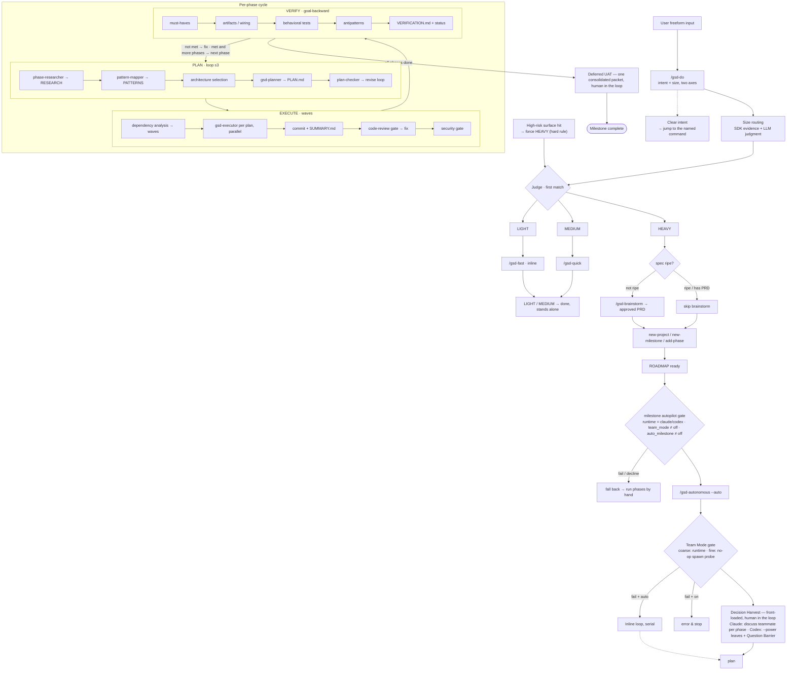

<div align="center">


# GSD Remix

**English** · [简体中文](README.zh-CN.md)

**An opinionated remix of GSD — a spec-driven build system for Claude Code and other AI coding runtimes.**

**You describe the work. It sizes the work, runs the right amount of process, and keeps context fresh the whole way.**

[](https://www.npmjs.com/package/gsd-remix)
[](https://www.npmjs.com/package/gsd-remix)
[](https://github.com/Wynne-cwb/gsd-remix/actions/workflows/test.yml)
[](LICENSE)

<br>

```bash
npx gsd-remix@latest
```

**Works on macOS, Windows, and Linux · Claude Code, Codex, Gemini, OpenCode, and more.**

<br>


<br>

[Core idea](#the-core-idea) · [Three lanes](#one-entry-point-three-lanes) · [Full flow](#the-full-flow) · [The heavy loop](#the-heavy-loop) · [Getting started](#getting-started) · [Commands](#commands) · [Why it works](#why-it-works) · [User Guide](docs/USER-GUIDE.md)

</div>

---

> [!NOTE]
> `gsd-remix` is an independent, opinionated fork published on npm. It is **not affiliated with the official GSD project**, but it keeps the same `/gsd-*` command surface and `.planning/` layout so upstream habits and projects carry over.

GSD is the context-engineering layer that makes an AI coding agent reliable. Under the hood: task-size routing, XML-structured plans, subagent orchestration, and durable planning state. What you see is a handful of commands that just work — and one router you can talk to in plain language.

---

## The Core Idea

Different work needs different amounts of process. A typo fix shouldn't trigger a research phase; a schema migration shouldn't be a one-line YOLO.

So you don't pick a command. You describe the task, and the router sizes it:

```
/gsd-do "the login button is misaligned on mobile"      → LIGHT
/gsd-do "add pagination to the products list"           → MEDIUM
/gsd-do "let users stay logged in across restarts"      → HEAVY   (touches auth → escalated)
```

The router judges **体量 (size)** from deterministic evidence — how many files, whether it introduces new architecture, and whether it touches a high-risk surface — then recommends a lane and lets you confirm. It never silently runs; it shows its evidence.

> [!IMPORTANT]
> **Escalation 铁律 (hard rule).** Anything touching a high-risk surface — auth/session/token, payments/billing, schema migration, public API, webhooks, tenant boundaries, PII/logging, cookies/CORS — is forced to the HEAVY lane, no matter how small the diff looks. The same risk scan guards the LIGHT and MEDIUM entry points too.

---

## One Entry Point, Three Lanes

All three lanes are GSD's own commands at different ceremony levels — one state model, so you can **escalate mid-stream without losing context, decisions, or committed code**.

| Lane | Command | For | What runs |
|------|---------|-----|-----------|
| **LIGHT** | `/gsd-fast` | one-sentence diffs, no new decision, no risk | inline edit, reproduce-then-resolve, atomic commit — no plan, no subagents |
| **MEDIUM** | `/gsd-quick` | cross-file changes, a decision or two | planner + executor, runnable verification evidence, optional review/validate |
| **HEAVY** | full flow | new architecture, greenfield, high-risk surfaces | discuss → plan → execute → verify → review, with resumable state |

### Escalate with evidence

Started small, turned out big? `/gsd-escalate` promotes a completed quick task into a heavy phase — seeding the new phase's context from the quick task's decisions, plan, and commits as **evidence**. It never reverts committed code; it just carries the work forward and re-plans at the right fidelity.

```
/gsd-escalate 250706-abc        # quick task → heavy phase, prior work preserved
```

---

## The Full Flow

What actually happens after you type `/gsd-do` — from size routing, through the HEAVY spec-first gate, into the autonomous per-phase cycle. Solid boxes are decision gates on the critical path; dashed boxes are branch exits and fallbacks.



---

## The Heavy Loop

For real features, HEAVY runs the full discuss → plan → execute → verify cycle. Each step writes durable state so context stays fresh across sessions.

### 1. Clarify the requirement

```
/gsd-brainstorm "a referral program for existing customers"
```

Converges a rough idea into a reviewable **PRD** (`prds/<date>-<topic>/PRD.md`) — problem, users, scope, non-goals, success criteria — self-reviewed through Red Team / risk / YAGNI lenses, with a **visual companion** (UI mockups + architecture/flow diagrams) to confirm the shape before you commit. It's a hard gate: nothing builds until you approve. The approved PRD then feeds `/gsd-new-milestone` or `/gsd-plan-phase --prd`.

You rarely invoke this by hand: when `/gsd-do` sizes a request as HEAVY but the spec is still vague (greenfield, unclear scope, no approved PRD), it routes here first automatically. A HEAVY request that's already spec'd skips straight to planning. The visual companion is capability-gated — it degrades to Mermaid diagrams in the PRD on text-only runtimes and never blocks the gate.

### 2. Initialize

```
/gsd-new-project      # or /gsd-new-milestone for existing projects
```

Questions until it understands the idea → optional parallel research → scoped requirements → a roadmap of phases. You approve the roadmap.

> **Already have code?** Run `/gsd-map-codebase` first — parallel agents map your stack, architecture, and conventions so planning loads your patterns.

### 3. Discuss → Plan → Execute → Verify

```
/gsd-discuss-phase 1     # capture your decisions as CONTEXT.md (or --auto for defaults)
/gsd-plan-phase 1        # research + atomic XML plans + a verification loop
/gsd-execute-phase 1     # wave-parallel executors, fresh context each, atomic commits
/gsd-verify-work 1       # goal-backward verification + conversational UAT
```

Plans are grouped into **waves** by dependency — independent plans run in parallel, dependent ones wait. Each executor gets a fresh context window, so a full phase can write thousands of lines while your main session stays at 30–40% context.

Or let GSD drive the whole thing:

```
/gsd-next                # auto-detect and run the next logical step
/gsd-autonomous          # run all remaining phases: discuss → plan → execute each
```

### Team mode (autonomous, capability-gated)

When the runtime supports agent teams (Claude Code, or Codex — single-level), `/gsd-autonomous` runs as a **Team Lead**: front-load every human decision up front (Decision Harvest), spawn a fresh teammate per bounded step, and defer UAT to one consolidated packet at the end. On by default via `workflow.team_mode: auto` — it engages when a capability probe passes and silently falls back to inline otherwise; set `off` to force the inline loop.

And you don't have to launch it by hand: when `/gsd-new-project` or `/gsd-new-milestone` finishes a roadmap on a team-capable runtime, it offers to hand straight off to the autonomous Team Lead for the whole milestone (`workflow.auto_milestone: ask` by default — one confirmation; `auto` for seamless, `off` to always stop at the roadmap).

---

## Code Review

`/gsd-code-review` runs a **two-axis structured review** in one report: a **Spec** axis (did it build what was asked?) and a **Standards** axis (bugs, security, quality). Findings are impact-weighted — a low-confidence, high-impact finding is never filtered out; it's flagged for human review.

`/gsd-code-review-fix` applies fixes as atomic commits, but **holds back** anything a human must decide (`needs_decision` / `blocks_auto_fix`) instead of guessing.

---

## Getting Started

```bash
npx gsd-remix@latest
```

The installer prompts for:

1. **Runtime** — Claude Code, Codex, Gemini, OpenCode, Kilo, Copilot, Cursor, Windsurf, Antigravity, Augment, Trae, Qwen Code, CodeBuddy, Cline, or all (multi-select in one session).
2. **Location** — global (all projects) or local (current project).

Verify with `/gsd-help` (Claude Code, Gemini, OpenCode, …) or `$gsd-help` (Codex).

> [!NOTE]
> Modern Claude Code, Qwen Code, and Codex install as skills (`.claude/skills/`, `.codex/skills/`, …). Older Claude Code uses `commands/gsd/`. The installer handles every format automatically. The bundled SDK ships as `@gsd-remix/sdk` / `gsd-remix-sdk` so it never collides with an upstream install.

<details>
<summary><strong>Non-interactive install (Docker, CI, scripts)</strong></summary>

```bash
npx gsd-remix --claude --global      # ~/.claude/
npx gsd-remix --claude --local       # ./.claude/
npx gsd-remix --codex --global       # ~/.codex/
npx gsd-remix --gemini --global      # ~/.gemini/
npx gsd-remix --opencode --global    # ~/.config/opencode/
npx gsd-remix --all --global         # every supported runtime
```

Use `--global`/`-g` or `--local`/`-l` to skip the location prompt, and a runtime flag (`--claude`, `--codex`, …, or `--all`) to skip the runtime prompt. The `gsd-remix-sdk` CLI installs automatically from bundled source; pass `--no-sdk` to skip or `--sdk` to force a reinstall. Add `--uninstall` to any combination to remove.

Confirm provenance with `/gsd-health --runtime` — it reports `Distribution: GSD Remix`, the version, and the resolved `IDENTITY.json`.

</details>

<details>
<summary><strong>Development install (from source)</strong></summary>

```bash
git clone https://github.com/Wynne-cwb/gsd-remix.git
cd gsd-remix
npm run build:hooks          # compiles hooks/dist/ — required before installing
node bin/install.js --claude --local
```

</details>

### Recommended: skip-permissions mode

GSD is built for frictionless automation. Approving `date` and `git commit` fifty times defeats the purpose:

```bash
claude --dangerously-skip-permissions
```

<details>
<summary><strong>Prefer granular permissions?</strong></summary>

Add an allowlist to your project's `.claude/settings.json`:

```json
{
  "permissions": {
    "allow": [
      "Bash(date:*)", "Bash(echo:*)", "Bash(cat:*)", "Bash(ls:*)",
      "Bash(mkdir:*)", "Bash(grep:*)", "Bash(sort:*)", "Bash(tr:*)",
      "Bash(git add:*)", "Bash(git commit:*)", "Bash(git status:*)",
      "Bash(git log:*)", "Bash(git diff:*)", "Bash(git tag:*)"
    ]
  }
}
```

</details>

---

## Why It Works

**Context engineering.** GSD keeps the right context in front of the model and nothing else. Durable files carry memory across sessions — `PROJECT.md` (vision), `REQUIREMENTS.md` (scoped v1/v2), `ROADMAP.md` (progress), `STATE.md` (decisions/blockers), `PLAN.md` (atomic tasks), `SUMMARY.md` (what shipped). Each is size-bounded to where the model's quality holds.

**XML-structured plans.** Every plan is precise, executable XML with verification built in — no guessing:

```xml
<task type="auto">
  <name>Create login endpoint</name>
  <files>src/app/api/auth/login/route.ts</files>
  <action>Use jose for JWT. Validate credentials. Return an httpOnly cookie on success.</action>
  <verify>curl -X POST localhost:3000/api/auth/login returns 200 + Set-Cookie</verify>
  <done>Valid credentials return a cookie; invalid return 401.</done>
</task>
```

**Multi-agent orchestration.** Thin orchestrators spawn specialized agents (research, planning, execution, verification) and integrate results — the heavy lifting happens in fresh subagent contexts, so your session stays fast.

**Atomic git commits.** Every task lands its own commit. Git bisect finds the exact failing task, each task is independently revertable, and future sessions read a clean history.

**Steal parts, not contractors.** External conventions worth borrowing (EARS acceptance phrasing, RED-GREEN verification, multi-lens architecture selection, adversarial self-review) are vendored as local text conventions — never as a second tool or a second state model. See [`references/stolen-parts.md`](get-shit-done/references/stolen-parts.md).

---

## Commands

### Route & lanes

| Command | What it does |
|---------|--------------|
| `/gsd-do <text>` | Route freeform text to the right lane/command by intent **and** size |
| `/gsd-fast <text>` | LIGHT — inline trivial change, reproduce-then-resolve, no planning |
| `/gsd-quick [--full] [--validate] [--review] [--discuss] [--research]` | MEDIUM — planner + executor with runnable verification (validate-lite by default) |
| `/gsd-escalate <quick-id>` | Promote a completed quick task into a heavy phase, carrying its work as evidence |
| `/gsd-brainstorm <idea>` | Converge a rough idea into an approved PRD before planning |

### Heavy loop

| Command | What it does |
|---------|--------------|
| `/gsd-new-project` · `/gsd-new-milestone [name]` | Questions → research → requirements → roadmap |
| `/gsd-discuss-phase [N] [--auto] [--chain]` | Capture implementation decisions before planning |
| `/gsd-plan-phase [N] [--prd <path>]` | Research + atomic plans + verification loop |
| `/gsd-execute-phase <N>` | Wave-parallel execution, verify on completion |
| `/gsd-verify-work [N]` | Goal-backward verification + conversational UAT |
| `/gsd-autonomous [--from N] [--to N] [--only N]` | Run remaining phases autonomously (with optional team mode) |
| `/gsd-complete-milestone` | Archive milestone, tag release |

### Navigation & session

| Command | What it does |
|---------|--------------|
| `/gsd-next` | Auto-detect state and run the next step |
| `/gsd-progress` | Where am I? What's next? |
| `/gsd-resume-work` · `/gsd-pause-work` | Restore / hand off mid-phase work |
| `/gsd-map-codebase [area]` | Map an existing codebase before new-project |
| `/gsd-help` | Show all commands and usage |

### Code quality & maintenance

| Command | What it does |
|---------|--------------|
| `/gsd-code-review [N]` | Two-axis (spec + standards) structured review |
| `/gsd-code-review-fix [N]` | Auto-fix findings, atomic commits, holds back human-decision items |
| `/gsd-pr-branch` | Clean PR branch filtering `.planning/` commits |
| `/gsd-debug [desc]` | Systematic debugging with persistent state |
| `/gsd-add-phase` · `/gsd-insert-phase [N]` · `/gsd-remove-phase [N]` | Roadmap surgery |
| `/gsd-add-todo` · `/gsd-note` · `/gsd-add-backlog` · `/gsd-review-backlog` | Capture and triage ideas |
| `/gsd-settings` · `/gsd-health [--runtime] [--repair]` | Configure workflow; diagnose or repair the install |

Full reference: [docs/COMMANDS.md](docs/COMMANDS.md).

---

## Configuration

Project settings live in `.planning/config.json` — set during `/gsd-new-project` or via `/gsd-settings`. Full schema in the [User Guide](docs/USER-GUIDE.md#configuration-reference) and [docs/CONFIGURATION.md](docs/CONFIGURATION.md).

| Setting | Default | What it controls |
|---------|---------|------------------|
| `mode` | `interactive` | Auto-approve (`yolo`) vs confirm at each step |
| `granularity` | `standard` | How finely scope is sliced into phases × plans |
| `workflow.code_review` | `true` | Enable `/gsd-code-review[-fix]` |
| `workflow.quick_plan_gate` | `auto` | MEDIUM plan→execute gate: `auto` (no stop) / `ask` / `off` |
| `workflow.team_mode` | `auto` | Autonomous team mode: `auto` (probe-gated, default) / `off` / `on` |
| `workflow.use_worktrees` | `true` | Git worktree isolation for parallel execution |
| `git.branching_strategy` | `none` | `none` / `phase` / `milestone` branch creation |

**Model profiles** resolve to one allocation — Opus for planning/research/debugging, Sonnet for everything else — configurable via `/gsd-settings`. Use `inherit` for non-Anthropic providers.

---

## Security

GSD generates markdown that becomes an LLM system prompt, so user-controlled text is a potential indirect prompt-injection vector. Defense-in-depth is built in: path-traversal validation on file arguments, a centralized injection scanner over user text, a `PreToolUse` prompt-guard hook on `.planning/` writes, and a CI scanner over all agent/workflow/command files. A high-risk surface scan also gates lane routing (see the escalation rule above).

**Protect secrets** by denying reads in `.claude/settings.json`:

```json
{
  "permissions": {
    "deny": [
      "Read(.env)", "Read(.env.*)", "Read(**/secrets/*)",
      "Read(**/*credential*)", "Read(**/*.pem)", "Read(**/*.key)"
    ]
  }
}
```

---

## Troubleshooting

- **Commands not found?** Restart the runtime to reload skills/commands, then `/gsd-help`. Verify files exist under `~/.claude/skills/gsd-*/` (global) or `.claude/skills/gsd-*/` (local).
- **Something off?** Re-run `npx gsd-remix@latest`, then `/gsd-health --runtime` to check provenance and `/gsd-health --runtime --repair` to rebuild the bundled SDK.
- **Docker / containers?** If tilde paths fail, set `CLAUDE_CONFIG_DIR=/home/you/.claude` before installing.
- **Coming from upstream GSD?** Run `/gsd-map-codebase` then `/gsd-new-project` to rebuild planning context — your code is untouched.

---

## Documentation

| Doc | Contents |
|-----|----------|
| [docs/USER-GUIDE.md](docs/USER-GUIDE.md) | Full walkthrough + configuration reference |
| [docs/COMMANDS.md](docs/COMMANDS.md) | Every command in detail |
| [docs/ARCHITECTURE.md](docs/ARCHITECTURE.md) | How the pieces fit together |
| [docs/CONFIGURATION.md](docs/CONFIGURATION.md) | Full config schema |
| [docs/REMIX-DIFFERENCES.md](docs/REMIX-DIFFERENCES.md) | How this fork diverges from upstream GSD |
| [docs/INVENTORY.md](docs/INVENTORY.md) | Every shipped command, agent, workflow, and reference |

---

<div align="center">

**AI coding agents are powerful. GSD makes them reliable.**

</div>
