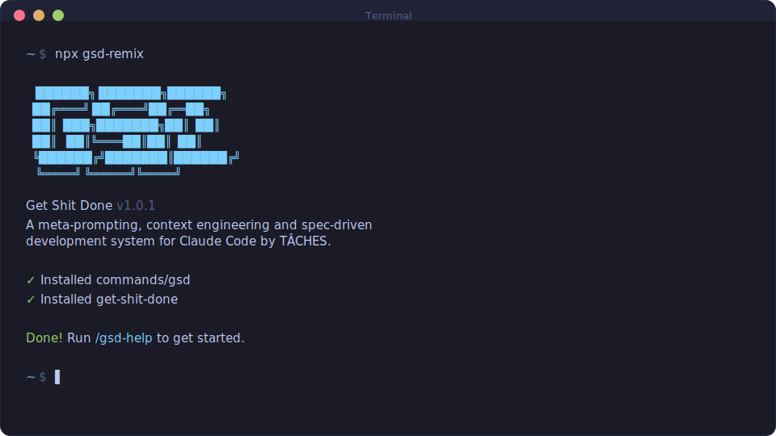
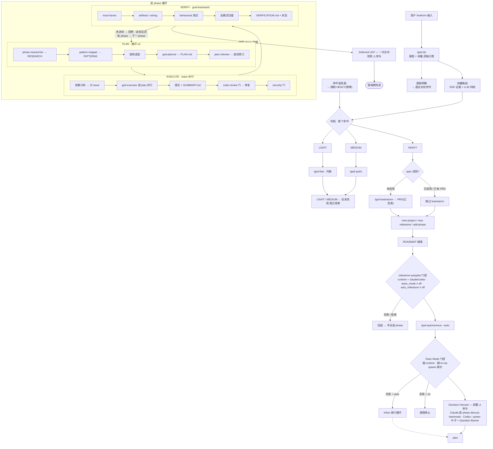

<div align="center">


# GSD Remix

[English](README.md) · **简体中文**

**一个带有明确主张的 GSD remix —— 面向 Claude Code 及其他 AI 编码 runtime 的规格驱动构建系统。**

**你描述工作,它评估体量、投入恰到好处的流程,并全程保持上下文新鲜。**

[](https://www.npmjs.com/package/gsd-remix)
[](https://www.npmjs.com/package/gsd-remix)
[](https://github.com/Wynne-cwb/gsd-remix/actions/workflows/test.yml)
[](LICENSE)

<br>

```bash
npx gsd-remix@latest
```

**支持 macOS、Windows、Linux · Claude Code、Codex、Gemini、OpenCode 等。**

<br>



<br>

[核心理念](#核心理念) · [一个入口三条车道](#一个入口三条车道) · [完整流程](#完整流程) · [重档循环](#重档循环) · [快速开始](#快速开始) · [命令](#命令) · [为什么有效](#为什么有效) · [用户指南](docs/USER-GUIDE.md)

</div>

---

> [!NOTE]
> `gsd-remix` 是一个独立、带有明确主张的 fork,发布在 npm 上。它**与官方 GSD 项目无关**,但保留了同样的 `/gsd-*` 命令面和 `.planning/` 布局,所以上游的使用习惯和项目都能平滑迁移过来。

GSD 是让 AI 编码 agent 变得可靠的那层上下文工程。底层是:任务体量路由、XML 结构化计划、subagent 编排、持久化的规划状态。你看到的,只是几个能用的命令——外加一个可以用大白话对话的 router。

---

## 核心理念

不同的工作需要不同的流程强度。改个错别字不该触发一整个研究阶段;做 schema 迁移也不该是一行 YOLO。

所以你不用挑命令。你描述任务,router 来评估体量:

```
/gsd-do "移动端登录按钮错位了"                      → LIGHT(轻)
/gsd-do "给商品列表加分页"                          → MEDIUM(中)
/gsd-do "让用户重启后保持登录状态"                  → HEAVY(重,碰到 auth → 强制升档)
```

router 从**确定性证据**判断**体量**——涉及多少文件、是否引入新架构、是否触及高危面——然后推荐一条车道让你确认。它从不静默执行,而是把证据摆给你看。

> [!IMPORTANT]
> **升档铁律。** 任何触及高危面的改动——auth/session/token、支付/账单、schema 迁移、公共 API、webhook、租户边界、PII/日志、cookie/CORS——无论 diff 看起来多小,都强制走 HEAVY 车道。LIGHT 与 MEDIUM 入口也由同一套风险扫描把关。

---

## 一个入口三条车道

三条车道都是 GSD 自己的命令,只是仪式感不同——**同一套状态模型**,所以你能**中途带着上下文、决策和已提交代码平滑升档**。

| 车道 | 命令 | 适用 | 跑什么 |
|------|------|------|--------|
| **LIGHT(轻)** | `/gsd-fast` | 一句话能描述的 diff,无新决策、无风险 | 内联改动、先复现再修复、原子提交——无计划、无 subagent |
| **MEDIUM(中)** | `/gsd-quick` | 跨文件改动、有一两个决策 | planner + executor、可运行的验证证据、可选 review/validate |
| **HEAVY(重)** | 全流程 | 新架构、全新项目、高危面 | discuss → plan → execute → verify → review,状态可 resume |

### 带证据升档

一开始觉得小,做着做着变大了?`/gsd-escalate` 把一个已完成的 quick 任务提升为 heavy phase——用该 quick 任务的决策、计划和 commit 作为**证据**来播种新 phase 的上下文。它**绝不回退已提交代码**,只是把工作带过去,以合适的精度重新规划。

```
/gsd-escalate 250706-abc        # quick 任务 → heavy phase,既有工作保留
```

---

## 完整流程

输入 `/gsd-do` 之后到底发生了什么——从体量路由,经 HEAVY 的 spec-first 门控,进入自动化逐 phase 循环。实线框是关键路径上的决策门控,虚线框是分支出口与回退。



---

## 重档循环

真正的功能走 HEAVY 的完整 discuss → plan → execute → verify 循环。每一步都写入持久化状态,所以跨会话上下文始终新鲜。

### 1. 澄清需求

```
/gsd-brainstorm "给老客户做一个推荐返利计划"
```

把一个粗糙想法收敛成可评审的 **PRD**(`prds/<date>-<topic>/PRD.md`)——问题、用户、范围、非目标、成功标准——并经 Red Team / 风险 / YAGNI 三个视角自审,还配一个**可视化陪伴**(界面 mockup + 架构/流程图),让你在动工前先确认形态。这是硬门:PRD 批准前不开工。批准后的 PRD 再喂给 `/gsd-new-milestone` 或 `/gsd-plan-phase --prd`。

你很少需要手动调它:当 `/gsd-do` 判定为 HEAVY 但需求还很虚(greenfield、范围不清、没有已批准的 PRD)时,会**自动先路由到这里**;已经想清楚、有规格的 HEAVY 请求则直接进规划、跳过 brainstorm。可视化陪伴是能力门控的——在纯文本 runtime 上降级为 PRD 内的 Mermaid 图,且永不阻塞硬门。

### 2. 初始化

```
/gsd-new-project      # 已有项目用 /gsd-new-milestone
```

不断提问直到真正理解你的想法 → 可选的并行研究 → 划定范围的需求 → 一份分 phase 的路线图。你批准路线图。

> **已经有代码?** 先跑 `/gsd-map-codebase`——并行 agent 摸清你的技术栈、架构和约定,让规划直接沿用你的模式。

### 3. Discuss → Plan → Execute → Verify

```
/gsd-discuss-phase 1     # 把你的决策记成 CONTEXT.md(或 --auto 用默认值)
/gsd-plan-phase 1        # 研究 + 原子化 XML 计划 + 验证循环
/gsd-execute-phase 1     # 波次并行的 executor,各自新上下文,原子提交
/gsd-verify-work 1       # 目标反推验证 + 对话式 UAT
```

计划按依赖分成**波次(wave)**——彼此独立的计划并行跑,有依赖的等前置完成。每个 executor 拿到全新的上下文窗口,所以一整个 phase 能写几千行代码,而你的主会话仍停在 30–40% 上下文。

或者让 GSD 全程自动驱动:

```
/gsd-next                # 自动判断并执行下一步
/gsd-autonomous          # 跑完所有剩余 phase:每个都 discuss → plan → execute
```

### Team 模式(自动化,能力门控)

当 runtime 支持 agent team(Claude Code,或 Codex —— 单层)时,`/gsd-autonomous` 会以 **Team Lead** 方式运行:开跑前先把所有人工决策集中收齐(Decision Harvest),每个边界步骤派一个全新 teammate,并把 UAT 推迟到末尾统一成一个 packet。由 `workflow.team_mode: auto` 默认开启——能力探针通过才启用,失败则静默回退到内联;设 `off` 可强制走内联。

而且你不用手动启动它:当 `/gsd-new-project` 或 `/gsd-new-milestone` 在 team 可用的 runtime 上建完 roadmap,会顺势提议直接交给 autonomous Team Lead 跑完整个 milestone(`workflow.auto_milestone` 默认 `ask`——确认一次;`auto` 无缝直接跑;`off` 则永远停在 roadmap)。

---

## 代码审查

`/gsd-code-review` 在同一份报告里跑**双轴结构化审查**:**Spec 轴**(有没有实现所要求的?)+ **Standards 轴**(bug、安全、质量)。发现按影响加权——低置信但高影响的发现绝不被过滤掉,而是标记为需人工评审。

`/gsd-code-review-fix` 以原子提交应用修复,但对**需要人工判断的项**(`needs_decision` / `blocks_auto_fix`)会**留手不动**,而不是瞎猜。

---

## 快速开始

```bash
npx gsd-remix@latest
```

安装器会询问:

1. **Runtime** —— Claude Code、Codex、Gemini、OpenCode、Kilo、Copilot、Cursor、Windsurf、Antigravity、Augment、Trae、Qwen Code、CodeBuddy、Cline,或全部(一次会话多选)。
2. **位置** —— 全局(所有项目)或本地(当前项目)。

用 `/gsd-help`(Claude Code、Gemini、OpenCode……)或 `$gsd-help`(Codex)验证。

> [!NOTE]
> 新版 Claude Code、Qwen Code、Codex 以 skill 形式安装(`.claude/skills/`、`.codex/skills/`……)。旧版 Claude Code 用 `commands/gsd/`。安装器自动处理所有格式。内置 SDK 以 `@gsd-remix/sdk` / `gsd-remix-sdk` 发布,不会与上游安装冲突。

<details>
<summary><strong>非交互式安装(Docker、CI、脚本)</strong></summary>

```bash
npx gsd-remix --claude --global      # ~/.claude/
npx gsd-remix --claude --local       # ./.claude/
npx gsd-remix --codex --global       # ~/.codex/
npx gsd-remix --gemini --global      # ~/.gemini/
npx gsd-remix --opencode --global    # ~/.config/opencode/
npx gsd-remix --all --global         # 所有支持的 runtime
```

用 `--global`/`-g` 或 `--local`/`-l` 跳过位置提问,用 runtime 标志(`--claude`、`--codex`……或 `--all`)跳过 runtime 提问。`gsd-remix-sdk` CLI 会从内置源自动安装;`--no-sdk` 跳过、`--sdk` 强制重装。任意组合加 `--uninstall` 即可卸载。

用 `/gsd-health --runtime` 确认来源——会输出 `Distribution: GSD Remix`、版本号,以及解析到的 `IDENTITY.json`。

</details>

<details>
<summary><strong>源码安装(开发用)</strong></summary>

```bash
git clone https://github.com/Wynne-cwb/gsd-remix.git
cd gsd-remix
npm run build:hooks          # 编译 hooks/dist/ —— 安装前必须先跑
node bin/install.js --claude --local
```

</details>

### 推荐:跳过权限确认模式

GSD 为无摩擦自动化而生。反复批准 `date`、`git commit` 五十次就失去意义了:

```bash
claude --dangerously-skip-permissions
```

<details>
<summary><strong>更想用细粒度权限?</strong></summary>

在项目的 `.claude/settings.json` 里加一个 allowlist:

```json
{
  "permissions": {
    "allow": [
      "Bash(date:*)", "Bash(echo:*)", "Bash(cat:*)", "Bash(ls:*)",
      "Bash(mkdir:*)", "Bash(grep:*)", "Bash(sort:*)", "Bash(tr:*)",
      "Bash(git add:*)", "Bash(git commit:*)", "Bash(git status:*)",
      "Bash(git log:*)", "Bash(git diff:*)", "Bash(git tag:*)"
    ]
  }
}
```

</details>

---

## 为什么有效

**上下文工程。** GSD 只把该给模型的上下文摆在它面前,别的不给。持久化文件承载跨会话记忆——`PROJECT.md`(愿景)、`REQUIREMENTS.md`(划定范围的 v1/v2)、`ROADMAP.md`(进度)、`STATE.md`(决策/阻塞)、`PLAN.md`(原子任务)、`SUMMARY.md`(交付了什么)。每个都有大小上限,卡在模型质量还稳的边界内。

**XML 结构化计划。** 每份计划都是精确、可执行、内建验证的 XML——不用猜:

```xml
<task type="auto">
  <name>Create login endpoint</name>
  <files>src/app/api/auth/login/route.ts</files>
  <action>Use jose for JWT. Validate credentials. Return an httpOnly cookie on success.</action>
  <verify>curl -X POST localhost:3000/api/auth/login returns 200 + Set-Cookie</verify>
  <done>Valid credentials return a cookie; invalid return 401.</done>
</task>
```

**多 agent 编排。** 轻量的 orchestrator 派出专职 agent(研究、规划、执行、验证)并整合结果——重活都在全新的 subagent 上下文里干,所以你的会话始终快。

**原子 git 提交。** 每个任务落一个自己的 commit。git bisect 能定位到出错的那个任务,每个任务都可独立回退,未来的会话也能读到干净的历史。

**只偷零件,不换承包商。** 值得借鉴的外部约定(EARS 验收句式、RED-GREEN 验证、多镜头架构选型、对抗式自审)都作为本地文本约定 vendored 进来——绝不引入第二套工具或第二套状态模型。见 [`references/stolen-parts.md`](get-shit-done/references/stolen-parts.md)。

---

## 命令

### 路由与车道

| 命令 | 作用 |
|------|------|
| `/gsd-do <text>` | 按意图**和**体量把自由文本路由到正确的车道/命令 |
| `/gsd-fast <text>` | LIGHT —— 内联琐碎改动,先复现再修复,无规划 |
| `/gsd-quick [--full] [--validate] [--review] [--discuss] [--research]` | MEDIUM —— planner + executor,带可运行验证(默认 validate-lite) |
| `/gsd-escalate <quick-id>` | 把已完成的 quick 任务提升为 heavy phase,携带其工作作为证据 |
| `/gsd-brainstorm <idea>` | 在规划前把粗糙想法收敛成已批准的 PRD |

### 重档循环

| 命令 | 作用 |
|------|------|
| `/gsd-new-project` · `/gsd-new-milestone [name]` | 提问 → 研究 → 需求 → 路线图 |
| `/gsd-discuss-phase [N] [--auto] [--chain]` | 规划前捕获实现决策 |
| `/gsd-plan-phase [N] [--prd <path>]` | 研究 + 原子计划 + 验证循环 |
| `/gsd-execute-phase <N>` | 波次并行执行,完成即验证 |
| `/gsd-verify-work [N]` | 目标反推验证 + 对话式 UAT |
| `/gsd-autonomous [--from N] [--to N] [--only N]` | 自动跑完剩余 phase(可选 team 模式) |
| `/gsd-complete-milestone` | 归档 milestone、打 release tag |

### 导航与会话

| 命令 | 作用 |
|------|------|
| `/gsd-next` | 自动判断状态并执行下一步 |
| `/gsd-progress` | 我在哪?下一步做什么? |
| `/gsd-resume-work` · `/gsd-pause-work` | 恢复 / 中途交接工作 |
| `/gsd-map-codebase [area]` | new-project 前先摸清现有代码库 |
| `/gsd-help` | 显示所有命令与用法 |

### 代码质量与维护

| 命令 | 作用 |
|------|------|
| `/gsd-code-review [N]` | 双轴(spec + standards)结构化审查 |
| `/gsd-code-review-fix [N]` | 自动修复发现、原子提交,对需人工判断项留手 |
| `/gsd-pr-branch` | 过滤掉 `.planning/` commit 的干净 PR 分支 |
| `/gsd-debug [desc]` | 带持久状态的系统化调试 |
| `/gsd-add-phase` · `/gsd-insert-phase [N]` · `/gsd-remove-phase [N]` | 路线图增删改 |
| `/gsd-add-todo` · `/gsd-note` · `/gsd-add-backlog` · `/gsd-review-backlog` | 捕获与整理想法 |
| `/gsd-settings` · `/gsd-health [--runtime] [--repair]` | 配置工作流;诊断或修复安装 |

完整参考见 [docs/COMMANDS.md](docs/COMMANDS.md)。

---

## 配置

项目设置在 `.planning/config.json`——在 `/gsd-new-project` 时设置,或用 `/gsd-settings` 修改。完整 schema 见[用户指南](docs/USER-GUIDE.md#configuration-reference)和 [docs/CONFIGURATION.md](docs/CONFIGURATION.md)。

| 设置 | 默认 | 控制什么 |
|------|------|----------|
| `mode` | `interactive` | 自动批准(`yolo`)还是每步确认 |
| `granularity` | `standard` | 范围切分成 phase × plan 的粗细 |
| `workflow.code_review` | `true` | 启用 `/gsd-code-review[-fix]` |
| `workflow.quick_plan_gate` | `auto` | MEDIUM 的 plan→execute 门:`auto`(不停) / `ask` / `off` |
| `workflow.team_mode` | `auto` | 自动化 team 模式:`auto`(探针门控,默认) / `off` / `on` |
| `workflow.use_worktrees` | `true` | 并行执行的 git worktree 隔离 |
| `git.branching_strategy` | `none` | `none` / `phase` / `milestone` 分支创建策略 |

**模型档位**统一为一套分配——Opus 用于规划/研究/调试,Sonnet 用于其余——通过 `/gsd-settings` 配置。非 Anthropic provider 用 `inherit`。

---

## 安全

GSD 生成的 markdown 会变成 LLM 的系统提示,所以用户可控的文本是潜在的间接提示注入向量。内建纵深防御:文件参数的路径穿越校验、对用户文本的集中式注入扫描、对 `.planning/` 写入的 `PreToolUse` 提示守卫 hook,以及对所有 agent/workflow/command 文件的 CI 扫描。高危面扫描还会为车道路由把关(见上文升档铁律)。

**保护密钥**——在 `.claude/settings.json` 里 deny 读取:

```json
{
  "permissions": {
    "deny": [
      "Read(.env)", "Read(.env.*)", "Read(**/secrets/*)",
      "Read(**/*credential*)", "Read(**/*.pem)", "Read(**/*.key)"
    ]
  }
}
```

---

## 故障排查

- **找不到命令?** 重启 runtime 重新加载 skill/命令,再跑 `/gsd-help`。确认文件在 `~/.claude/skills/gsd-*/`(全局)或 `.claude/skills/gsd-*/`(本地)。
- **行为不对?** 重跑 `npx gsd-remix@latest`,再用 `/gsd-health --runtime` 检查来源、`/gsd-health --runtime --repair` 重建内置 SDK。
- **Docker / 容器?** 如果 `~` 路径失败,安装前设 `CLAUDE_CONFIG_DIR=/home/you/.claude`。
- **从上游 GSD 迁移?** 跑 `/gsd-map-codebase` 再 `/gsd-new-project` 重建规划上下文——你的代码不受影响。

---

## 文档

| 文档 | 内容 |
|------|------|
| [docs/USER-GUIDE.md](docs/USER-GUIDE.md) | 完整走查 + 配置参考 |
| [docs/COMMANDS.md](docs/COMMANDS.md) | 每个命令的详细说明 |
| [docs/ARCHITECTURE.md](docs/ARCHITECTURE.md) | 各部分如何组合 |
| [docs/CONFIGURATION.md](docs/CONFIGURATION.md) | 完整配置 schema |
| [docs/REMIX-DIFFERENCES.md](docs/REMIX-DIFFERENCES.md) | 本 fork 与上游 GSD 的差异 |
| [docs/INVENTORY.md](docs/INVENTORY.md) | 所有已发布的命令、agent、workflow、reference |

---

<div align="center">

**AI 编码 agent 很强。GSD 让它可靠。**

</div>
