# GSD Claude Code 实现深度教程

这份教程只讲一条主线: **GSD 在 Claude Code 里是怎么工作的**。

但这份教程真正的成功标准, 不应该只是“你看懂了仓库结构”。

**更高也更正确的标准是:**

> 一个读者看完之后, 能按这份教程自己复刻出一套最小可用版 GSD。

所以目标不是带你背文档, 而是带你建立一套足够稳定的实现心智模型, 让你最后能做到四件事:

1. 知道 GSD 在 Claude Code 里的产品形态到底是什么
2. 能沿着一条命令链路从入口一路追到落盘
3. 能说清每个子系统为什么存在、输入输出是什么
4. 能按顺序自己复刻一个最小版 GSD, 再逐步补齐高级能力

如果你已经用了很久 GSD, 这份教程应该被当成两样东西来读:

- 一份源码导航图
- 一份复刻蓝图

---

## 0. 先建立正确心智模型

很多人第一次看 GSD 会误以为它是:

- 一堆 slash commands
- 一套 prompt 模板
- 一个 CLI 工具
- 一个规划目录 `.planning/`

这些都对, 但都不完整。

**更准确的定义是:**

> GSD 是一个运行在 Claude Code 之上的“工作流操作系统”。

它把 Claude Code 原本松散的一次次对话, 变成一个有状态的开发流水线:

`命令入口 -> workflow 编排 -> 专用 agent -> 查询/工具层 -> .planning 文件状态 -> hooks 护栏`

你可以把它理解成 6 层:

1. **入口层**: 你在 Claude Code 里输入 `/gsd-*`
2. **命令层**: `commands/gsd/*.md`
3. **编排层**: `get-shit-done/workflows/*.md`
4. **执行角色层**: `agents/*.md`
5. **工具/查询层**: `gsd-remix-sdk query` 和 `get-shit-done/bin/gsd-tools.cjs`
6. **状态层**: `.planning/` 里的 Markdown/JSON 文件

GSD 的设计原则是:

- orchestrator 尽量薄
- agent 尽量专职
- 状态尽量写盘
- 每个子任务尽量用新上下文

理解这四条, 后面的代码会顺很多。

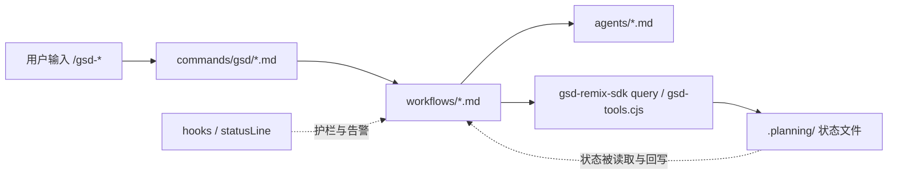

### 0.1 这份教程的成功标准

如果你只是想“会用 GSD”, 看 README 就够了。

你现在要的是“能复刻 GSD”, 那教程至少要让你回答下面这些问题:

1. 最小可用版本到底需要哪些子系统
2. 每个子系统的输入、输出、状态边界在哪里
3. 哪些能力是核心闭环, 哪些只是增强模块
4. 如果不照抄这个仓库, 只保留设计思想, 应该先实现什么

所以后面每一节, 你都应该带着三个问题去看:

- 这一层**解决什么问题**
- 这一层**依赖什么输入, 产出什么工件**
- 如果我自己做一版, **最小实现应该长什么样**

### 0.2 什么叫“最小可复刻版 GSD”

你不需要一上来就复刻这个仓库的全部能力。

一个最小可用版 GSD, 至少应该有 7 个子系统:

1. **命令入口层**
   - 能从 `/my-plan-phase 1` 这样的入口进入某个 workflow
2. **状态层**
   - 有一个 `.planning/` 目录, 至少能保存 `PROJECT.md`、`ROADMAP.md`、`STATE.md` 和单个 phase 目录
3. **init/query 层**
   - 能把零散文件状态收敛成结构化 JSON, 例如 `init.plan-phase`
4. **discuss/context 层**
   - 能把用户的实现偏好沉淀成 `CONTEXT.md`
5. **plan orchestrator**
   - 能读取 roadmap/context/research, 生成一个或多个 `PLAN.md`
   - 最好有 checker 或最少一轮自检
6. **execute orchestrator**
   - 能按 plan 执行, 写 `SUMMARY.md`, 更新 phase 状态
7. **状态推进器**
   - 至少有一个 `next` 或等价逻辑, 知道下一步该 discuss、plan、execute 还是 complete

如果这 7 个东西没有, 你做出来的更像是一组 prompt, 还不是一个 GSD 式系统。

### 0.3 复刻时哪些先不要做

这个仓库里有很多高级能力, 但它们不是你做第一版时的必要条件。

第一版复刻时可以先不做:

- AI-SPEC / UI-SPEC gate
- Nyquist validation
- seeds / milestone archive
- review convergence
- external bounce
- hooks 的全部护栏
- 多 runtime 安装器兼容

先做出最核心的闭环:

> `command -> workflow -> context -> plan -> execute -> state update -> next`

只要这个闭环稳定跑起来, 你就已经复刻出 GSD 的骨架了。

### 0.4 建议的复刻顺序

如果你的目标真的是“自己实现一套 GSD”, 最好的顺序不是照着仓库文件树抄, 而是按系统依赖顺序实现:

1. 先做 `.planning/` 和状态读写
2. 再做 `init.*` 这类 query
3. 再做 `discuss-phase` 生成 `CONTEXT.md`
4. 再做 `plan-phase` 生成 `PLAN.md`
5. 再做 `execute-phase` 消费 `PLAN.md`
6. 最后做 `next`、milestone、hooks 和各种高级 gate

原因很简单:

- 没有状态层, workflow 就无从谈起
- 没有 query 层, prompt workflow 很快会变成散乱的文件拼接
- 没有 discuss/context, plan 很容易退化成 generic plan
- 没有 execute, 你其实还没形成完整闭环

后面这份教程, 你都可以按这个“复刻顺序”来读, 而不只是按仓库目录顺序来读。

---

## 1. 在 Claude Code 里, GSD 安装后到底长什么样

先别急着读 workflow。先搞清楚 Claude Code 运行时里到底会被装进去什么。

### 1.1 全局安装和本地安装不完全一样

这是理解 Claude Code 集成时最容易忽略的一点。

在 `bin/install.js` 里, Claude Code 的安装分两种:

- **全局安装**: 走 `skills/gsd-*/SKILL.md`
- **本地安装**: 走 `.claude/commands/gsd/*.md`

也就是说, Claude Code 这里存在一个现实上的“双形态”:

- 新版全局偏向 **skills**
- 项目内本地仍然使用 **commands**

这不是文档口径差异, 而是安装器里明确写死的行为。

### 1.2 安装器做了三类事情

从 Claude Code 视角看, 安装器主要做三件事:

1. 复制命令/skills
2. 复制 agents / references / workflows / templates / hooks / engine
3. 修改 `.claude/settings.json`

你可以把安装器理解成一个“把仓库内容映射到 Claude Code 运行时目录”的分发器。

### 1.3 Claude Code 安装后的关键目录

如果只看 Claude Code, 你最应该关心这些目录:

- `.claude/commands/gsd/`
- `.claude/skills/gsd-*/SKILL.md`
- `.claude/agents/`
- `.claude/hooks/`
- `.claude/get-shit-done/`
- `.claude/settings.json`

它们的职责分别是:

- `commands/gsd/`: Claude Code 的命令入口
- `skills/gsd-*`: 新版 skill 入口
- `agents/`: 可被 `Task(subagent_type=...)` 调用的专用 agent
- `hooks/`: Claude Code 生命周期钩子
- `get-shit-done/`: GSD 自己的工作流、模板、references、CLI
- `settings.json`: 把 hook/statusline 真正挂到 Claude Code 上

### 1.4 为什么 GSD 要安装这么多东西

因为它不是“一个 prompt”。

它要解决的是一整个持续开发问题:

- 怎样开始任务
- 怎样保留状态
- 怎样把大任务拆小
- 怎样让子代理吃到正确上下文
- 怎样在上下文快爆掉时提醒
- 怎样在写入 `.planning/` 时防 prompt injection

所以它必须同时占住:

- **用户入口**
- **子代理入口**
- **状态目录**
- **护栏**

这也是为什么 GSD 看起来比普通 prompt 工具“更像一个系统”。

---

## 2. 命令层: `/gsd-*` 到底是什么

先看一个代表性命令: `commands/gsd/plan-phase.md`

你会发现它不是代码, 而是一个带 frontmatter 的 Markdown 文件。这个文件通常包含:

- `name`
- `description`
- `argument-hint`
- `allowed-tools`
- 可选 `agent`
- 一段结构化 prompt 正文

### 2.1 命令文件的本质

命令文件本质上是一个**超薄入口 prompt**。

它通常只做三件事:

1. 定义这个命令能用哪些工具
2. 告诉 Claude 这条命令的目标是什么
3. 把真正流程委托给某个 workflow 文件

例如 `plan-phase` 命令里最关键的不是说明文字, 而是:

- `execution_context`
- `process`

`execution_context` 指向真正的 workflow:

- `@~/.claude/get-shit-done/workflows/plan-phase.md`

这说明:

> 命令文件不是流程本身, 只是 workflow 的入口壳。

### 2.2 为什么命令层要这么薄

因为 GSD 不希望把复杂逻辑复制到每个运行时入口里。

如果命令文件本身塞满逻辑, 就会出现:

- 运行时差异难以维护
- command / skill 转换困难
- 相同流程在多个入口重复实现

所以 GSD 采取的是:

- **入口层极薄**
- **workflow 层承载逻辑**

这也是它能够同时支持 Claude Code / Codex / OpenCode / Gemini 等多个运行时的关键原因。

### 2.3 Claude skill 其实是命令的一种重包装

在 `bin/install.js` 里, `copyCommandsAsClaudeSkills()` 会把 `commands/gsd/*.md` 转成 `skills/gsd-*/SKILL.md`。

转换时基本只做这些事:

- `name: gsd:plan-phase` 转成 `name: gsd-plan-phase`
- 保留 `description`
- 保留 `argument-hint`
- 保留 `allowed-tools`
- 正文基本原样保留

也就是说:

> 对 Claude Code 来说, skill 不是另一套内容, 而是命令文件的另一种包装格式。

所以你读源码时, **优先看 `commands/gsd/*.md` 就够了**。

---

## 3. Workflow 层: 真正的“大脑”在这里

如果说命令层只是入口壳, 那 workflow 层才是 GSD 的 orchestrator。

代表目录:

- `get-shit-done/workflows/*.md`

这些文件不是“静态说明书”, 而是 Claude 实际遵循的流程脚本。

### 3.1 Workflow 的角色

workflow 负责:

- 解析参数
- 初始化上下文
- 检查 gate
- 决定是否提问
- 决定是否研究
- 拉起哪个 agent
- 收集 agent 结果
- 决定是否进入下一步

但它**尽量不直接做重活**。

这就是 GSD 一直强调的 “thin orchestrator”。

### 3.2 一个典型 workflow 的结构

看 `get-shit-done/workflows/plan-phase.md` 和 `execute-phase.md`, 你会发现高度一致的套路:

1. `required_reading`
2. `available_agent_types`
3. `process`
4. 分步骤说明
5. 每一步尽量通过 `gsd-remix-sdk query` 获取结构化数据

GSD 很少让 orchestrator 自己去手写一堆 ad-hoc Bash 逻辑, 而是倾向于:

- 先 `gsd-remix-sdk query init.*`
- 再基于 JSON 做分支

### 3.3 为什么 workflow 先用 `init.*`

这是 GSD 很关键的架构选择。

比如 plan-phase workflow 开头会做类似这样的事:

- `gsd-remix-sdk query init.plan-phase`
- `gsd-remix-sdk query agent-skills gsd-planner`
- `gsd-remix-sdk query config-get ...`

这样做的好处是:

- orchestrator 不需要自己到处 grep 文件
- phase 路径、模型、开关、现有工件一次拿全
- prompt 更稳定
- 同一个 init 输出可以被多个运行时复用

可以把 `init.*` 理解成:

> 给 workflow 提供“启动快照”的查询接口。

### 3.4 Workflow 真正做的是“路由”

以 `/gsd-plan-phase 1` 为例, workflow 实际做的是:

1. 判断 phase 是否存在
2. 判断是否已有 CONTEXT / RESEARCH / REVIEWS
3. 必要时引导你先跑 discuss-phase
4. 需要研究时拉起 `gsd-phase-researcher`
5. 拉起 `gsd-planner`
6. 再拉起 `gsd-plan-checker`
7. 如果 checker 失败, 进入 revision loop

请注意:

- workflow 自己不负责“写出高质量计划”
- planner agent 才负责“真正规划”

这就是 orchestrator / worker 分离。

---

## 4. Agent 层: 专用角色才是实际生产者

代表目录:

- `agents/*.md`

这里的 agent 不是抽象概念, 而是 Claude Code 可以按名字调用的专用子代理角色卡。

### 4.1 Agent 文件是什么

一个 agent 文件通常包含:

- `name`
- `description`
- `tools`
- `color`
- 一整套角色提示词

和 command 不同, agent 文件强调的是:

- 你是谁
- 你做什么
- 你不能做什么
- 你必须遵守哪些参考文档

### 4.2 Planner 和 Executor 是两种完全不同的思维模式

这是学习 GSD 时非常重要的一刀。

#### `gsd-planner`

planner 的职责不是“实现功能”, 而是:

- 把 phase 拆成可执行的 PLAN
- 控制任务粒度
- 处理依赖和 wave
- 保证用户在 `CONTEXT.md` 中锁定的决策被尊重
- 通过 source audit 检查 roadmap / requirements / research / context 是否被覆盖

它最重要的思维方式是:

- 计划不是文档, 是 prompt
- 计划要小到一个 fresh context 能稳定执行

#### `gsd-executor`

executor 的职责才是:

- 读取某个具体 PLAN
- 改代码
- 跑验证
- 处理偏差
- 按任务粒度提交 commit
- 写 SUMMARY

它更像一个“受限实施工”。

### 4.3 为什么要把 planner 和 executor 分开

因为这两种工作最怕混在一起:

- 规划时需要抽象、覆盖面、依赖建模
- 执行时需要聚焦、细节、验证、修复

如果把它们塞进同一个上下文, 很容易出现:

- 计划过宽, 执行发散
- 一边想方案一边改代码, 上下文污染严重

GSD 的拆分方式本质上是在做:

> 用角色隔离来对抗上下文退化。

---

## 5. 主流程全景: 从 `new-project` 到 `new-milestone`

如果你想完整理解 GSD, 只看 `plan-phase` 和 `execute-phase` 还不够。

因为 GSD 的真实主流程不是一条线, 而是两个闭环:

1. **首次建项闭环**
   - `/gsd-new-project`
   - `/gsd-discuss-phase`
   - `/gsd-plan-phase`
   - `/gsd-execute-phase`
   - `/gsd-verify-work`

2. **里程碑循环闭环**
   - `/gsd-complete-milestone`
   - `/gsd-new-milestone`
   - `/gsd-discuss-phase`
   - `/gsd-plan-phase`
   - `/gsd-execute-phase`
   - `/gsd-verify-work`

这里有一个很容易混淆的点:

- `new-project` 和 `new-milestone` 不是顺序执行的两步
- 它们是**不同轮次的入口命令**

更准确地说:

- **首次进入项目**: `new-project -> discuss/plan/execute 各 phase -> complete-milestone`
- **进入下一轮**: `new-milestone -> discuss/plan/execute 各 phase -> complete-milestone`

所以不是 `new-project -> new-milestone -> plan-phase`。

`new-milestone` 只有在当前 milestone 完成、准备进入下一轮时才出现。

所以 GSD 不是“初始化一次, 后面永远 plan/execute”。

它更像一个持续运行的开发状态机:

- 项目尚未建立时, 用 `new-project`
- 项目已经存在但进入下一轮时, 用 `new-milestone`
- phase 进入实现前, 用 `discuss-phase`
- phase 要拆任务时, 用 `plan-phase`
- phase 要真正动代码时, 用 `execute-phase`
- phase 做完后, 用 `verify-work`

### 5.1 为什么 `new-milestone` 是主流程的一部分

很多人第一次读仓库会误以为:

- `new-project` 是初始化
- 后面就不停 `plan/execute`

这不够准确。

因为真实项目开发一定会遇到:

- 第一版做完了
- 要进入第二轮需求
- 需要重新定义本 milestone 的目标
- 需要清理旧 phase 目录和状态
- 需要把历史里程碑信息纳入上下文

`new-milestone` 就是在处理这个问题。

它说明 GSD 不是只为“从 0 到 1”设计, 也为“从 1 到 2、2 到 3”设计。

### 5.2 每一步到底在产出什么

你可以用“工件流”来理解整个系统:

- `/gsd-new-project`
  - 建 `PROJECT.md`、`REQUIREMENTS.md`、`ROADMAP.md`、`STATE.md`、`config.json`
- `/gsd-discuss-phase`
  - 为单个 phase 生成 `CONTEXT.md`
- `/gsd-plan-phase`
  - 为单个 phase 生成 `RESEARCH.md` 和多个 `PLAN.md`
- `/gsd-execute-phase`
  - 为每个 plan 生成 `SUMMARY.md`
- `/gsd-verify-work`
  - 生成人工验收和 gap closure 计划
- `/gsd-complete-milestone`
  - 把当前 milestone 归档
- `/gsd-new-milestone`
  - 进入下一轮 requirements / roadmap

所以 GSD 的主线其实是:

> 项目定义 -> milestone 定义 -> phase 决策 -> plan 拆分 -> 执行 -> 验证 -> 归档 -> 下一轮

### 5.3 `/gsd-next` 的真正位置

你现在也可以反过来理解 `/gsd-next`。

它不是“另一个工作流”, 而是一个状态路由器。

它会根据 `.planning/` 判断:

- 缺不缺 `PROJECT.md`
- 当前 phase 有没有 `CONTEXT.md`
- 有没有 `PLAN.md`
- 是否已执行但没验证
- milestone 是否该归档

所以:

- `new-project`
- `new-milestone`
- `discuss-phase`
- `plan-phase`
- `execute-phase`
- `verify-work`

这些命令才是主角, `/gsd-next` 只是帮助你跳到正确入口。

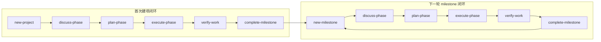

### 5.4 `/gsd-next` 其实是主流程路由器

如果你要自己复刻 GSD, `next` 这条 workflow 很值得单独研究, 因为它把整个系统真正变成了一个**可恢复状态机**。

`get-shit-done/workflows/next.md` 不是在“做事”, 而是在做 4 件非常具体的事:

1. 读状态快照
2. 先跑硬性 safety gate
3. 把当前项目路由到正确命令
4. 直接调用那个命令, 不再二次确认

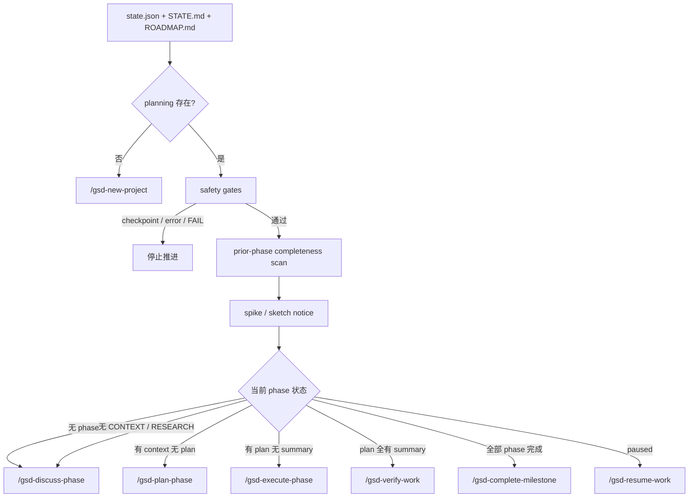

它的 Step 级逻辑基本是这样的:

#### Step 0: detect_state

先读:

- `gsd-remix-sdk query state.json`
- `.planning/STATE.md`
- `.planning/ROADMAP.md`

抽出:

- 当前 phase
- plan 执行进度
- overall status
- 有没有 `.planning/`

所以 `next` 不是靠目录猜, 而是同时看 query snapshot 和文件状态。

#### Step 1: safety_gates

真正关键的是这一步。它会在真正路由前先挡住几类“现在推进一定会出事”的场景:

- `.planning/.continue-here.md` 还没处理
- `STATE.md` 里是 `error` / `failed`
- 当前 phase 的 `VERIFICATION.md` 还有 unresolved `FAIL`

然后它还会做 **prior-phase completeness scan**:

- 之前 phase 有没有 `PLAN.md` 但没有 `SUMMARY.md`
- 有没有 prior phase verification fail
- 有没有 `CONTEXT.md` 有了但根本没 plan

如果你选择继续, 它会把这些 incomplete items 自动转成 `ROADMAP.md` 里的 `999.x` backlog follow-up phase。

这一步特别重要, 因为它不是简单“阻塞用户”, 而是在保护**历史执行记录不丢**。

#### Step 2: spike / sketch notice

它还会扫描:

- `.planning/spikes/`
- `.planning/sketches/`

有 pending exploratory work 会提醒你, 但不改路由。

所以 `next` 的哲学是:

- exploratory work 影响判断
- 但不强行绑死主线

#### Step 3: determine_next_action

这一步基本就是整个 GSD 生命周期的显式路由表:

- 没有 phase 目录 → `discuss-phase`
- 有 `CONTEXT` / `RESEARCH` 但没有 plan → `plan-phase`
- 有 plan 但 summary 不全 → `execute-phase`
- summary 全了 → `verify-work`
- phase complete 且还有下一个 → 下一 phase 的 `discuss-phase`
- 所有 phase complete → `complete-milestone`
- paused → `resume-work`

也就是说, `/gsd-next` 的价值不是“简化命令记忆”, 而是把**状态解释权**从用户脑子里挪到系统里。

#### Step 4: show_and_execute

最后它不是只告诉你下一步是什么, 而是直接 `SlashCommand` 调过去。

这正是 GSD 能跑出连续闭环的原因:

- 不是“建议你下一步去做什么”
- 而是“系统现在替你跳到那一步”

### 5.5 `complete-milestone` 不是结束按钮, 而是一次重写

如果你前面只盯着 phase workflow, 很容易把 `/gsd-complete-milestone` 看成“收尾动作”。真实情况要重得多。

`get-shit-done/workflows/complete-milestone.md` 做的是:

- readiness audit
- requirements completion check
- milestone archive
- `PROJECT.md` 全量演进
- `ROADMAP.md` 重组
- `REQUIREMENTS.md` 归档后删除
- retrospective / tag / branch handling
- 准备下一轮 `new-milestone`

可以把它理解成:

> phase 生命周期结束之后, 再做一次项目级 compaction。

#### Step 0-1: 先看有没有资格关 milestone

workflow 一开始先跑:

- `gsd-remix-sdk query audit-open`
- `gsd-remix-sdk query roadmap.analyze`

然后检查:

- 有没有 open artifacts
- milestone 范围里每个 phase 是不是真的 complete
- `REQUIREMENTS.md` 里有多少 requirement 真正被打勾

如果 requirements 不完整, 它不会默认继续, 而是显式给你:

- proceed anyway
- run audit first
- abort

所以 `complete-milestone` 的第一职责其实不是 archive, 而是**判定这轮是否真的能算 shipped**。

#### Step 2-4: 统计、提炼 accomplishment、演进 `PROJECT.md`

它会从:

- `SUMMARY.md`
- `VERIFICATION.md`
- `UAT.md`
- git log

提取:

- key accomplishments
- 里程碑 stats
- shipped decisions
- lessons learned

然后对 `PROJECT.md` 做一次 full evolution review:

- 哪些 Active requirements 现在该移到 Validated
- 有没有新的 Active requirement 要进入下一轮
- Out of Scope 还成立吗
- Core Value 还对吗
- 项目定义有没有 drift

这一步意味着 `PROJECT.md` 不是初始化时写一次, 而是 milestone 边界反复重写。

#### Step 5-7: archive + rewrite + safety commit

真正 archive 是委托给:

- `gsd-remix-sdk query milestone.complete "vX.Y" --name "..."`

这个 query 负责:

- 把 `ROADMAP.md` 归档到 `.planning/milestones/vX.Y-ROADMAP.md`
- 把 `REQUIREMENTS.md` 归档到 `.planning/milestones/vX.Y-REQUIREMENTS.md`
- 更新 `MILESTONES.md`
- 更新部分 `STATE.md`

但 workflow 自己还要做两件高价值工作:

1. **重写当前 `ROADMAP.md`**
   把已经 shipped 的 phase 按 milestone 分组, 并保留 `## Backlog`
2. **先 safety commit, 再 `git rm .planning/REQUIREMENTS.md`**

这个顺序非常关键。它不是随便写的, 而是在防止:

- archive 写到一半
- 原文件已经删了
- git 历史里没有安全恢复点

所以这里体现的是一种很强的“可恢复优先”设计。

#### Step 8-10: retrospective、branch、tag、next offer

最后才是:

- 更新 `RETROSPECTIVE.md`
- 处理 milestone / phase branch
- git tag `vX.Y`
- 提示下一步 `/gsd-new-milestone`

因此 `complete-milestone` 的真正语义是:

> 把当前 milestone 压缩成历史记录, 再把工作区恢复成适合下一轮规划的形态。

---

## 6. `new-project` 和 `new-milestone`: 初始化与再初始化

这两个命令看起来像, 但实现语义不一样。

最好的理解方式是:

- `new-project` = **greenfield init**
- `new-milestone` = **brownfield re-init**

### 6.1 相同点: 都不是简单“写文件”

它们都遵循一条骨架:

1. 先做初始化快照
2. 收集用户目标
3. 必要时做研究
4. 生成 requirements
5. 生成 roadmap
6. 更新 state

所以这两个命令的本质, 都是把模糊想法变成后续 phase 可消费的结构化工件。

### 6.2 `new-project` 的真实实现链路

`new-project` 的 workflow 在 `get-shit-done/workflows/new-project.md`。

它有几个非常关键的实现点:

#### 第一层: 先跑 `init.new-project`

它会先调用:

- `gsd-remix-sdk query init.new-project`

读取这些元信息:

- 是否已经初始化过项目
- 是否已有 git
- 是否已有代码
- 是否是 brownfield
- 是否需要先 `map-codebase`
- agents 是否已安装

这说明 `new-project` 不是“盲目地开始问问题”, 而是先判断你现在所在的项目状态。

#### 第二层: brownfield offer

如果发现目录里有现成代码但还没做代码库映射, workflow 会先问:

- 要不要先跑 `/gsd-map-codebase`

这一步很能说明 GSD 的设计哲学:

- 先理解已有结构
- 再进入 requirements / roadmap

#### 第三层: deep questioning

`new-project` 的核心不是生成 `PROJECT.md`, 而是先把问题问对。

它会:

- 先用 freeform 问一句 “What do you want to build?”
- 再基于回答继续追问
- 用 `questioning.md` 里的方法逼近真实意图

所以 `new-project` 更像一个“定义问题的 workflow”, 而不是模板填空器。

#### 第四层: 并行 project research

如果 research 开启, 它会拉起多个 `gsd-project-researcher` 子代理, 通常围绕这些方向:

- stack
- features
- architecture
- pitfalls

然后再用 `gsd-research-synthesizer` 合并。

这里研究的不是某个 phase, 而是整个项目层级。

#### 第五层: requirements -> roadmap

最后 workflow 会把前面的内容压缩成:

- `REQUIREMENTS.md`
- `ROADMAP.md`

再用 roadmapper 把 requirements 映射成 phase。

也就是说, `new-project` 真正完成的是:

> idea -> project context -> scoped requirements -> phased roadmap

### 6.3 `new-milestone` 的真实实现链路

`new-milestone` 则是在已有项目基础上重新启动一轮。

它的 workflow 会优先读取:

- `PROJECT.md`
- `MILESTONES.md`
- `STATE.md`
- 可选 `MILESTONE-CONTEXT.md`

这就说明它默认工作在“已有历史”的世界里。

#### 第一层: gather milestone goals

如果已经有 `MILESTONE-CONTEXT.md`, 它会优先使用。

否则会结合:

- 上一个 milestone 做了什么
- 当前 state 里还有什么未完成/阻塞
- 用户现在想做什么

来定义“下一轮要做什么”。

#### 第二层: scan planted seeds

`new-milestone` 会主动检查 `.planning/seeds/`。

这意味着它不只是问“下一步要做什么”, 还会把过去埋下的想法重新带回来, 看本轮 milestone 要不要吸收。

这是一个非常“长期系统化”的设计点。

#### 第三层: versioning + summary confirm

它会:

- 从 `MILESTONES.md` 推断下一个版本
- 生成本轮 milestone summary
- 先让用户确认“这轮到底做什么”

这一步的意义是把里程碑意图固定下来, 再进入 requirements/roadmap。

#### 第四层: 显式更新 `PROJECT.md` 和 `STATE.md`

`new-milestone` 不是只写新 roadmap。

它还会:

- 在 `PROJECT.md` 里更新当前 milestone
- 在 `STATE.md` 里把位置切回“定义 requirements”

所以 milestone 切换在 GSD 里是一个显式状态迁移。

#### 第五层: 清理旧 phase 目录

它还会调用:

- `gsd-remix-sdk query phases.clear --confirm`

来清理旧 milestone 的 phase 目录。

如果启用 `--reset-phase-numbers`, 还会更严格:

- 检查 archive path
- 把旧 phase 目录归档
- 避免新 milestone 的 `01-*` 跟旧目录冲突

这就是为什么 `new-milestone` 不能被理解成“改一下 ROADMAP.md”。

### 6.4 为什么 `new-milestone` 不能被手工编辑替代

因为它改的不只是 roadmap。

它还负责:

- milestone version
- current milestone summary
- seeds surfaced
- `PROJECT.md` 更新
- `STATE.md` 重置
- phase 目录清理/归档
- 新一轮 requirements / roadmap

所以它本质上是:

> 一个 milestone 级状态迁移命令。

### 6.5 `new-project` Step 0-2b: 初始化快照、运行时判断、brownfield 入口

前面说 `new-project` 是“项目定义 workflow”, 但如果你去读 `get-shit-done/workflows/new-project.md`，会发现它一上来根本不是提问, 而是先做系统判定。

Step 级骨架大概是:

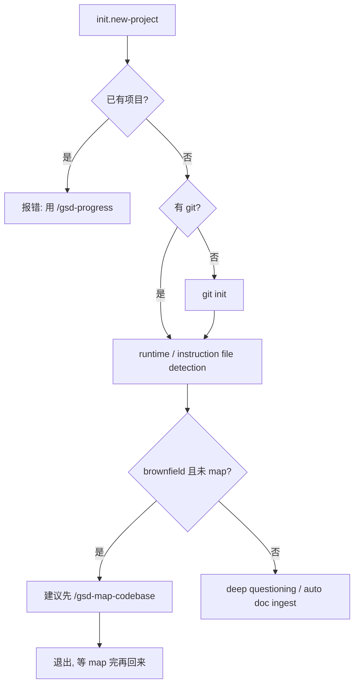

#### Step 0: `init.new-project`

先跑:

- `gsd-remix-sdk query init.new-project`
- `gsd-remix-sdk query agent-skills ...`

它读出来的不只是“有没有 `.planning/`”, 还包括:

- `project_exists`
- `has_existing_code`
- `needs_codebase_map`
- `has_git`
- `agents_installed`
- 各 researcher / synthesizer / roadmapper model

这说明 `new-project` 的第一层不是 prompt engineering, 而是 **environment introspection**。

#### Step 1: runtime detection

workflow 会根据 `execution_context` 推导当前跑在哪个 runtime:

- `/.codex/` → `AGENTS.md`
- 其他默认 Claude → `CLAUDE.md`

这一步很说明 GSD 的多运行时设计:

- 核心 workflow 基本同一份
- 但 instruction file 名字会按 runtime 适配

#### Step 2: brownfield offer

如果目录里有代码, 但还没有 codebase map:

- 不会直接问愿景
- 先问你要不要 `/gsd-map-codebase`

所以“已有代码库怎么入场”的正确路径其实是:

- `map-codebase`
- 再 `new-project`

而不是直接把 `new-milestone` 当 onboarding。

#### Step 2a / 2b: auto mode config + prior exploration detection

如果 `--auto`, workflow 会先收:

- granularity
- execution parallelization
- commit_docs
- research / plan_check / verifier
- model profile

然后立刻写 `.planning/config.json`。

同时它还会查:

- spike findings skill
- sketch findings skill
- `.planning/spikes/`
- `.planning/sketches/`

也就是说, `new-project` 在真正写 `PROJECT.md` 前, 已经把**运行配置**和**历史探索资产**都挂进上下文了。

### 6.6 `new-project` Step 3-5.5: deep questioning、`PROJECT.md`、config 写盘

这部分才是大多数人以为的 `new-project` 全部内容, 但其实它只是中段。

#### Step 3: deep questioning

这里不是简单“聊项目是什么”, 而是按 `questioning.md` 的方法做追问:

- challenge vagueness
- make abstract concrete
- surface assumptions
- find edges
- reveal motivation

如果开启 `workflow.research_before_questions`, 它甚至会在追问前做 brief web research 来增强问题质量。

所以这里本质上是在做:

> 从模糊愿景提炼出一个足够能写 `PROJECT.md` 的结构化项目定义。

#### Step 4: write `PROJECT.md`

生成时要分 greenfield / brownfield:

- greenfield: Active requirements 先是 hypothesis
- brownfield: 从 codebase map 里推导已有 capability, 直接放进 Validated

并且它会初始化:

- `Requirements`
- `Key Decisions`
- `Evolution`
- footer

所以 `PROJECT.md` 不是“项目简介”, 而是后续所有 phase 的 project-level contract。

#### Step 5: workflow preferences

这一段常被忽略, 但其实是 GSD 的运行模式定义器。

它会决定:

- yolo 还是 interactive
- coarse / standard / fine granularity
- parallel 还是 sequential
- planning docs 是否 commit
- research / plan_check / verifier 是否默认开启
- model profile

然后写到:

- `.planning/config.json`

这一步对复刻者很重要, 因为它说明 GSD 并不是“workflow 写死”; 它是**workflow + project config** 一起驱动。

#### Step 5.1 / 5.5: sub-repo detection + model resolution

如果 workspace 里有多个 `.git` 子仓:

- config 会写 `planning.sub_repos`
- `commit_docs` 会被关掉
- `.planning/` 走本地状态, 不强行跟任一 repo 绑定

这说明 GSD 从一开始就在考虑 monorepo / multi-repo 的现实问题, 不是只为单仓 demo 设计。

### 6.7 `new-project` Step 6-9: research、requirements、roadmap、done

前面准备好以后, 才进入“真正建项产物生成”。

#### Step 6: research decision

这里会决定要不要先做 project-level research。

如果走 research, 它会并行起 4 个 `gsd-project-researcher`:

- stack
- features
- architecture
- pitfalls

然后再由 `gsd-research-synthesizer` 合成 `SUMMARY.md`。

注意它研究的是**整个项目维度**, 不是当前 phase 的实现细节。

#### Step 7: define requirements

requirements 可以来自两种源:

- research 输出
- 对话直接抽取

最后会写:

- `.planning/REQUIREMENTS.md`

并且要求:

- requirement 要 testable
- 要 user-centric
- 要 atomic
- 要 independent

这里是 GSD 真正把“想法”转成后续可 trace 的需求系统的地方。

#### Step 8: create roadmap

roadmap 不是 inline 拼出来的, 而是交给:

- `gsd-roadmapper`

它读:

- `PROJECT.md`
- `REQUIREMENTS.md`
- `research/SUMMARY.md`
- `config.json`

然后写:

- `ROADMAP.md`
- `STATE.md`
- requirement traceability

所以 roadmap 不是“另存一个文件”, 而是系统正式进入**phase 编排态**。

#### Step 9: done

最终 `new-project` 会把“下一步去哪”显式打印出来:

- 默认去第一 phase 的 `discuss-phase`
- 或者直接 `plan-phase`

所以它本质上不是 init script, 而是**把项目送上 phase 主线**。

### 6.8 `new-project` 对复刻者最重要的启发

如果你想自己做一个最小版 GSD, `new-project` 里真正不可少的不是那些问法细节, 而是这四件事:

1. 有一个 `init.new-project` 快照接口
2. 能把愿景压成 `PROJECT.md`
3. 能把需求压成 `REQUIREMENTS.md`
4. 能把 roadmap 写成后续 phase 可消费的 `ROADMAP.md`

第一版其实可以先不做:

- prior spike / sketch integration
- sub-repo detection
- auto mode config rounds
- 4 researcher + synthesizer 并发

但你不能不做**state write-back**。否则它就只是个长 prompt, 不是工作流系统。

### 6.9 `new-milestone` Step 1-3.5: 先重新理解历史, 再定义下一轮

`new-milestone` 的前半段比 `new-project` 更“历史敏感”。

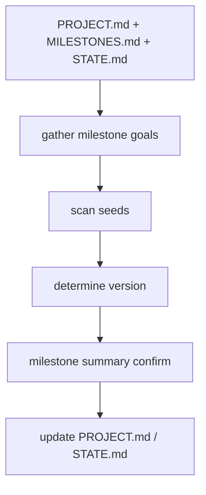

#### Step 1: load context

先读:

- `PROJECT.md`
- `MILESTONES.md`
- `STATE.md`
- 可选 `MILESTONE-CONTEXT.md`

跟 `new-project` 最大差别就在这里:

- `new-project` 是从 0 定义项目
- `new-milestone` 是先拿历史, 再定义下一轮

#### Step 2: gather milestone goals

如果已有 `MILESTONE-CONTEXT.md`, 它优先消费这份上下文。

否则就直接问:

- 上一轮做了什么
- 现在下一轮要做什么

也就是说, milestone goal 不是凭空新建, 而是在**历史交付背景**里被重新定义。

#### Step 2.5: scan planted seeds

它会扫描 `.planning/seeds/SEED-*.md`, 根据 trigger conditions 和本轮目标做匹配。

这一步非常关键, 因为它让“之前记下但没进 scope 的想法”可以在未来自然 resurfacing。

如果你自己复刻, 第一版甚至可以不做 seeds, 但要知道这是 GSD 支持长期演进的重要钩子。

#### Step 3 / 3.5: determine version + verify understanding

它会:

- 从 `MILESTONES.md` 推下一个版本号
- 先生成 milestone summary
- 循环确认 “这轮到底做什么”

所以 `new-milestone` 和 `new-project` 一样, 都不是直接写文件, 而是先锁定 intent。

### 6.10 `new-milestone` Step 4-7.5: 明确状态迁移、清理旧目录、重新载入 agent 配置

#### Step 4-5: update `PROJECT.md` + `STATE.md`

这一步是它和“手工改 roadmap”本质不同的地方。

它会显式更新:

- `PROJECT.md` 里的 Current Milestone
- `STATE.md` 里的 Current Position

所以 milestone 切换被记录成一条**正式状态迁移**。

#### Step 6: cleanup and commit

然后它会:

- 消费掉 `MILESTONE-CONTEXT.md`
- `gsd-remix-sdk query phases.clear --confirm`
- 先提交一版新的 milestone 起点文档

这说明在 GSD 里, “进入下一 milestone” 和 “清理上一轮 phase residue” 是一件事。

#### Step 7 / 7.5: re-init models + reset-phase safety

后半段再跑:

- `init.new-milestone`
- `agent-skills`

然后在 `--reset-phase-numbers` 模式下处理:

- `.planning/phases/` 归档冲突
- 新 milestone 从 Phase 1 重新编号

这一段特别能说明 workflow 和 query 的分工:

- workflow 决定什么时候该清
- query / 文件系统操作负责真正状态变更

### 6.11 `new-milestone` Step 8-11: 研究、requirements、roadmap、todo 回链

#### Step 8: research decision

这一步和 `new-project` 很像, 但研究问题是 milestone-aware 的:

- 只研究本轮新能力
- 不重研究已有 validated capability

所以它是**增量研究**, 不是重跑项目建项。

#### Step 9: define requirements

这里会把:

- 新 milestone 的 feature scope
- research findings
- selected seeds

压进新的 `REQUIREMENTS.md`, 并生成 REQ-ID。

换句话说, milestone 级 requirements 是重新定义一份新的, 不是沿用旧版 requirement 文件继续追加。

#### Step 10: create roadmap

roadmapper 这时只对**当前 milestone**生成 phase。

如果没 `--reset-phase-numbers`, 编号延续。

如果有 `--reset-phase-numbers`, 编号从 1 开始。

所以 phase numbering 在 GSD 里其实是**milestone policy** 的一部分, 不是纯显示问题。

#### Step 10.5 / 11: pending todo linking + done

workflow 最后还会把 pending todo 与新 roadmap phase 做 best-effort 匹配, 写 `resolves_phase: N`。

这一步很细, 但很有代表性:

- roadmap 不是只服务 phase
- 它还要反向吸收 backlog / todo 系统

### 6.12 重新理解 `new-project` / `new-milestone`

现在你可以把它们理解成两种不同的 state transition:

- `new-project`: `repo -> GSD project`
- `new-milestone`: `completed milestone -> next milestone`

它们共享的不是“都写几个文档”, 而是共享一条更深的状态机骨架:

- 读上下文
- 锁定 intent
- 可选研究
- requirements 化
- roadmap 化
- 写回 state
- 把系统推进到下一入口

---

## 7. `discuss-phase`: 为什么它是规划质量分水岭

如果说 `new-project/new-milestone` 定义“做什么”, 那 `discuss-phase` 定义的是:

> **这个 phase 按你的想法, 应该怎么做。**

它是 GSD 最容易被低估的一步。

### 7.1 它不是闲聊, 而是决策捕获

`discuss-phase` 的目标不是“让 Claude 更懂你一点”, 而是:

- 把用户真正在意的 implementation decisions 结构化
- 写成后续 agent 可直接消费的 `CONTEXT.md`

这份 `CONTEXT.md` 之后会被:

- `gsd-phase-researcher`
- `gsd-planner`

直接读取。

所以这一步不是附加项, 而是 planning 质量的输入层。

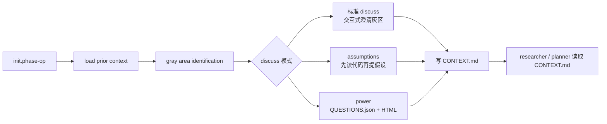

### 7.2 标准 discuss 模式的链路

标准 workflow 在 `get-shit-done/workflows/discuss-phase.md`。

它大致会做这些事情:

#### 第一步: 先 `init.phase-op`

获取:

- phase 是否存在
- phase 目录
- 是否已有 context / plans / verification
- 当前 phase 元信息

如果 phase 不存在, 它直接退出。

#### 第二步: 检查现有工件

如果已经有 `CONTEXT.md`, 它不会无脑重写, 而是让你选择:

- 更新
- 查看
- 跳过

如果已有 plans, 它也会明确提醒:

- 现在 capture 的 context 不会自动影响旧 plan
- 你后面需要重新 `plan-phase`

这说明它不是聊天机器人, 而是一个有状态感知的 workflow。

#### 第三步: load prior context

它会主动读:

- `PROJECT.md`
- `REQUIREMENTS.md`
- `STATE.md`
- 之前 phase 的 `CONTEXT.md`

目的不是复述这些文件, 而是避免重复追问已经定过的东西。

#### 第四步: scout codebase

如果已有 `.planning/codebase/*.md`, 它先读这些映射文件。

没有的话, 它会自己做 targeted grep 和少量文件读取。

这意味着它的“问题生成”不是凭空来的, 而是尽量参考现有代码现实。

#### 第五步: gray area identification

这一步是 discuss-phase 的核心。

它会根据 phase goal 识别:

- 哪些地方存在多个合理实现方向
- 哪些地方用户很可能有明确偏好
- 哪些地方如果不问清楚, 结果会完全不同

也就是说, 它不是问 generic categories, 而是在找真正影响结果的 gray areas。

#### 第六步: 讨论选中的 gray areas

之后它会:

- 让用户选择要聊哪些 gray areas
- 对每个 area 深挖到足够清楚
- 拦 scope creep
- 把新 capability 记到 deferred ideas 而不是混进当前 phase

所以它的本质是:

- 澄清当前 scope 的做法
- 而不是偷偷扩大当前 scope

#### 第七步: 写 `CONTEXT.md`

最终写出来的通常是:

- decisions
- specifics
- deferred ideas

这份文件就是下游的“产品意图输入”。

### 7.3 assumptions 模式: interview 的替代实现

当:

- `workflow.discuss_mode = assumptions`

时, workflow 会切到:

- `get-shit-done/workflows/discuss-phase-assumptions.md`

这条路的思路是:

- 先读代码
- 先形成 assumption
- 再只让用户纠正不对的地方

它还会拉起:

- `gsd-assumptions-analyzer`

去做深度代码分析。

所以 assumptions 模式的核心不是“问更多”, 而是:

> 尽量把可以从代码推出的东西先推出，只把真正不确定的点交给用户。

### 7.4 power 模式: 把 discuss 变成异步文件工作流

`--power` 则会切到:

- `get-shit-done/workflows/discuss-phase-power.md`

这条路不会在聊天里一个个追问, 而是:

1. 先分析所有 gray areas
2. 生成 `{phase}-QUESTIONS.json`
3. 生成一个配套 HTML 文件
4. 让用户离线/异步填写
5. 再通过 `refresh` / `finalize` 回到流程里

这说明 discuss-phase 其实已经不仅是聊天流程, 而是一个多交互模式系统。

### 7.5 `--all`、`--auto`、`--chain` 改的是“控制权”

理解这些 flags 最好的方法不是背参数, 而是看控制权交给谁。

#### `--all`

- 自动选择所有 gray areas
- 但每个 area 依然交互式讨论

它是“跳过 gray area 选择, 保留讨论控制权”。

#### `--auto`

- 自动选择所有 gray areas
- 自动选推荐答案
- 讨论后自动接 plan/execute

它是“把大部分控制权交给系统”。

#### `--chain`

- discuss 本身仍然是交互式
- 但 discuss 结束后自动接 `plan-phase` 和 `execute-phase`

它是中间态:

- 用户控制 discuss 决策
- 系统控制后续推进

### 7.6 为什么它直接决定 planning 质量

planner 不是凭空做计划。

它会同时读:

- ROADMAP
- REQUIREMENTS
- RESEARCH
- CONTEXT

如果你跳过 discuss-phase, planner 只能靠 requirement 文本和默认判断工作。

如果你跑了 discuss-phase, planner 读到的是:

- 哪些决策已经锁定
- 哪些行为必须实现
- 哪些东西禁止做
- 哪些地方可以由 Claude 自行裁量

所以 discuss-phase 的真正价值不是“更懂用户”, 而是:

> 给 planner 喂一份可执行的产品意图。

### 7.7 `discuss-phase` Step 0-3: 初始化、阻塞反模式、SPEC 锁、恢复逻辑

如果你只从 UI 看 `discuss-phase`, 会以为它就是“问用户几个问题”。但实际 workflow 的前半段几乎全是 guard rail。

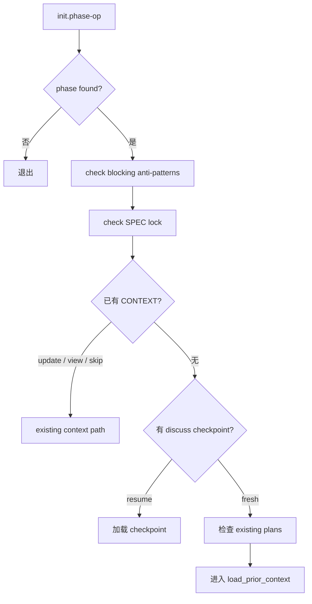

#### Step 0: `init.phase-op`

先跑:

- `gsd-remix-sdk query init.phase-op <phase>`

它抽出来的不只是目录路径, 还有:

- `has_context`
- `has_research`
- `has_plans`
- `has_verification`
- `plan_count`
- `response_language`

这一步决定了 workflow 后面是:

- update existing context
- 从 checkpoint 恢复
- 继续无 context 的正常链路

#### Step 1: blocking anti-patterns

如果 phase 目录下有 `.continue-here.md`, 它会先检查里面有没有 `blocking` anti-pattern。

更关键的是: 不是只提醒一句, 而是要求 agent 明确回答:

1. 这是什么 anti-pattern
2. 这次是怎么触发的
3. 用什么结构机制防止复发

这说明 GSD 的 handoff 不只是“记住 TODO”, 还在尝试把**失败模式内化成操作约束**。

#### Step 2: SPEC lock

如果当前 phase 有 `*-SPEC.md`:

- 先把 requirement 读进来
- 把 spec 作为 locked requirements
- 后续只讨论 HOW, 不再讨论 WHAT

这一步很关键, 因为它说明 discuss-phase 会根据上游 artifact 改变自身 scope。

#### Step 3: check existing / resume logic

然后它才处理:

- 已有 `CONTEXT.md` 怎么办
- 有 `*-DISCUSS-CHECKPOINT.json` 要不要 resume
- 已经有 plan 但没 discuss 时, 要不要继续并 replan

所以 discuss-phase 其实天然支持:

- 中断恢复
- 旧 context 更新
- “先 plan 了, 后补 discuss” 这种不理想但常见的现实路径

### 7.8 `discuss-phase` Step 4-6: prior context、todo 匹配、代码现实扫描

这部分决定了它为什么不像普通访谈机器人。

#### Step 4: load prior context

它会系统性读取:

- `PROJECT.md`
- `REQUIREMENTS.md`
- `STATE.md`
- 所有 prior phase 的 `CONTEXT.md`
- spike / sketch findings

然后拼出内部的 `<prior_decisions>`。

这个 internal context 后面会影响:

- gray area 是否还值得问
- 某个问题是否已在 earlier phase 决过
- 当前 phase 是否和既有 pattern 冲突

#### Step 5: cross-reference todos

这一步经常被忽略, 但很体现 GSD 的“范围守恒”设计。

它会:

- `gsd-remix-sdk query todo.match-phase <N>`
- 找出跟当前 phase scope 匹配的 pending todo

然后分成两类:

- folded into current scope
- reviewed but deferred

最后这些都会进 `CONTEXT.md`。

所以 todo 系统不是和 discuss-phase 分离的; 它会在 phase 边界被重新吸收。

#### Step 6: scout codebase

如果有 `.planning/codebase/*.md`, 它读 map。

没有的话, 它会自己做 targeted grep / file read, 抽出:

- reusable assets
- established patterns
- integration points

所以它问的问题会带着代码现实:

- 不是纯产品脑暴
- 而是“你的代码里已经有 Card / useInfiniteQuery / EmptyState, 那你这里要怎么选”

### 7.9 `discuss-phase` Step 7-9: 识别 gray areas, 再决定用哪种讨论模式

#### Step 7: analyze_phase

这一步才是真正的“生成该讨论什么”。

它会同时参考:

- phase goal
- prior decisions
- codebase context
- canonical refs
- 是否有 SPEC lock

然后产出:

- domain boundary
- gray areas
- 已经预先回答过的点

所以 gray areas 不是通用分类, 而是**当前 phase 的决策空洞图**。

#### Step 8: advisor mode

如果检测到 USER-PROFILE / vendor philosophy / advisor model, 它还会切到 advisor path:

- 按 gray area 并发起 research agent
- 返回 comparison table
- 再让用户基于 table 做选择

这时 discuss-phase 的形态会从“访谈”变成“研究辅助决策”。

#### Step 9: present_gray_areas

它先把:

- phase boundary
- carrying-forward prior decisions
- code context annotations

都展示出来, 再让用户选择想讨论哪些 area。

所以 UI 上看只是一个多选框, 但背后其实已经做了:

- scope guard
- prior decision carry-over
- code-aware prompting

### 7.10 `discuss-phase` Step 10: 真正讨论时, 它其实有三条不同执行路径

#### 路径 A: 默认交互式

默认模式下, 每个 area 会:

1. 进入该 area
2. 按单题或 batch 提问
3. 每轮问完检查“继续还是下一个 area”
4. 所有初始 area 结束后再问“要不要继续探索更多 gray areas”

这意味着讨论不是固定问卷, 而是**可收缩、可扩展的探索循环**。

#### 路径 B: advisor research 驱动

如果是 advisor mode, 先给 comparison table:

- Option
- Pros
- Cons
- Complexity
- Recommendation

然后用户选, Claude 再只在必要时追问 1-2 个 clarification。

这条路径的核心是:

- 先研究再讨论
- 而不是先讨论再研究

#### 路径 C: `--auto` / `--chain` / `--all`

flags 实际上改的是控制权和节奏:

- `--all`: area 全选, 但讨论仍然交互
- `--auto`: area 全选 + 推荐答案自动选 + 后续自动 plan/execute
- `--chain`: discuss 交互, 但 discuss 结束后自动推进

workflow 里还专门有 **single-pass cap** 来防止 `--auto` 一直反复读自己刚生成的 `CONTEXT.md` 形成死循环。

这说明 GSD 不是只关心“质量”, 也关心 agentic loop control。

### 7.11 `discuss-phase` Step 11-14: 写 `CONTEXT.md`、写 `DISCUSSION-LOG.md`、更新 `STATE.md`、自动推进

真正落盘时, discuss-phase 不只写一个 context 文件。

#### Step 11: write `CONTEXT.md`

里面至少会组织这些块:

- `<domain>`
- `<spec_lock>` 如果有 SPEC
- `<decisions>`
- `<canonical_refs>`
- `<code_context>`
- `<specifics>`
- `<deferred>`

这不是装饰性标记, 而是在给后续 agent 一个稳定可读的结构协议。

#### Step 12: write `DISCUSSION-LOG.md`

这个文件不是给 planner / researcher 用的, 而是给人类 audit / compliance /回看 alternatives 用的。

这说明 GSD 把:

- “当前生效决策”
- “讨论过程中看过哪些替代方案”

显式分开存。

#### Step 13: commit + update state

之后它会:

- 删除 checkpoint
- commit `CONTEXT.md` 和 `DISCUSSION-LOG.md`
- `state.record-session`
- 再 commit `STATE.md`

所以 phase discuss 完成后, 不只是文件在了, 连“你停在什么位置、下次从哪恢复”也被状态化了。

#### Step 14: auto_advance

如果:

- `--auto`
- `--chain`
- 或 config 里的 auto mode 生效

它会直接用 skill 调:

- `gsd-plan-phase`

而不是再嵌套一层复杂 Task 树。

这里其实体现了一个很成熟的 agent 工程经验:

- 尽量避免深层嵌套 agent session
- 用平面链式 workflow 替代递归套娃

### 7.12 为什么它要同时写 `CONTEXT.md` 和 `DISCUSSION-LOG.md`

如果只写 `CONTEXT.md`, 你会丢掉:

- 当时有哪些 alternatives 被考虑过
- 为什么某个选项没选
- 用户到底是点了选项还是 freeform 改写了一个答案

如果只写 `DISCUSSION-LOG.md`, 下游 agent 又会被 audit 噪音淹没。

所以 GSD 最终拆成:

- `CONTEXT.md` = 下游执行输入
- `DISCUSSION-LOG.md` = 人类审计日志

这对复刻者是个非常值得抄的设计。

### 7.13 从复刻角度看, discuss-phase 的最小骨架是什么

如果你自己实现最小版, 第一版不需要把 discuss-phase 完整复刻成现在这样。

真正不可少的是这 6 件事:

1. 读当前 phase 和已有 artifact
2. 读 prior context
3. 生成 3-5 个 phase-specific gray areas
4. 把用户选择压成结构化 decisions
5. 写 `CONTEXT.md`
6. 把下一步稳定地交给 `plan-phase`

第一版可以先不做:

- advisor mode
- assumptions mode
- power mode
- discussion checkpoint
- todo folding
- discussion log

但如果你连 `prior context` 和 `scope guard` 都不做, 那它很快就会退化成“每个 phase 都在重新问同样的问题”。

---

## 8. `.planning/` 不是附件, 它是数据库

理解 GSD 的另一个关键点:

> `.planning/` 不是顺手生成的一堆文档, 它就是系统的状态存储。

这是 GSD 的“文件型数据库”。

### 8.1 最核心的几个文件

你最应该先理解这几个:

- `.planning/PROJECT.md`
- `.planning/REQUIREMENTS.md`
- `.planning/ROADMAP.md`
- `.planning/STATE.md`
- `.planning/config.json`
- `.planning/phases/<phase-dir>/...`

它们分别回答不同问题:

- `PROJECT.md`: 这项目是什么
- `REQUIREMENTS.md`: 具体要交付什么
- `ROADMAP.md`: 这些需求分成哪些 phase
- `STATE.md`: 当前做到哪里了
- `config.json`: 工作流怎么跑
- `phases/`: 每个 phase 的上下文、研究、计划、总结、验证

### 8.2 为什么 GSD 要坚持写盘

因为它解决的是多 session、多阶段、多子代理的问题。

如果状态只存在对话里, 会立刻遇到:

- `/clear` 后上下文丢失
- 子代理看不到完整历史
- 用户和 agent 无法共享同一份状态

而写到 `.planning/` 后:

- Claude 可以读
- 人也可以读
- git 可以追踪
- hooks 也能基于它判断当前是否处于 GSD 工作流

这就是 file-based state 的价值。

### 8.3 一个 phase 目录里通常有什么

典型 phase 目录大概是:

- `01-CONTEXT.md`
- `01-RESEARCH.md`
- `01-01-PLAN.md`
- `01-01-SUMMARY.md`
- `01-VERIFICATION.md`
- `01-UAT.md`

你可以把它理解成一个 phase 的完整生命周期记录:

- `CONTEXT`: 你想怎么做
- `RESEARCH`: 外部知识和实现思路
- `PLAN`: 拆成哪些任务
- `SUMMARY`: 实际做了什么
- `VERIFICATION`: 是否达到 phase 目标
- `UAT`: 人工验收结果

GSD 的“可恢复性”和“可审计性”主要都来自这里。

---

## 9. Query 层: workflow 为什么总在调用 `gsd-remix-sdk query`

如果 workflow 是大脑, 那 query 层就是它的 API。

代表代码:

- `sdk/src/query/index.ts`
- `sdk/src/query/init.ts`
- `sdk/src/query/phase.ts`
- `sdk/src/query/state-project-load.ts`
- `sdk/src/gsd-tools.ts`
- `get-shit-done/bin/gsd-tools.cjs`

### 9.1 先理解历史分层

GSD 现在同时保留两套工具入口:

1. **新路径**: `gsd-remix-sdk query`
2. **旧路径**: `get-shit-done/bin/gsd-tools.cjs`

设计目标不是二选一, 而是:

- 新逻辑尽量迁到 typed registry
- 老 CLI 保留兼容和兜底

所以现在最准确的理解是:

> `gsd-remix-sdk query` 是主路, `gsd-tools.cjs` 是兼容层和回退层。

### 9.2 `createRegistry()` 是什么

在 `sdk/src/query/index.ts` 里, `createRegistry()` 会注册大量 query handler。

这些 handler 大体分三类:

1. **读状态**
2. **写状态**
3. **组合初始化**

例如:

- `state.load`
- `state.json`
- `phase-plan-index`
- `roadmap.get-phase`
- `init.plan-phase`
- `init.execute-phase`
- `commit`

workflow 通过这些 handler 获得结构化 JSON, 避免让 prompt 自己解析一堆原始文件。

### 9.3 为什么 `init.*` 特别重要

以 `init.plan-phase` 为例, 它会把这些东西打包成一个 JSON:

- 模型选择
- workflow 开关
- phase 是否存在
- phase 目录
- phase name / slug / req ids
- 是否已有 context / research / reviews / plans
- 各关键文件路径
- `response_language`
- `agents_installed`

这意味着 workflow 开头只要打一枪 `init.plan-phase`, 就能拿到足够多的上下文元数据。

这个思路非常像后端里的“聚合查询”。

### 9.4 `phase-plan-index` 的作用

执行阶段最关键的查询之一是:

- `phase-plan-index`

它负责:

- 找到 phase 目录
- 枚举 PLAN/SUMMARY
- 判断哪些 plan 已完成
- 解析 frontmatter 里的 `wave`
- 构造 `waves` 分组

于是 execute-phase workflow 不需要自己遍历目录和解析 plan 依赖, 直接吃 query 输出即可。

### 9.5 `state.load` 的作用

`state.load` 是另一个关键 query。

它返回:

- 当前 config
- `STATE.md` 原文
- state / roadmap / config 是否存在

这类 query 的价值在于:

- workflow 不用自己打开文件拼状态
- SDK / CLI / workflow 共用同一份状态契约

这也是 GSD 能逐步从 CJS CLI 向 typed SDK 迁移的关键。

---

## 10. GSDTools: 为什么 SDK 里还包了一层工具桥

在 `sdk/src/gsd-tools.ts` 里, 你会看到 `GSDTools`。

它的职责可以简单理解为:

> 给上层 runner 提供一组稳定的方法, 底下再决定走 registry 还是 CLI。

### 10.1 它解决的核心问题

上层 runner 不想知道:

- 这个命令是不是已经迁到了 SDK registry
- 这个命令要不要 fallback 到 CJS
- raw stdout 和 structured JSON 怎么转换

所以 `GSDTools` 封装了这些差异。

### 10.2 为什么这层有价值

这让 `PhaseRunner`、`InitRunner` 这种更高层的 orchestrator 类可以专心处理流程, 而不用操心工具分发细节。

也就是说, GSD 现在大致是这样分层:

- `runner`: 生命周期状态机
- `tools bridge`: 工具桥
- `query registry`: typed handler
- `legacy cjs`: 兼容层

这是一种很标准的“渐进式重构”结构。

---

## 11. Hook 层: 这是 GSD 在 Claude Code 里的“护栏系统”

Claude Code 集成如果只装命令, 其实远远不够。

GSD 真正把自己嵌进 Claude Code 的关键, 是 `settings.json + hooks`。

### 11.1 安装器会往 `settings.json` 里写什么

在 Claude Code 相关安装逻辑里, 安装器会给 `settings.json` 挂上:

- `statusLine`
- `SessionStart` hooks
- `PostToolUse` hooks
- `PreToolUse` hooks

这意味着 GSD 不只是“等你输入命令”, 它还会在 Claude Code 的会话生命周期里参与运行。

### 11.2 最重要的几个 hook

#### `gsd-statusline.js`

职责:

- 显示模型、任务、目录、上下文占用

它主要是面向用户的可见反馈层。

#### `gsd-context-monitor.js`

职责:

- 从 statusline bridge 文件里读上下文指标
- 在上下文余量低时, 通过 `additionalContext` 把警告注入回 agent

关键点是:

- statusline 主要提醒用户
- context monitor 直接提醒 agent

这是一种非常实用的“双通道设计”。

#### `gsd-prompt-guard.js`

职责:

- 在写 `.planning/` 时扫描 prompt injection 模式

它是 advisory-only, 不强拦。

也就是说它更像:

- 预警器

而不是:

- 防火墙

这样做是为了避免误报导致工作流卡死。

#### `gsd-read-guard.js`

职责:

- 提醒“先读再改”

这类 guard 的意义是降低低质量模型或复杂上下文下的盲改概率。

#### `gsd-read-injection-scanner.js`

职责:

- 在 Read 返回内容后扫描注入模式

这属于另一层 defense-in-depth。

### 11.3 为什么 hook 对 Claude Code 尤其重要

因为 Claude Code 提供的是一个持续会话环境, 而不是一次性 CLI 调用。

在这种环境里:

- 只靠 prompt 约束不够
- 只靠 `.planning/` 也不够

你还需要:

- 在关键事件点补充上下文
- 监测上下文剩余量
- 给 agent 打预警

这就是 hook 层存在的根本理由。

---

## 12. 端到端追一条真实链路: `/gsd-plan-phase 1`

现在我们把前面几层串起来。

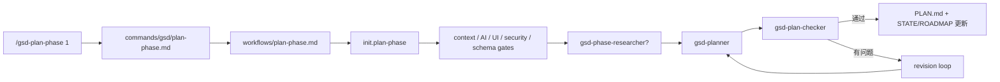

### 12.1 第一步: 用户输入命令

你在 Claude Code 里输入:

```text
/gsd-plan-phase 1
```

Claude 先读取命令文件:

- 本地安装: `.claude/commands/gsd/plan-phase.md`
- 全局技能形态: `skills/gsd-plan-phase/SKILL.md`

本质上都来自仓库里的:

- `commands/gsd/plan-phase.md`

### 12.2 第二步: 命令把控制权交给 workflow

命令文件告诉 Claude:

- 目标是什么
- 允许哪些工具
- 真正流程在 `workflows/plan-phase.md`

于是 Claude 开始按照 workflow 执行。

### 12.3 第三步: workflow 调 `init.plan-phase`

workflow 一上来先取启动快照:

- `gsd-remix-sdk query init.plan-phase 1`

拿到:

- 当前 phase 是否存在
- 目录在哪
- 是否已有 `CONTEXT.md`
- 是否已有 `RESEARCH.md`
- 是否已有 `REVIEWS.md`
- 当前配置里 research / checker 是否开启
- 用哪个模型跑 planner/checker

### 12.4 第四步: workflow 决定分支

然后 workflow 依据快照决定:

- 没有 `CONTEXT.md` 时要不要继续
- 要不要 research
- 是否进入 `--reviews`
- 是否进入 `--gaps`

这一步是 GSD 很典型的“状态驱动 prompt 流程”。

### 12.5 第五步: 拉起 agent

如果需要 research, 先起:

- `gsd-phase-researcher`

再起:

- `gsd-planner`

最后起:

- `gsd-plan-checker`

这里 orchestrator 只做调度, 不写计划本身。

### 12.6 第六步: 计划落盘

planner 产物会写到 phase 目录:

- `XX-RESEARCH.md`
- `XX-01-PLAN.md`
- `XX-02-PLAN.md`

如果 checker 不通过, workflow 会进入 revision loop, 重新驱动 planner 修计划。

### 12.7 这一整条链路的核心认识

`/gsd-plan-phase` 不是“让 Claude 直接规划”。

它实际上是:

`命令壳 -> workflow -> init query -> researcher/planner/checker agents -> phase artifacts`

当你这样看它时, 整个项目就不神秘了。

### 12.8 但上面还只是“骨架”, 真正细节在 `workflows/plan-phase.md`

如果你真要把 `gsd-plan-phase` 读透, 只知道它会起:

- `gsd-phase-researcher`
- `gsd-planner`
- `gsd-plan-checker`

还远远不够。

真正复杂的地方在于:

- 什么时候允许继续 plan
- 什么时候强制你先补 context / AI-SPEC / UI-SPEC
- 什么时候可以复用现有研究
- 什么时候要重新规划
- 什么时候自动推进到 execute

这些都不在 `commands/gsd/plan-phase.md`, 而在 `get-shit-done/workflows/plan-phase.md`。

你应该把这个 workflow 理解成:

> 一个**带很多前置 gate、质量回路和落盘动作的 orchestrator**。

### 12.9 Step 0-3: 初始化、参数规范化、phase 校验

这一段是 planning 真正开始前的“启动序列”。

#### Step 0: Git Branch Invariant

workflow 一上来先声明:

- planning 阶段**不能切分支**
- branch identity 由 discuss 阶段和用户自己的 git 流程决定

这一步不是小事。

它说明 GSD 把:

- git 分支
- phase 目录
- ROADMAP 里的 phase slug

看成三件相关但不完全等价的东西。

#### Step 1: `init.plan-phase`

然后调用:

- `gsd-remix-sdk query init.plan-phase "$PHASE"`

这一步会一次性返回 planning 需要的大部分快照。`sdk/src/query/init.ts` 里能看到它组装的字段包括:

- `researcher_model`
- `planner_model`
- `checker_model`
- `research_enabled`
- `plan_checker_enabled`
- `nyquist_validation_enabled`
- `commit_docs`
- `text_mode`
- `auto_advance`
- `auto_chain_active`
- `phase_found`
- `phase_dir`
- `phase_number`
- `phase_name`
- `phase_slug`
- `phase_req_ids`
- `has_context`
- `has_research`
- `has_reviews`
- `has_plans`
- `plan_count`
- `state_path`
- `roadmap_path`
- `requirements_path`
- `context_path`
- `research_path`
- `verification_path`
- `uat_path`
- `reviews_path`
- `patterns_path`

这里非常关键。

因为这说明 workflow 后面的绝大多数分支, 不是临时读文件拼出来的, 而是先收敛成一个统一 init 快照, 再由 prompt 流程消费。

#### Step 2: 参数解析与 phase 目录准备

接着 workflow 会解析:

- `--research`
- `--skip-research`
- `--gaps`
- `--skip-verify`
- `--prd <file>`
- `--reviews`
- `--text`
- `--bounce`
- `--skip-bounce`

同时处理:

- phase 号规范化
- `TEXT_MODE` 开关
- 没传 phase 时自动找下一个未规划 phase
- phase 在 roadmap 里存在但目录还没建时, 自动创建 `.planning/phases/XX-slug/`

也就是说, `plan-phase` 不是“只接受一个已经准备好的 phase 目录”, 它可以在 roadmap 已存在时补齐目录层。

#### Step 2.5 / 3: reviews 模式和 roadmap phase 校验

这里还会做两个前置检查:

- `--reviews` 不能和 `--gaps` 同时用
- 如果传了 `--reviews` 但 phase 目录里没有 `REVIEWS.md`, 直接退出并要求先跑 `/gsd-review`

之后它还会再次通过:

- `gsd-remix-sdk query roadmap.get-phase "${PHASE}"`

确认这个 phase 在 roadmap 里确实存在。

所以到这里为止, workflow 解决的是:

- phase 合法不合法
- 目录存不存在
- 当前运行模式是什么
- 需要哪些文件作为后续输入

### 12.10 Step 3.5-5.7: planning 前不是直接 planner, 而是一连串 gate

这一段是很多人第一次读 GSD 最容易低估的地方。

#### Step 3.5: `--prd` express path

如果传了:

- `--prd <filepath>`

workflow 不会先要求你跑 discuss-phase, 而是:

1. 读取 PRD
2. 把 PRD 里的 requirements / stories / acceptance criteria 转成 `CONTEXT.md`
3. 把 PRD 里写死的东西视为 locked decisions
4. 提交这个新生成的 `CONTEXT.md`

换句话说:

- `discuss-phase` 是“聊天式生成 context”
- `--prd` 是“文档式生成 context”

两条入口最后都要收敛到 `CONTEXT.md`。

#### Step 4: CONTEXT gate

如果没有 `CONTEXT.md`, workflow 不会静默忽略。

它会明确告诉你:

- 继续规划, 但只基于 requirements / research
- 或先去跑 `discuss-phase`

如果当前 discuss mode 是 assumptions, 它给出的建议入口也会跟着变。

这说明 `CONTEXT.md` 在 GSD 里不是可有可无, 而是一个明确的 planning 输入门。

#### Step 4.5: AI-SPEC gate

如果 phase 目标里带有 AI 相关关键字, 且当前 phase 没有 `AI-SPEC.md`, workflow 会提示:

- 要不要先跑 `/gsd-ai-integration-phase`

它不是绝对阻塞, 但会把“AI 系统设计合同缺失”显式暴露出来。

#### Step 5: research gate

research 不是永远跑, 也不是永远跳过。

它会根据这些条件决定:

- `--gaps` / `--skip-research` / `--reviews` 时直接跳过
- 已有 `RESEARCH.md` 且没显式 `--research` 时复用
- 否则询问或自动决定是否起 `gsd-phase-researcher`

所以 RESEARCH.md 在 GSD 里是**可缓存的 phase 工件**, 不是一次性 prompt 文本。

#### Step 5.5: VALIDATION.md / Nyquist

如果启用了 Nyquist validation, workflow 还会从 `RESEARCH.md` 中抽取 validation architecture, 生成:

- `XX-VALIDATION.md`

这说明 planning 阶段不只是拆任务, 也在预先定义“后面如何验证”。

#### Step 5.55: security threat model gate

如果开启 security enforcement, workflow 会要求:

- 每个 `PLAN.md` 都包含 `<threat_model>` block

这不是 executor 阶段再补的, 而是 planner 在生成计划时就必须内嵌安全威胁模型。

#### Step 5.6: UI-SPEC gate

如果 phase 看起来像前端/UI phase, 但没有 `UI-SPEC.md`, workflow 会:

- 在 auto/chain 模式下自动先跑 `gsd-ui-phase`
- 在手动模式下直接建议你先去生成 UI-SPEC, 然后退出 planning

这说明 GSD 把 UI 设计合同视为 planning 之前的必要输入, 而不是实现时即兴发挥。

#### Step 5.7: schema push gate

workflow 还会扫描:

- `CONTEXT.md`
- `RESEARCH.md`
- roadmap phase section

里提到的文件路径, 判断是否涉及:

- Prisma
- Drizzle
- Payload
- Supabase
- TypeORM

一旦识别出 schema 相关文件, 它不会只提醒, 而是会把一个强制性的:

- `[BLOCKING] schema push`

要求注入到 planner prompt 里。

这个设计很有代表性:

> workflow 不只是决定“起哪个 agent”, 还会主动把跨任务约束写进 planner 的生成规则。

### 12.11 Step 6-8: 真正生成计划前, 还会再做上下文编排

#### Step 6: 现有 PLAN.md 的处理

如果 phase 目录里已经有 `*-PLAN.md`, workflow 不会无脑覆盖。

它会区分:

- `--reviews` 模式: 直接进入 replan
- 普通模式: 让你选择
  - 追加更多 plans
  - 查看现有 plans
  - 从头 replan

这说明 `plan-phase` 是**增量式可重入 workflow**, 不是只能跑一次的单次命令。

#### Step 7: 从 init 快照里提取所有路径

这一步把 init JSON 里的路径变量正式展开成:

- `STATE_PATH`
- `ROADMAP_PATH`
- `REQUIREMENTS_PATH`
- `CONTEXT_PATH`
- `RESEARCH_PATH`
- `VERIFICATION_PATH`
- `UAT_PATH`
- `REVIEWS_PATH`
- `PATTERNS_PATH`

还会顺便发现项目本地的:

- spike findings skill
- sketch findings skill

这说明 workflow 在 planning 时已经会吸纳:

- phase context
- 技术研究
- 历史验证缺口
- 外部 review 反馈
- 实验性结论

#### Step 7.5 / 7.8: Nyquist artifact 检查和 pattern mapper

如果启用了 pattern mapper 且还没有 `PATTERNS.md`, workflow 会额外拉起:

- `gsd-pattern-mapper`

它读取:

- `CONTEXT.md`
- `RESEARCH.md`

抽取将要修改的文件, 去代码库里找最接近的现有模式, 然后产出:

- `XX-PATTERNS.md`

也就是说, planner 在真正写计划前, 还会尽量先拿到“项目里现成的参考实现地图”。

#### Step 8: planner prompt 才是“计划生成”的核心

直到这里, workflow 才真正去起:

- `gsd-planner`

给 planner 的输入非常重, 不只是 roadmap 一段话, 而是整个 planning 上下文包:

- `STATE.md`
- `ROADMAP.md`
- `REQUIREMENTS.md`
- `CONTEXT.md`
- `RESEARCH.md`
- `PATTERNS.md`
- `VERIFICATION.md` / `UAT.md`（`--gaps`）
- `REVIEWS.md`（`--reviews`）
- `UI-SPEC.md`
- spike/sketch findings
- 高 context window 下的跨 phase context / summary / learnings

更重要的是, planner prompt 不只给输入, 还给出非常强的输出约束:

- 每个 task 必须有 `<read_first>`
- 每个 task 必须有 `<acceptance_criteria>`
- `<action>` 必须写具体值, 不能写模糊短句
- frontmatter 必须带 `wave`、`depends_on`、`files_modified`、`autonomous`
- 必须提炼 `must_haves`

所以 `plan-phase` 的本质不是“让 planner 自由发挥”, 而是:

> 用一个重约束 prompt 工厂, 逼 planner 产出下游 executor 真能消费的 PLAN。

### 12.12 Step 9-12.5: planner 返回后, 还有 checker 和 revision loop

#### Step 9: 处理 planner 返回值

planner 的返回不只有一种。

workflow 会根据返回头进入不同分支:

- `## PLANNING COMPLETE`
- `## PHASE SPLIT RECOMMENDED`
- `## ⚠ Source Audit: Unplanned Items Found`
- `## CHECKPOINT REACHED`
- `## PLANNING INCONCLUSIVE`

这点很重要。

因为它说明 planner 不是“总能一次给出结果”的黑盒, 而是 workflow 里一个可能返回多种控制信号的角色。

#### Step 9b / 9c: phase split 和 source audit

如果 planner 判断:

- 当前 phase 超出上下文预算

它会建议拆 phase。

如果 planner 发现:

- `REQUIREMENTS.md`
- `RESEARCH.md`
- ROADMAP goal
- `CONTEXT.md`

里有内容没有被任何 plan 覆盖, 它会显式报 source audit gaps。

这意味着 planner 不只是“拆任务”, 还在做:

- phase 粒度审查
- source coverage 审查

#### Step 10: plan checker

如果没有 `--skip-verify` 且 config 开了 checker, workflow 会再起:

- `gsd-plan-checker`

checker 读取:

- 当前 phase 的所有 `PLAN.md`
- `ROADMAP.md`
- `REQUIREMENTS.md`
- `CONTEXT.md`
- `RESEARCH.md`

它的职责不是写 plan, 而是验证:

- phase goal 有没有被覆盖
- requirement IDs 有没有漏
- 计划是否足够可执行

#### Step 11-12: revision loop

如果 checker 返回 `ISSUES FOUND`, workflow 不会简单报错结束。

它会进入一个最多 3 轮的 revision loop:

1. 统计 blocker / warning 数
2. 比较 issue count 是否下降
3. 如果停滞, 让用户决定是继续还是调整思路
4. 用 checker 的结构化问题重新喂给 `gsd-planner`
5. 再次跑 checker

也就是说:

- planner 负责生成
- checker 负责找问题
- orchestrator 负责把 checker 的问题变成下一轮 planner 的输入

这就是 GSD 在 planning 阶段的“自修正回路”。

#### Step 12.5: bounce

如果启用了 plan bounce, workflow 还可以把 `PLAN.md` 丢给外部脚本做二次 refinement, 然后:

- 校验 YAML frontmatter 是否还合法
- 再次跑 checker
- 失败就从 `.pre-bounce.md` 恢复

这说明 GSD 的 plan pipeline 甚至允许接外部 refinement 系统, 但前提是要受 checker 和回滚保护。

### 12.13 Step 13-15: 不是“生成完计划就结束”, 还要落盘、标注、自动推进

#### Step 13: requirements coverage gate

plans 通过 checker 后, workflow 还要再做一次覆盖率核对:

1. 从 plan frontmatter 提取 `requirements`
2. 对照 roadmap phase 里的 `phase_req_ids`
3. 再检查 `CONTEXT.md` 里的 feature / decision 有没有在 plan objective 里出现

如果缺口还在, 它会再次要求你决定:

- replan
- 移到下一 phase
- 带缺口继续

#### Step 13b / 13c / 13d: 状态更新、roadmap 注释、commit

通过之后, workflow 还会执行几件真正的“状态写盘动作”:

- `gsd-remix-sdk query state.planned-phase`
  - 把 `STATE.md` 改成 ready to execute
- `gsd-remix-sdk query roadmap.annotate-dependencies`
  - 把 wave 分组和 cross-cutting constraints 注回 `ROADMAP.md`
- 如果 `commit_docs` 开启:
  - 提交 phase 的 `PLAN.md`、`STATE.md`、`ROADMAP.md`

所以 planning 阶段并不是只产生 phase 目录下的 plan 文件, 它还会反写全局状态文件。

#### Step 14 / 15: 最终展示和 auto-advance

最后 workflow 会判断:

- 是否 `--auto`
- 是否 `--chain`
- config 里 `auto_advance` 是否开启

如果满足条件, 它不会停在“计划完成”, 而是直接调用:

- `gsd-execute-phase`

这也是为什么你看到 GSD 的很多命令不是单点命令, 而是能串成 pipeline 的状态机节点。

### 12.14 读完这一节后, 你应该怎么重新理解 `plan-phase`

真正的 `plan-phase` 不是:

- 读 roadmap
- 起 planner
- 写几个 plan

而是:

1. 拉 init 快照
2. 解析模式和 flags
3. 过 context / AI / UI / security / schema 等 gate
4. 视情况补 research / validation / patterns
5. 起 planner
6. 起 checker
7. 跑 revision loop
8. 做 requirements coverage 审查
9. 更新 `STATE.md` 和 `ROADMAP.md`
10. 可选自动推进到 execute

当你这样理解它时, 你会发现 `plan-phase` 本身就是一个非常厚的 orchestrator, 而不只是 planner 的外壳。

---

## 13. 再追一条链路: `/gsd-execute-phase 1`

执行阶段更能体现 GSD 的系统感。

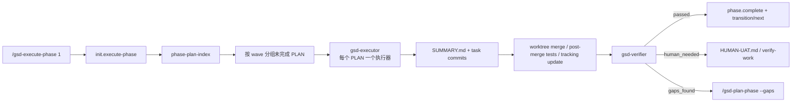

### 13.1 execute-phase workflow 的职责

`execute-phase` workflow 主要负责:

- 解析 phase 参数和 flags
- 通过 `init.execute-phase` 读取 phase 快照
- 用 `phase-plan-index` 找到当前所有 plan
- 识别 wave
- 决定并行还是串行
- 为每个 plan 拉起 `gsd-executor`
- 最后进入 verifier

### 13.2 为什么执行阶段一定要有 `phase-plan-index`

因为执行阶段需要解决一个很具体的问题:

> 哪些 plan 已经完成, 哪些还没完成, 哪些可以并行, 哪些必须等待依赖。

`phase-plan-index` 负责把这些“文件系统事实”变成结构化 JSON。

workflow 只要拿着这个 JSON:

- 过滤 `has_summary: true`
- 按 `wave` 分组
- 同 wave 并发
- 跨 wave 顺序

### 13.3 executor 真正执行什么

单个 `gsd-executor` 拿到的是一个具体 PLAN。

它会:

1. 读 plan
2. 逐 task 执行
3. 跑验证
4. 处理 deviation rules
5. 每 task commit
6. 写 `SUMMARY.md`

所以 execute-phase 的 orchestrator 更像一个“批处理调度器”。

### 13.4 为什么 GSD 一直强调 wave

因为它不是简单地“一个 phase 一个 agent”。

它想要的是:

- 尽量让独立 plan 并行
- 让依赖 plan 顺序化
- 控制上下文成本

这和传统构建系统里的 DAG 调度很像, 只是节点从“编译任务”换成了“AI 子任务”。

### 13.5 Step 0-2.5: 执行前, 先拿快照、同步模式、准备调度上下文

如果你只把 execute-phase 理解成“把所有 plan 交给 executor”, 你会低估这个 workflow 的厚度。

真正开始执行前, 它先做的是启动序列。

#### Step 0: parse args

先解析:

- phase 参数
- `--wave N`
- `--gaps-only`
- `--cross-ai`
- `--no-cross-ai`

这一步的意义是先定义:

- 这次跑整个 phase, 还是只跑某一 wave
- 是正常执行, 还是只跑 gap closure plans
- 是走本地 executor, 还是强制走 cross-AI 外部执行

#### Step 1: `init.execute-phase`

然后调用:

- `gsd-remix-sdk query init.execute-phase "${PHASE_ARG}"`

取回 execute 需要的启动快照。这里的关键信息包括:

- `executor_model`
- `verifier_model`
- `parallelization`
- `branching_strategy`
- `branch_name`
- `phase_found`
- `phase_dir`
- `phase_number`
- `phase_name`
- `plans`
- `incomplete_plans`
- `plan_count`
- `incomplete_count`
- `phase_req_ids`

以及一些运行时配置:

- 是否用 worktree
- 当前 context window 大小
- 当前 auto-chain 状态

这和 `init.plan-phase` 是同一种设计思路:

> 先把文件系统和 config 的零散事实压成一个 init 快照, 再让 workflow 基于这个快照分支。

#### Step 1 的附加逻辑: worktree / runtime / auto-chain 同步

在这一步里, execute-phase 还会额外做三类很“运行时”的判断:

1. **worktree 能不能用**
   - 如果 config 开了 `workflow.use_worktrees`, 默认会走 worktree 隔离
   - 但如果项目有 submodule, 会强制退回串行执行
2. **当前 runtime 能不能可靠起 subagent**
   - Claude Code 正常并行 spawn
   - Copilot / 其他不可靠 runtime 会退回 inline sequential
3. **auto-chain flag 要不要清掉**
   - 手动执行时, 先清掉残留的 `_auto_chain_active`

也就是说 execute-phase 在真正调度之前, 先把“这次到底以什么模式运行”确定下来。

#### Step 1.5: blocking anti-pattern handoff

如果 phase 目录里有:

- `.continue-here.md`

workflow 会先检查里面有没有 `blocking` 级别的 anti-pattern。

这不是展示给你看就算完了, 而是要求当前 agent 先解释:

- 这个 anti-pattern 是什么
- 上次怎么踩到的
- 这次靠什么结构机制避免复发

这里体现出 GSD 的一个很强的设计取向:

> 失败经验不是靠“记住”, 而是靠工作流的进入门重新激活。

#### Step 2: interactive mode 和 branching

接着 execute-phase 会判断:

- 是否 `--interactive`

如果是, 就不再走并行 subagent 调度, 而是:

- 逐个 plan inline 执行
- 中间允许用户随时介入

然后再根据 init 里的 `branching_strategy` 判断:

- 继续当前分支
- 或切到 phase / milestone branch

这意味着 execute-phase 不是只有一种“后台批处理模式”, 它同时兼顾:

- 高吞吐批量执行
- 低风险人工盯盘执行

### 13.6 Step 3-5.8: 真正困难的部分是 wave 调度和 worktree 合并

#### Step 3: `phase-plan-index`

真正进入调度前, workflow 会调用:

- `gsd-remix-sdk query phase-plan-index "${PHASE_NUMBER}"`

拿到:

- 每个 plan 的 `id`
- `wave`
- `autonomous`
- `objective`
- `files_modified`
- `task_count`
- `has_summary`
- 整个 phase 的 wave map

这个 query 的意义非常大。

因为 execute-phase 后面的很多动作, 都依赖这个结构化索引:

- 过滤已完成 plan
- 只执行特定 wave
- 发现 checkpoint plans
- 做 files overlap 检查

#### Step 3.5: optional cross-AI delegation

如果某些 plan 标记了:

- `cross_ai: true`

或者用户显式传了:

- `--cross-ai`

workflow 还可以不走本地 `gsd-executor`, 而是:

1. 从 PLAN 里抽取 objective / tasks
2. 构造成一个自包含执行 prompt
3. 通过 stdin 喂给外部 AI command
4. 要求外部命令产出可接受的 `SUMMARY.md`

这里很关键的一点是:

- 外部执行不是旁路
- 它仍然要回到 phase 目录的 `SUMMARY.md` 和 tracking 状态

所以 cross-AI 仍然是被 GSD 主状态机包住的。

#### Step 4: wave 内部的 files overlap 检查

这是 execute-phase 很“工程化”的一个地方。

即使 planner 已经给 plan 分了同一 wave, execute-phase 仍然会在真正并发前检查:

- 同 wave 的两个 plan 是否在 `files_modified` 上有重叠

如果有, 它会:

- 把当前 wave 强制改成串行
- 同时把这视为 planning defect

这说明 execute-phase 不是盲信 planner。

它会在执行前再做一次调度安全检查。

#### Step 5: spawn executor agents

真正拉起执行器时, 有两种主模式:

1. **worktree parallel mode**
   - 每个 plan 在独立 worktree 里跑
   - executor 只负责 plan 内任务、commit、`SUMMARY.md`
   - 不允许 executor 自己写 `STATE.md` / `ROADMAP.md`
2. **main-tree sequential mode**
   - 不用 worktree
   - 每个 plan 在主工作树串行执行
   - 可以直接更新共享 tracking 文件

在 worktree 模式下, prompt 里还会强制 executor 先验证:

- 当前 worktree branch 的 base commit 是否正确

这是为了修补已知的 worktree base 偏移问题。

也就是说, execute-phase 不只是“起 agent”, 它还把一堆运行时安全约束直接塞进 executor prompt。

#### Step 5.5: worktree merge 不是简单 git merge

当一整个 wave 的 worktree executor 跑完后, orchestrator 要做的事情非常重:

1. 枚举这波生成的 worktrees
2. 逐个 merge 回主分支
3. merge 前备份 `STATE.md` / `ROADMAP.md`
4. merge 后恢复这些 orchestrator-owned 文件
5. 检查是否有异常删除
6. 检查是否有 phase 目录 resurrection
7. 如果 executor 忘了 commit `SUMMARY.md`, 先救回来再删 worktree
8. 最后删除 worktree 和临时 branch

所以 worktree 机制真正难的部分根本不是 “add worktree”, 而是:

> 如何把多个 AI 子执行器的结果安全收敛回主工作树, 同时保护共享状态文件不被 stale branch 覆盖。

#### Step 5.6 / 5.7 / 5.8: post-merge test gate 和 tracking update

worktree merge 完之后, execute-phase 还不会立刻把这些 plans 记为 complete。

它先跑一个:

- post-merge test gate

目的是抓这种问题:

- 每个 worktree 内自检都通过
- 但一 merge 回主树就出现交叉冲突

只有在测试通过后, orchestrator 才会更新:

- `ROADMAP.md` plan progress
- `STATE.md`

如果测试失败或超时, tracking update 会被跳过, plans 保持 in-progress。

这一步非常值得你在复刻时保留。

因为它体现了 GSD 对一个现实问题的认识:

> “AI agent 在隔离环境里说自己没问题” 不等于 “合并后的系统真的没问题”。

### 13.7 Step 6-8: checkpoint、失败恢复、跨 wave 依赖检查

#### Step 6: report completion 前先做 spot-check

即使 executor 声称自己完成了, orchestrator 仍然会 spot-check:

- `SUMMARY.md` 是否存在
- git log 里是否真有对应 commit
- `Self-Check: FAILED` 是否出现

如果这些检查不成立, execute-phase 不会盲目相信 executor 的完成信号。

#### Step 7: failure handler

如果某个 plan 真失败了, orchestrator 会要求用户选择:

- 继续后面的波次
- 或停下来处理

这里还有一个很典型的工程细节:

- 已知 Claude Code completion handler bug 会被 special-case
- 如果 bug 只是 completion signal 异常, 但文件和 commit 都对, 就当成功

换句话说, GSD 在 execute-phase 里对“runtime bug”和“真实业务失败”做了显式区分。

#### Step 7b: pre-wave dependency check

在跑下一 wave 之前, execute-phase 还会检查:

- 当前 wave 依赖的上一个 wave 关键连接是否真的接好了

通过:

- `gsd-remix-sdk query verify.key-links`

来验证某些关键 wiring 是否存在。

这一步特别像传统 build / deploy pipeline 里的 contract test。

它的目标是:

- 不让 Wave 2 建在一个“看起来完成, 实际没接通”的 Wave 1 上

#### Step 8: checkpoint handling

如果某个 plan frontmatter 里:

- `autonomous: false`

那它会变成 checkpoint plan。

这时 execute-phase 的流程变成:

1. 先跑到 checkpoint 点
2. executor 返回 structured checkpoint state
3. orchestrator 把“已完成部分 + 当前阻塞点 + 等待什么”呈现给用户
4. 用户给反馈
5. 再起一个 continuation agent, 从 checkpoint 续跑

这里一个很重要的设计点是:

- 它不是 resume 同一个 agent
- 而是起一个 fresh continuation agent

这正是 GSD 的一贯策略:

- 尽量让 continuation 依赖显式状态, 而不是依赖 agent 内部会话状态

### 13.8 Step 9-14: execute-phase 真正收尾在 verifier 和 phase completion

#### Step 9: aggregate results

所有 wave 执行完后, workflow 会聚合:

- 每个 wave 的状态
- 每个 plan 的一行总结
- 整体 issues encountered

这是 execute-phase 的“批处理摘要层”。

#### Step 10-12: code review / regression / schema drift

真正进入 verifier 前, execute-phase 还会再过几道 execution 后 gate:

- 自动 code review
- prior-phase regression gate
- schema drift gate

特别是 schema drift gate 很值得注意。

它会检查:

- schema 相关文件改了
- 但数据库 push 命令没跑

如果出现这种情况, 它会**阻塞 verification**, 因为否则会产生 false positive:

- TypeScript / build 看起来都过了
- 但真实数据库状态没同步

这说明 execute-phase 的后半段, 已经不仅仅是“跑完 plans”, 而是在防执行结果被误判为成功。

#### Step 13: `gsd-verifier`

接着才会起:

- `gsd-verifier`

它要验证的不是:

- task 有没有打勾

而是:

- phase goal 到底有没有达成
- must_haves 有没有落地
- REQ-ID traceability 是否完整
- `CONTEXT.md` 锁定的关键决策是否真的被实现

这是 GSD 很核心的一点:

> execute 完成 != phase 成功。  
> phase 成功必须经过 verifier 的 goal-backward 检查。

#### Step 13 的三种结果: passed / human_needed / gaps_found

verifier 返回后, execute-phase 会进三条完全不同的路:

1. **passed**
   - 进入 `phase.complete`
2. **human_needed**
   - 把人工验证项写成 `HUMAN-UAT.md`
   - 等待用户 approval 或问题反馈
3. **gaps_found**
   - 引导你跑 `/gsd-plan-phase {X} --gaps`

这说明 execute-phase 的结束态并不只有“完成”一种。

它实际上有三个稳定出口:

- 直接完结
- 转人工验证
- 转 gap closure cycle

#### Step 14: `phase.complete` 和全局状态回写

如果 verifier 通过, execute-phase 还会调用:

- `gsd-remix-sdk query phase.complete`

这一步负责:

- 勾掉 `ROADMAP.md` 里的 phase checkbox
- 更新 progress table
- 推进 `STATE.md` 到下一 phase
- 更新 `REQUIREMENTS.md` traceability

之后还可能继续做:

- copy learnings
- auto-close todos
- evolve `PROJECT.md`

也就是说, execute-phase 最后的本质是:

> 把“这一 phase 真完成了”这个事实, 反写回整个项目的全局状态树。

### 13.9 读完后, 你应该怎么重新理解 `execute-phase`

真正的 `execute-phase` 不是:

- 读 plan
- 起 executor
- 等结果

而是:

1. 拉 execute init 快照
2. 决定 runtime / worktree / interactive / branch 模式
3. 用 `phase-plan-index` 构造调度图
4. wave 内做并行安全检查
5. 起 executor
6. merge worktree 结果回主树
7. 跑 post-merge test gate
8. 处理 checkpoint / failure / dependency wiring
9. 跑 code review / regression / schema drift
10. 起 verifier
11. 根据 passed / human_needed / gaps_found 分流
12. 用 `phase.complete` 回写全局状态

当你这样看它时, execute-phase 已经不是“执行器入口”, 而是一个完整的 AI 构建调度与收敛系统。

---

## 14. Claude Code 专属细节: `CLAUDE.md` 在 GSD 里扮演什么角色

如果你长期在 Claude Code 里用 GSD, 这一点很重要。

### 14.1 `CLAUDE.md` 不是 GSD 的核心状态, 但它是项目级约束入口

在 planner 和 executor 里都能看到类似规则:

- 如果工作目录下有 `./CLAUDE.md`, 必须读取并遵守

也就是说:

- `.planning/` 管的是 GSD 的流程状态
- `CLAUDE.md` 管的是项目本身的开发约束

### 14.2 GSD 还提供 `CLAUDE.md` 生成能力

模板在:

- `get-shit-done/templates/claude-md.md`

它会按 marker 分段管理:

- Project
- Stack
- Conventions
- Architecture
- Skills
- Workflow Enforcement
- Profile

这说明 GSD 不只关心 phase 流程, 它还想把项目级静态知识也喂给 Claude Code。

这是 GSD 非常 Claude-native 的一面。

---

## 15. 从 SDK 角度再看一遍: 为什么仓库里还有 `PhaseRunner` / `InitRunner`

如果你只从命令和 workflow 看仓库, 会觉得系统已经完整了。

但 `sdk/` 说明 GSD 还在做另一件事:

> 把原本依赖 prompt 文件的系统, 逐步提炼成可编程的 SDK。

### 15.1 `PhaseRunner`

`sdk/src/phase-runner.ts` 是一个明确的状态机。

它按顺序组织:

- discuss
- research
- plan
- plan-check
- execute
- verify

并在中间处理:

- config 开关
- blocker callback
- retry / replan
- 事件流上报

换句话说, 这是把原本“workflow prompt 中的过程知识”进一步程序化。

### 15.2 `InitRunner`

`sdk/src/init-runner.ts` 则把 `new-project` 这种初始化流程程序化:

- setup
- config
- PROJECT
- 4 路 research
- synthesis
- requirements
- roadmap

它非常像一个更显式的 orchestrator 实现。

### 15.3 你应该怎么理解 SDK 的存在

最好的理解方式是:

- **GSD v1 主要是 prompt/workflow 驱动**
- **SDK 是把这些行为逐步收敛成 typed contract**

这不是重复实现, 而是“从 prompt 系统向程序系统演进”的中间态。

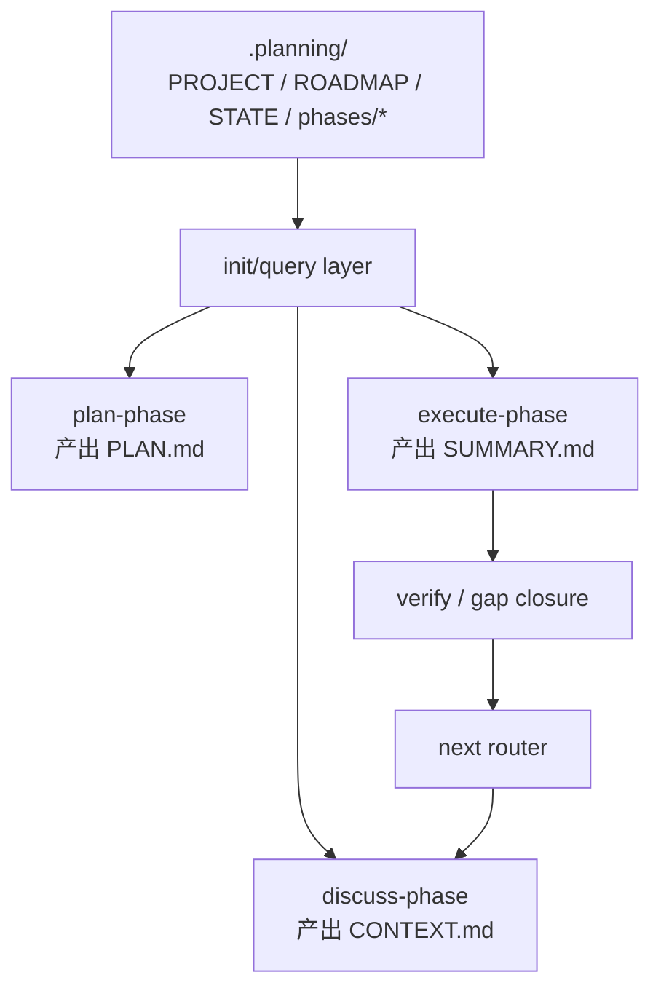

### 15.4 如果你要自己复刻一版 GSD, SDK / query 层最少要抽哪些接口

如果你真的要自己做一套最小版 GSD, 最值得抄的不是 prompt 文案, 而是这个仓库的 query contract 思路。

最小版建议至少先抽出这几类接口:

#### 1. init 类接口

例如:

- `init.plan-phase`
- `init.execute-phase`

职责是:

- 把 phase 目录状态
- config 开关
- 相关文件路径
- 模型选择

压成一个 workflow 启动快照。

#### 2. phase inventory 接口

例如:

- `find-phase`
- `phase-plan-index`

职责是:

- 找 phase 目录
- 列出 plans / summaries
- 标注 wave
- 标注 incomplete plans

如果没有这层, 你的 workflow 很快就会退化成 prompt 里散落着一堆 `ls` / `grep` 逻辑。

#### 3. state mutation 接口

例如:

- `state.begin-phase`
- `state.planned-phase`
- `phase.complete`

职责是把“phase 已开始 / 已规划 / 已完成”这些状态迁移做成可重复调用的操作。

#### 4. roadmap mutation 接口

例如:

- `roadmap.get-phase`
- `roadmap.update-plan-progress`
- `roadmap.annotate-dependencies`

职责是把 roadmap 从“静态文档”变成“可被 workflow 安全修改的状态文件”。

#### 5. commit / helper 接口

例如:

- `commit`
- `config-get`
- `config-set`

这些接口的价值在于:

- 让 workflow prompt 少碰具体 shell 细节
- 让不同 runtime 共享相同 contract

#### 6. verify 辅助接口

例如:

- `verify.key-links`
- `verify.schema-drift`

这是 execute-phase 后期很重要的一类能力:

- 不是直接让 verifier 自己什么都猜
- 而是先用一些窄而确定的 query 把“结构事实”算出来

### 15.5 如果只做最小版, 这一层应该长什么样

最小版你甚至不需要完整 SDK。

你只需要一个很小的内部 API 层:

```ts
type InitPlanPhase = () => {
  phaseDir: string
  contextPath?: string
  researchPath?: string
  hasPlans: boolean
  planCount: number
}

type PhasePlanIndex = () => {
  plans: Array<{
    id: string
    wave: number
    hasSummary: boolean
    filesModified: string[]
  }>
}

type StateOps = {
  beginPhase(): void
  markPlanned(): void
  markComplete(): void
}
```

重点不在类型要多完整, 而在于你要先建立一个边界:

- workflow 不直接到处摸文件
- workflow 通过 query / ops 层拿结构化事实

这就是为什么 GSD 后面能逐步从 prompt 系统过渡到 runner / SDK 系统。

---

## 16. 从零复刻最小版 GSD: 实施蓝图

到这里为止, 你已经能看懂这个仓库是怎么跑的。

但如果目标真的是“自己做一套 GSD”, 还缺最后一步:

> 把“源码理解”转成“可执行实现方案”。

这一节就是那张蓝图。

### 16.1 先定义你到底要复刻什么

如果你说“我要复刻 GSD”, 这句话其实有三种不同难度:

1. **prompt 套壳版**
   - 只有几个命令 prompt
   - 没有稳定状态
   - 没有真正的 phase lifecycle
2. **最小可用版**
   - 有 `.planning/`
   - 有 discuss / plan / execute / next
   - 能跨会话恢复
   - 能把 phase 真正推进到完成
3. **完整工程版**
   - 有 milestone、hooks、UI/AI/security gate、worktree、review、audit、全套 runtime 兼容

你现在应该瞄准的是第 2 种:

- 不追求一次复刻完整仓库
- 但一定要复刻出“可运行的状态机闭环”

### 16.2 最小版的核心状态树

如果第一版没有稳定状态树, 后面所有 workflow 都会变成一次性 prompt。

最小版建议先固定这棵树:

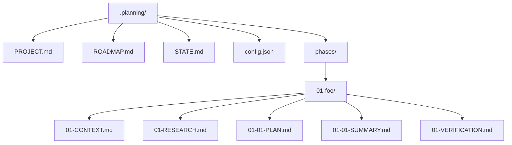

第一版最少要有 4 个全局文件:

- `PROJECT.md`
  - 项目目标、边界、当前 milestone、关键决策
- `ROADMAP.md`
  - phase 列表、每个 phase 的 goal、可选 REQ-ID 映射
- `STATE.md`
  - 当前 phase、当前状态、最近活动、已完成计划数
- `config.json`
  - workflow 开关、模型、并行策略

以及每个 phase 最少 4 类工件:

- `CONTEXT.md`
- `PLAN.md`
- `SUMMARY.md`
- `VERIFICATION.md`

如果你只能先做更小版本, 那也至少先保留:

- `PROJECT.md`
- `ROADMAP.md`
- `STATE.md`
- `CONTEXT.md`
- `PLAN.md`
- `SUMMARY.md`

### 16.3 最小文件契约应该长什么样

第一版不要追求文件格式优雅, 先追求:

- 稳定
- 可 grep
- 可让 workflow 安全读取

#### `STATE.md`

最小版建议至少固定这些字段:

```markdown
## Current Position

Phase: 1
Plan: 01-02
Status: executing
Last activity: 2026-04-21 - Executing phase 1
```

这 4 个字段已经足够支撑:

- progress / next
- resume
- 当前 phase 展示

#### `ROADMAP.md`

最小版建议至少固定:

```markdown
## Phases

### Phase 1: Authentication
Goal: Let users sign in and sign out
Requirements: REQ-1, REQ-2
Status: planned

### Phase 2: Dashboard
Goal: Show user dashboard
Requirements: REQ-3
Status: todo
```

只要你的 parser 能稳定抽出:

- phase number
- phase name
- goal
- requirements
- status

workflow 就能工作。

#### `CONTEXT.md`

最小版建议别做太花, 先固定成三块:

```markdown
# Phase 1 Context

## Decisions
- Use email/password first
- No social login in this phase

## Specifics
- Session via signed cookie

## Deferred
- Magic link login
```

这样 planner 至少能分清:

- 锁定决策
- 细节偏好
- 延后项

#### `PLAN.md`

最小版最重要的是 frontmatter 契约。

```markdown
---
id: 01-01
wave: 1
objective: Add login endpoint and session handling
files_modified:
  - src/auth.ts
  - src/routes/login.ts
autonomous: true
requirements:
  - REQ-1
---

## Tasks

### Task 1
Read first: src/auth.ts
Action: add verifyPassword() and createSession()
Acceptance:
- src/auth.ts contains createSession(
- login test passes
```

哪怕你不用 XML task 格式, 也一定要保留这些核心字段:

- `id`
- `wave`
- `objective`
- `files_modified`
- `autonomous`
- `requirements`

因为 execute 和 verifier 后面都要靠它们做调度和追踪。

#### `SUMMARY.md`

最小版也要固定:

- 做了什么
- 改了哪些文件
- 有没有偏差
- 自检是否通过

例如:

```markdown
# Plan 01-01 Summary

## Built
- Added login route
- Added session cookie handling

## Files
- src/auth.ts
- src/routes/login.ts

## Self-Check
- passed
```

#### `VERIFICATION.md`

最小版 verifier 不需要很聪明, 但输出最好至少有:

- `passed`
- `human_needed`
- `gaps_found`

这三个状态。

因为 execute-phase 的后半段分流, 本质上就靠这三个状态做路由。

### 16.4 最小 query contract

如果你只抄 prompt 而不抽 query contract, 系统会很快变脆。

最小版建议至少实现这 8 个 query / op:

1. `init.plan-phase`
   - 返回当前 phase 目录、context/research/plan 是否存在、相关路径
2. `init.execute-phase`
   - 返回 phase 目录、plans、incomplete plans、并行配置
3. `find-phase`
   - 通过 phase number 找到目录
4. `phase-plan-index`
   - 列出当前 phase 的 plans、waves、has_summary
5. `roadmap.get-phase`
   - 给定 phase 号, 返回 goal / name / requirements
6. `state.begin-phase`
   - 把 `STATE.md` 切到 executing
7. `state.planned-phase`
   - 把 `STATE.md` 切到 ready to execute
8. `phase.complete`
   - 更新 `ROADMAP.md` / `STATE.md` / `REQUIREMENTS.md`

用 TypeScript 伪接口表示, 大概像这样:

```ts
type InitPlanPhase = {
  phaseDir: string | null
  phaseFound: boolean
  hasContext: boolean
  hasResearch: boolean
  hasPlans: boolean
  contextPath?: string
  researchPath?: string
}

type PhasePlanIndex = {
  plans: Array<{
    id: string
    wave: number
    autonomous: boolean
    filesModified: string[]
    hasSummary: boolean
  }>
  waves: Record<string, string[]>
}
```

重点不是类型多复杂, 而是:

- workflow 读结构化数据
- 不是自己现场拼一堆 `grep` 和 `sed`

### 16.5 最小 workflow 套件

最小版不用一下子做全部 slash commands。

先把这 5 个工作流做出来就够了:

1. `new-project`
   - 初始化 `.planning/`
   - 写 `PROJECT.md` / `ROADMAP.md` / `STATE.md`
2. `discuss-phase`
   - 读取 roadmap phase
   - 和用户讨论
   - 写 `CONTEXT.md`
3. `plan-phase`
   - 读取 roadmap + context
   - 产出一个或多个 `PLAN.md`
4. `execute-phase`
   - 读取 `PLAN.md`
   - 执行
   - 写 `SUMMARY.md`
   - 调 verifier
5. `next`
   - 看当前状态
   - 路由到 discuss / plan / execute / verify / complete

这 5 个命令连起来, 就已经是一个真正可用的 GSD 核心闭环。

### 16.6 你自己的目录结构可以这样切

如果你从零做一版, 我建议你别照这个仓库的历史包袱完全复刻, 先切得更干净:

```text
my-gsd/
  commands/
    new-project.ts
    discuss-phase.ts
    plan-phase.ts
    execute-phase.ts
    next.ts
  workflows/
    new-project.ts
    discuss-phase.ts
    plan-phase.ts
    execute-phase.ts
    next.ts
  queries/
    init.ts
    phase.ts
    roadmap.ts
    state.ts
  state/
    read.ts
    write.ts
    parsers.ts
  agents/
    planner.ts
    executor.ts
    verifier.ts
  templates/
    plan.ts
    summary.ts
```

这里最关键的边界是:

- `commands/` 负责 CLI / slash command 入口
- `workflows/` 负责 orchestrator 逻辑
- `queries/` 负责结构化状态读取
- `state/` 负责文件读写
- `agents/` 负责构造子代理 prompt / 角色卡

### 16.7 第一版实现顺序

这件事最容易失败的方式, 就是从“最复杂的 planner”开始写。

正确顺序应该是:

1. 先写 `.planning/` 初始化器
   - 能稳定创建 `PROJECT.md` / `ROADMAP.md` / `STATE.md`
2. 再写 `roadmap.get-phase` 和 `find-phase`
   - 让系统能定位 phase
3. 再写 `discuss-phase`
   - 先把 `CONTEXT.md` 产出来
4. 再写最小 `plan-phase`
   - 先只产出 1 个 `PLAN.md` 都没关系
5. 再写最小 `execute-phase`
   - 先串行执行 plan
   - 先不做 worktree
6. 再写 verifier
   - 先只支持 `passed` / `gaps_found`
7. 最后写 `next`
   - 把整个闭环串起来

先把这条线跑通:


只要这条线稳定, 你就已经做出了一套真正的最小版 GSD。

### 16.8 哪些能力第二版再做

下面这些都很有价值, 但不应该拖慢第一版:

- worktree 并行执行
- milestone archive
- seeds
- AI-SPEC / UI-SPEC gate
- schema drift gate
- code review gate
- hooks / statusline
- cross-AI delegation
- review convergence

这些能力本质上都是在给主闭环加:

- 安全性
- 并行性
- 质量门
- runtime 适配

但没有它们, 核心闭环依然可以成立。

### 16.9 你的复刻版什么时候算成功

不要用“功能很多”来判断。

应该用下面这组验收标准:

1. 新项目能创建 `.planning/`
2. Phase 1 能生成 `CONTEXT.md`
3. `plan-phase` 能稳定写出 `PLAN.md`
4. `execute-phase` 能消费 `PLAN.md` 并写出 `SUMMARY.md`
5. verifier 能根据 `SUMMARY.md` 给出 `passed` / `gaps_found`
6. `next` 能根据状态正确路由到下一步
7. 关闭会话后重新打开, 系统还能从 `.planning/` 恢复

如果这 7 条都满足, 你已经不是“在模仿 GSD 的表面”, 而是真的做出了 GSD 的骨架。

### 16.10 一个最实用的落地建议

如果你准备真的开做, 最好的策略不是:

- 先把 prompt 写得很华丽

而是:

- 先把文件契约写死
- 先把 query contract 写出来
- 先让 `next` 能基于状态做 deterministic routing

因为 GSD 真正不可替代的地方, 不是 prompt 文案本身, 而是:

> 它把 AI 开发流程收敛成了一个**有状态、可恢复、可验证、可推进**的系统。

你一旦把这个骨架做出来, 后面的 prompt 优化、agent 优化、gate 增强, 都只是增量工程。

### 16.11 一个最小 workflow engine 伪代码

如果你现在准备自己写第一版, 可以直接按下面这个骨架开工。它不会一比一复刻 GSD, 但足够把核心循环跑起来。

```ts
type WorkflowName =
  | "new-project"
  | "discuss-phase"
  | "plan-phase"
  | "execute-phase"
  | "verify-work"
  | "next";

async function runWorkflow(name: WorkflowName, args: string[]) {
  const state = await queries.stateJson();

  switch (name) {
    case "new-project": {
      const init = await queries.initNewProject();
      const project = await workflows.newProject.collectProjectIntent(init, args);
      await files.writeProject(project);
      const requirements = await workflows.newProject.defineRequirements(project);
      await files.writeRequirements(requirements);
      const roadmap = await workflows.newProject.createRoadmap(project, requirements);
      await files.writeRoadmap(roadmap);
      await files.writeState({ status: "ready", currentPhase: roadmap.firstPhase });
      return;
    }

    case "discuss-phase": {
      const phase = await queries.findPhase(args[0]);
      const prior = await workflows.discuss.loadPriorContext(phase);
      const grayAreas = await workflows.discuss.identifyGrayAreas(phase, prior);
      const decisions = await workflows.discuss.captureDecisions(grayAreas);
      await files.writeContext(phase, decisions, prior);
      await queries.recordSession(`Phase ${phase.number} context gathered`);
      return;
    }

    case "plan-phase": {
      const phase = await queries.findPhase(args[0]);
      const init = await queries.initPlanPhase(phase.number);
      const research = await workflows.plan.maybeResearch(init, phase);
      const plans = await workflows.plan.createPlans(phase, research);
      await files.writePlans(phase, plans);
      await queries.markPhasePlanned(phase.number);
      return;
    }

    case "execute-phase": {
      const phase = await queries.findPhase(args[0]);
      const index = await queries.phasePlanIndex(phase.number);
      for (const wave of index.waves) {
        const results = await workflows.execute.runWave(wave);
        await files.writeSummaries(phase, results);
      }
      await queries.completePhase(phase.number);
      return;
    }

    case "verify-work": {
      return workflows.verify.run(state.currentPhase);
    }

    case "next": {
      const nextStep = await workflows.next.route(state);
      return runWorkflow(nextStep.name, nextStep.args);
    }
  }
}
```

这个伪代码背后的真正重点只有 3 个:

1. workflow 自己不保存状态, 它只读 query + 写文件
2. `next` 不是魔法, 它只是一个 deterministic router
3. phase 推进靠 artifact 完整性, 不是靠对话记忆

只要你先把这 3 点做对, 你的第一版就已经站在和 GSD 同一条设计路线上了。

---

## 17. 你应该按什么顺序读源码

如果你想真正看懂这个仓库, 我建议你按下面顺序读。

### 第一轮: 建立全局图

先读这些:

1. `README.md`
2. `docs/ARCHITECTURE.md`
3. `docs/COMMANDS.md`
4. `docs/AGENTS.md`

目标不是记细节, 而是知道层次结构。

### 第二轮: 先追初始化和 discuss 链

按这个顺序读:

1. `commands/gsd/new-project.md`
2. `get-shit-done/workflows/new-project.md`
3. `commands/gsd/new-milestone.md`
4. `get-shit-done/workflows/new-milestone.md`
5. `commands/gsd/discuss-phase.md`
6. `get-shit-done/workflows/discuss-phase.md`
7. `get-shit-done/workflows/discuss-phase-assumptions.md`
8. `get-shit-done/workflows/discuss-phase-power.md`

这一轮的目标是:

- 看懂项目是怎么进入“可规划状态”的
- 看懂 `CONTEXT.md` 为什么是后续质量分水岭

### 第三轮: 追一条 planning 链

按这个顺序读:

1. `commands/gsd/plan-phase.md`
2. `get-shit-done/workflows/plan-phase.md`
3. `agents/gsd-planner.md`
4. `agents/gsd-plan-checker.md`
5. `sdk/src/query/init.ts`
6. `sdk/src/query/phase.ts`

这一轮的目标是:

- 看懂 plan-phase 为什么能稳定落出 PLAN 文件

### 第四轮: 追一条 execution 链

按这个顺序读:

1. `commands/gsd/execute-phase.md`
2. `get-shit-done/workflows/execute-phase.md`
3. `agents/gsd-executor.md`
4. `agents/gsd-verifier.md`
5. `sdk/src/query/phase.ts`
6. `sdk/src/phase-runner.ts`

这一轮的目标是:

- 看懂 wave 执行和 plan 执行分工

### 第五轮: 理解 Claude Code 集成

按这个顺序读:

1. `bin/install.js`
2. `hooks/gsd-context-monitor.js`
3. `hooks/gsd-prompt-guard.js`
4. `get-shit-done/templates/claude-md.md`
5. `docs/CONFIGURATION.md`

这一轮的目标是:

- 看懂 GSD 是怎么真正嵌进 Claude Code 运行时里的

### 第六轮: 理解状态和工具层

按这个顺序读:

1. `sdk/src/query/index.ts`
2. `sdk/src/query/init.ts`
3. `sdk/src/query/state-project-load.ts`
4. `sdk/src/query/phase.ts`
5. `sdk/src/gsd-tools.ts`
6. `get-shit-done/bin/lib/init.cjs`
7. `get-shit-done/bin/lib/state.cjs`

这一轮的目标是:

- 看懂为什么 workflow 能“像调 API 一样”拿状态

---

## 18. 如果你想开始动代码, 从哪里下手最安全

我建议你把修改难度分成四级。

### Level 1: 最安全

- 改文案
- 改命令说明
- 改模板
- 改 docs

这些地方出错通常不会破坏主流程。

### Level 2: 仍然比较安全

- 改单个 workflow 的提示词结构
- 改单个 agent 的角色约束
- 改 `allowed-tools`

这类改动会影响行为, 但影响范围还比较局部。

### Level 3: 要开始谨慎

- 改 `sdk/src/query/*`
- 改 `get-shit-done/bin/lib/*`
- 改 install 逻辑

因为这些地方会影响多个 workflow。

### Level 4: 高风险

- 改 phase lifecycle
- 改 state schema
- 改 hook 注入逻辑
- 改多运行时路径替换

这些改动容易带来全局行为变化。

---

## 19. 你读这个项目时最容易误判的点

最后给你列几个很常见的误区。

### 误区 1: “核心逻辑在 commands 里”

不对。

commands 只是入口壳, workflow 才是 orchestrator。

### 误区 2: “workflow 就是在干活”

也不对。

workflow 主要在调度, 真正的专业工作通常在 agent 里完成。

### 误区 3: “`discuss-phase` 只是可有可无的前置聊天”

不对。

它其实是把产品意图转成 locked decisions 的输入层。

少了这层, planner 就只能靠 requirement 文本和默认判断来拆计划。

### 误区 4: “`.planning/` 是附带文档”

不对。

它就是 GSD 的状态存储层。

### 误区 5: “`new-milestone` 只是改一下 ROADMAP.md”

也不对。

它其实是 milestone 级状态迁移:

- 更新 `PROJECT.md`
- 重置 `STATE.md`
- 扫描 seeds
- 清理/归档旧 phase 目录
- 再进入新一轮 requirements / roadmap

### 误区 6: “`gsd-remix-sdk` 和 `gsd-tools.cjs` 是重复的”

不完全对。

更准确地说:

- `gsd-remix-sdk query` 是主路
- `gsd-tools.cjs` 是遗留兼容与回退

### 误区 7: “Claude Code 集成就是多了几个 slash commands”

差得很远。

真正的 Claude Code 集成还包括:

- skill/command 安装格式
- agents 安装
- hook 注入
- statusline
- `CLAUDE.md` 约束

---

## 20. 一句话总结整个 Claude Code 版 GSD

如果你要用一句最精确的话描述它, 我建议你这样说:

> GSD 在 Claude Code 中的实现, 本质上是一个以文件状态为中心、以 workflow 为编排层、以专用 agent 为执行单元、以 SDK query 为查询接口、以 hooks 为护栏的多阶段开发系统。

你真正吃透这句话之后, 再回去看仓库, 每个目录基本都会自动归位。

---

## 21. 下一步建议

如果你准备继续深挖, 最合适的实战顺序是:

1. 手动完整 trace 一次 `/gsd-new-project`
2. 手动完整 trace 一次 `/gsd-new-milestone`
3. 手动完整 trace 一次 `/gsd-discuss-phase 1`
4. 手动完整 trace 一次 `/gsd-plan-phase 1`
5. 手动完整 trace 一次 `/gsd-execute-phase 1`
6. 再读 `bin/install.js` 的 Claude Code 分支和 `sdk/src/query/init.ts`
7. 最后选一个最小改动, 例如给某个 workflow 增加一个判断分支

做到这一步, 你就已经不是“会用 GSD 的用户”, 而是“能改 GSD 的贡献者”了。
