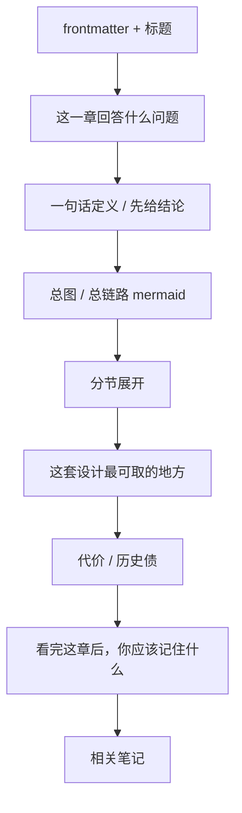

---
aliases:
  - GSD Guide Writing Conventions
  - GSD 文档编写规范
  - GSD Guide Style Guide
tags:
  - gsd
  - guide
  - conventions
  - obsidian
---

# 00. Guide Writing Conventions

> [!WARNING]
> 这份文件是当前 `guide/` 的强约束写作规范。
> 后续继续补章时，应优先遵守这里的约定。

> [!INFO]
> 目录入口：[[README]]
> 当前已完成：[[01-system-overview]] 到 [[14-architecture-strengths-and-debts]]

## 这份文件的用途

这不是给仓库用户看的功能文档，而是给“后续继续写 guide 的人”看的约束说明。

它要解决两个问题：

1. 上下文重置后，后续章节不要写偏
2. 让 `guide/` 保持统一的术语、结构和表达风格

一句话说：

> 以后继续写 `guide/`，先读这份文件，再动笔。

## 当前写作目标

`guide/` 的目标不是重复 README，也不是做 API reference。

当前目标是：

- 系统化理解 `get-shit-done` 仓库
- 重点解释 workflow、agent、query、state、hooks 这些核心机制
- 让读者获得“结构级理解”，而不是只知道几个命令怎么用

当前主线强调：

- 先纵向打穿关键链路
- 再横向归纳角色家族和系统层

## 当前用户偏好

这是强约束，后续不要丢。

### 1. 语言

- 默认使用简体中文
- 专有名词保留必要英文
- 不是把英文逐句翻译，而是写成面向中文读者的技术讲解

### 2. 阅读载体

- 用户主要在 Obsidian 里读
- 所以后续 Markdown 默认按 Obsidian 友好格式写

### 3. 图示要求

- mermaid 图是强需求
- 不能只堆文字
- 讲调用链、目录关系、状态迁移、职责边界时，优先配图

### 4. 关注重点

- 用户不关心安装器和多 runtime 适配细节
- 安装相关内容可以存在，但不是后续主线
- 后续优先写 workflow、agent、query、`.planning/`、hooks

### 5. agent 讲法要求

- 不只讲 agent “做什么”
- 必须讲它“怎么被构造出来”
- 包括静态定义、运行时注入、输出契约、handoff、限制边界

## 术语强约束

后续章节里，下面这些词不要反复漂移。

| 英文 | 固定写法 | 备注 |
| --- | --- | --- |
| `orchestration` | `流程编排` | 首选写法 |
| `orchestrator` | `编排器` | 不要反复改回 `orchestrator` |
| `workflow` | `workflow` | 必要时补一句“工作流定义” |
| `agent` | `agent` | 不强行全翻成“智能体” |
| `runtime` | `runtime` | 需要时解释，不强制硬译 |
| `phase` | `phase` | 必要时解释为“阶段” |
| `plan` | `plan` | 与 `PLAN.md` 保持一致 |

额外要求：

- 不要把 `orchestrator` 和 `编排器` 混着用
- 不要把 `流程编排` 偷偷缩成 `调度`
- 不要为了中文统一而把所有英文名词都硬译掉

## 文档结构约束

每一章后续尽量保持下面这个骨架。

### 必备区块

后续新章尽量都包含：

- `frontmatter`
- 开头导航 callout
- `这一章回答什么问题`
- 至少 1 张总览 mermaid 图
- `看完这章后，你应该记住什么`
- `相关笔记`

### 常见补充区块

按主题补：

- `一句话定义`
- `先给总图`
- `这套设计最值得学的地方`
- `这条链路的代价`
- `为什么这一步很关键`

## Obsidian 兼容规范

后续写法默认遵守：

1. 每章带 YAML `frontmatter`
2. `aliases` 和 `tags` 尽量完整
3. 用 `[[wiki links]]` 串章节
4. 适当使用 callout：
   - `> [!INFO]`
   - `> [!TIP]`
   - `> [!NOTE]`
   - `> [!WARNING]`
5. 目录和章节之间尽量能被 Graph View 串起来

## mermaid 使用规范

这块是强约束。

### 必须优先用图的场景

- command -> workflow -> agent -> query 调用链
- 状态迁移
- phase 工件流转
- agent handoff
- 目录和子系统分层
- 读写路径或桥接关系

### 画图原则

- 先给总图，再展开细节
- 节点名字尽量短，但要能读懂
- 文字里已经解释过的概念，图里不要再堆长句
- 图是为了固定心智模型，不是为了堆装饰

### 默认期待

- 每章至少 1 张图
- 复杂章节通常 2-4 张图更合适

## 内容组织原则

### 1. 优先纵向打穿

不要一开始就横向罗列 80 多个 workflow。

优先写：

- 一条调用链怎么跑通
- 一个核心机制怎么闭环

之后再横向归纳。

### 2. 先讲“系统为什么这样设计”，再讲“它在哪里实现”

不要一上来就变成源码目录导游。

推荐顺序：

1. 先定义这个机制在系统里干什么
2. 再讲关键文件
3. 再讲调用链
4. 最后讲可取之处和代价

### 3. 强调“职责边界”

对 workflow、agent、query handler、hook，都要尽量讲清：

- 谁负责什么
- 谁不负责什么
- 谁的输出被谁消费

### 4. 不只讲作用，要讲构造和约束

尤其是 agent、query、state 这几层。

不能只说：

- “这个 agent 用来验证”

还要说：

- 它的输入是什么
- 输出工件是什么
- completion marker 是什么
- workflow 真正信什么
- 它的边界在哪

## 源码引用规范

后续章节要尽量带上关键源码入口。

推荐在章节前部明确列：

- command 入口
- workflow 文件
- agent 文件
- query handler 文件
- 参考规范文件

引用时优先使用相对仓库路径，例如：

- [`../agents/gsd-executor.md`](../agents/gsd-executor.md)
- [`../sdk/src/query/phase-lifecycle.ts`](../sdk/src/query/phase-lifecycle.ts)

## 论述风格约束

### 1. 面向“理解机制”，不是面向“使用功能”

`guide/` 不是用户手册。

重点是：

- 解释系统怎么运作
- 为什么这样设计
- 哪些地方值得学
- 哪些地方有历史包袱

### 2. 先下定义，再展开

对于抽象概念，优先使用：

- “一句话定义”
- “如果一句话概括”
- “更准确地说”

### 3. 允许下判断，但判断要有结构依据

可以写：

- “这点非常关键”
- “这是最值得学的地方之一”
- “这里有明显的契约张力”

但后面必须跟：

- 为什么
- 证据在哪
- 从哪些文件能看出来

### 4. 兼顾优点和代价

后续章节不要只夸设计，也不要只挑刺。

尽量都包含：

- 值得学的点
- 真实代价 / 历史债

## 当前已形成的章节结论风格

后续继续沿用：

- 每章最后有一段“看完这章后，你应该记住什么”
- 用 4-6 条高信号结论收束
- 不做纯文件清单式结尾

## 当前主线边界

后续主线不要跑偏到安装器优先。

当前主线是：

1. system overview
2. repo map
3. core lifecycle
4. `plan-phase`
5. agents construction
6. `execute-phase`
7. executor / verifier contracts
8. `.planning/` as external memory
9. query registry / CJS bridge
10. hooks and guards
11. agent family map
12. discuss / spec / context capture
13. brownfield / intel / map-codebase
14. architecture strengths / debts

这条主线的特点是：

- 先解释核心运行机制
- 再解释 supporting layers

## 当前主线状态

当前核心主线已经写完。

如果后续继续扩展，更适合走专题篇，而不是继续往主线后面硬接：

1. `AI integration` 专题
2. `UI phase / UI review` 专题
3. `docs / ingest / verifier` 专题
4. `debug / repair / review` 专题

## 后续续写时的操作建议

如果上下文重置，后续继续写的人建议先做这几步：

1. 先读 [[README]]
2. 再读这份 [[00-writing-conventions]]
3. 看最近一章的 `相关笔记` 和 `下一章`
4. 再去读对应源码入口

## 看完这份规范后，你应该记住什么

- `guide/` 的目标是解释系统机制，不是重写 README 或做 API 手册。
- Simplified Chinese、Obsidian 友好、mermaid 配图，是强约束。
- `流程编排 / 编排器` 这套术语要保持稳定，不要来回漂。
- 后续重点仍然是 workflow、agent、query、`.planning/`、hooks，不走安装器主线。
- 每章都要尽量做到“先定义，再配图，再讲调用链，再讲优点和代价”。

## 相关笔记

- 目录入口：[[README]]
- 学习主线最新章节：[[14-architecture-strengths-and-debts]]
