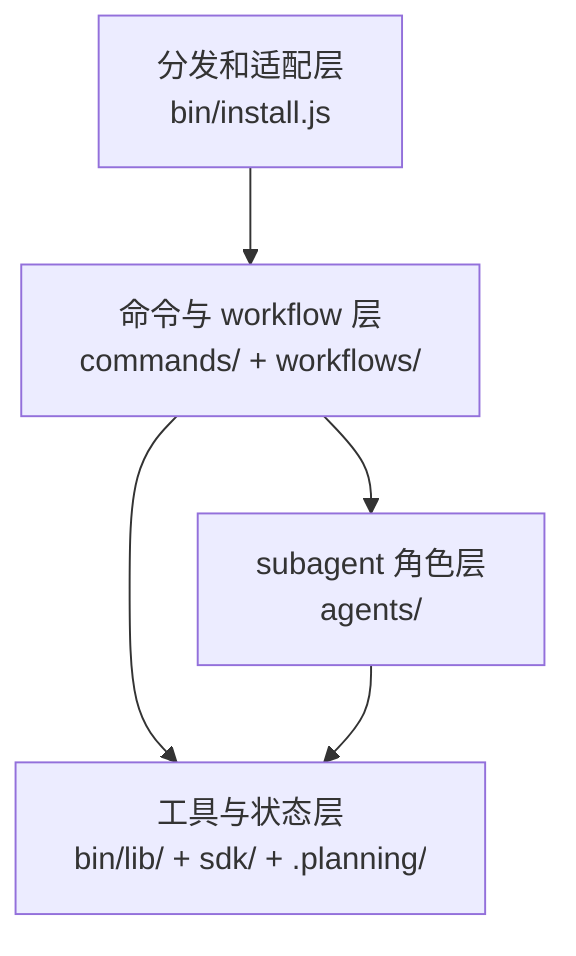
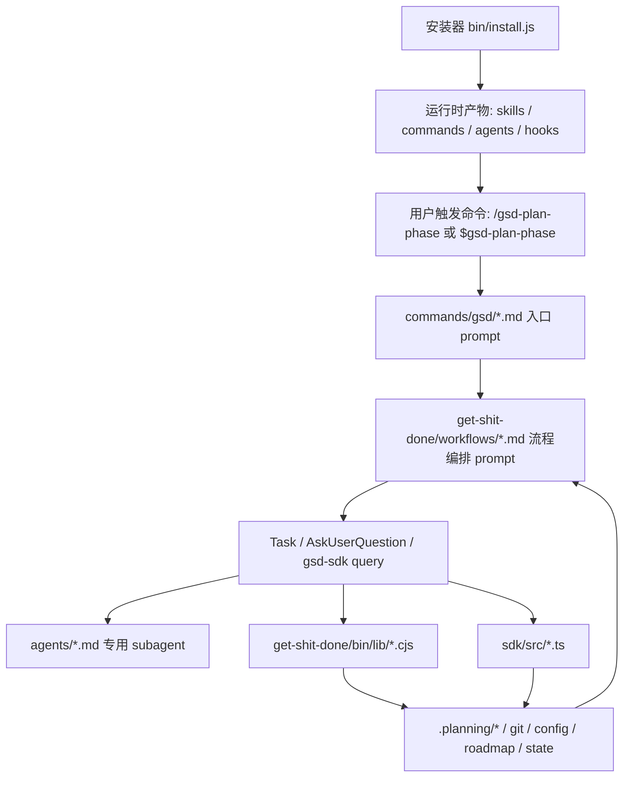

---
aliases:
  - GSD System Overview
  - GSD 系统总览
tags:
  - gsd
  - guide
  - overview
  - obsidian
---

# 01. System Overview

> [!INFO]
> 上一章：[[README]]
> 下一章：[[02-repo-map]]

## 一句话定义

`get-shit-done` 不是“给 Claude 多塞几段 prompt”这么简单。

它更像一个面向 AI coding runtime 的轻量操作系统，包含 4 层:

1. 分发和适配层
2. 命令与 workflow 层
3. subagent 角色层
4. 可执行工具与状态层

## 四层结构

### 1. 分发和适配层

核心入口是 [`../bin/install.js`](../bin/install.js)。

它负责把同一套 GSD 源资产安装到不同运行时里，比如 Claude Code、Codex、Gemini、Cursor、Copilot、Cline 等。这里最值得注意的点有两个:

- 源资产是统一维护的，但安装产物按 runtime 转换。
- GSD 不把“命令格式”绑死在某一个宿主上，而是把命令、agent、hook 做成可以转译的资产。

从 `package.json` 可以看出这个包本身就是一个安装器分发包，而不是传统业务库。

## 2. 命令与 workflow 层

这层分成两段:

- [`../commands/gsd/`](../commands/gsd/) 是“用户可调用入口”
- [`../get-shit-done/workflows/`](../get-shit-done/workflows/) 是“真正执行逻辑”

你可以把它理解成:

- `commands/gsd/*.md` = 薄入口
- `get-shit-done/workflows/*.md` = 厚流程编排 prompt

例如:

- [`../commands/gsd/plan-phase.md`](../commands/gsd/plan-phase.md) 主要声明命令名、允许工具、执行上下文
- [`../get-shit-done/workflows/plan-phase.md`](../get-shit-done/workflows/plan-phase.md) 才真正定义研究、规划、校验、回路和提交策略

这层的核心思想是: 把“命令名”和“流程本体”分离。这样更容易跨运行时复用，也更容易独立维护 workflow。

## 3. Subagent 角色层

[`../agents/`](../agents/) 里的每个文件，本质上都是一个专用角色说明书。

最核心的几个角色是:

- `gsd-planner`: 把 phase 目标拆成可执行 PLAN
- `gsd-executor`: 真正执行 PLAN，提交代码和 SUMMARY
- `gsd-verifier`: 反向验证 phase goal 是否真的达成
- `gsd-roadmapper`: 生成路线图
- `gsd-project-researcher`: 项目级研究
- `gsd-codebase-mapper`: brownfield 代码库建图
- `gsd-plan-checker`: 站在“目标是否真能完成”的角度审计划

这套角色分工很重要，因为 GSD 的主张不是“一个大 prompt 干到底”，而是“让编排器尽量薄，把判断工作拆给窄职责 agent”。

## 4. 可执行工具与状态层

这部分是很多人第一次看会忽略，但其实最关键。

主要有两套实现:

- 兼容层: [`../get-shit-done/bin/gsd-tools.cjs`](../get-shit-done/bin/gsd-tools.cjs) 和 [`../get-shit-done/bin/lib/`](../get-shit-done/bin/lib/)
- 新的 TypeScript SDK: [`../sdk/src/`](../sdk/src/)

workflow 里大量出现的 `gsd-sdk query ...`，说明设计正在从“bash + cjs 工具集合”逐渐迁移到“可编程 query registry + runner”。

这是个非常关键的信号:

- prompt 只负责编排和判断
- 确定性的文件读写、配置解析、phase 查找、状态更新、commit 行为，逐步沉到 SDK/CJS 层

也就是说，GSD 在努力减少“prompt 直接操作 shell 的随机性”。

## 真实执行链路

下面这条链路是理解整个仓库最重要的一张图:

## 为什么这套设计有效

我认为它最可取的地方有 6 个。

### 1. Prompt 和 deterministic logic 分层

workflow 负责“如何推进”，工具层负责“如何准确操作文件和状态”。这是对 agent 系统非常关键的边界划分。

### 2. 外部记忆显式化

GSD 没有把项目记忆全寄托在当前会话上下文里，而是把长期状态落到 `.planning/PROJECT.md`、`ROADMAP.md`、`STATE.md`、phase 目录等文件里。

这正是它对抗 context rot 的核心。

### 3. 编排器尽量轻

像 [`../get-shit-done/workflows/execute-phase.md`](../get-shit-done/workflows/execute-phase.md) 明确写了:

- 编排器负责协调，而不是亲自执行

这说明主控 prompt 不想自己背所有细节，而是把 plan 执行交给 `gsd-executor`。

### 4. 多运行时适配不是补丁，而是第一等公民

`bin/install.js` 的体量说明这件事不是后加的。GSD 从结构上就把“同一套资产安装到不同 AI runtime”当成核心需求。

### 5. 退化路径写得很明确

很多 workflow 都内置:

- `TEXT_MODE`
- `Task` 不可用时的顺序执行回退
- Copilot/Codex/Gemini 的兼容分支

这类设计很现实，不是只在理想宿主里跑。

### 6. Hook 补足了 prompt 看不到的运行时状态

比如 [`../hooks/gsd-context-monitor.js`](../hooks/gsd-context-monitor.js) 会把 context 使用情况重新注入给 agent，让 agent 在上下文快满的时候主动收尾。

这其实是在给宿主 AI 增加“自我感知”。

## 现阶段你最该记住的判断

- 这不是单纯的 prompt 仓库，而是一套 runtime-oriented system。
- workflow 文件是“系统行为说明书”。
- agent 文件是“角色职责说明书”。
- `gsd-sdk query` 和 `bin/lib/*.cjs` 才是很多真实状态变更的落点。
- `.planning/` 是它真正的长期记忆区。

下一章看仓库地图，把这些抽象层落到具体目录。

## 相关笔记

- 上一章：[[README]]
- 下一章：[[02-repo-map]]
- 主干流程：[[03-core-lifecycle]]
