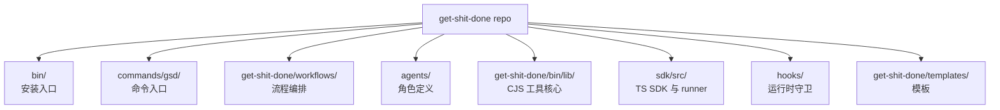
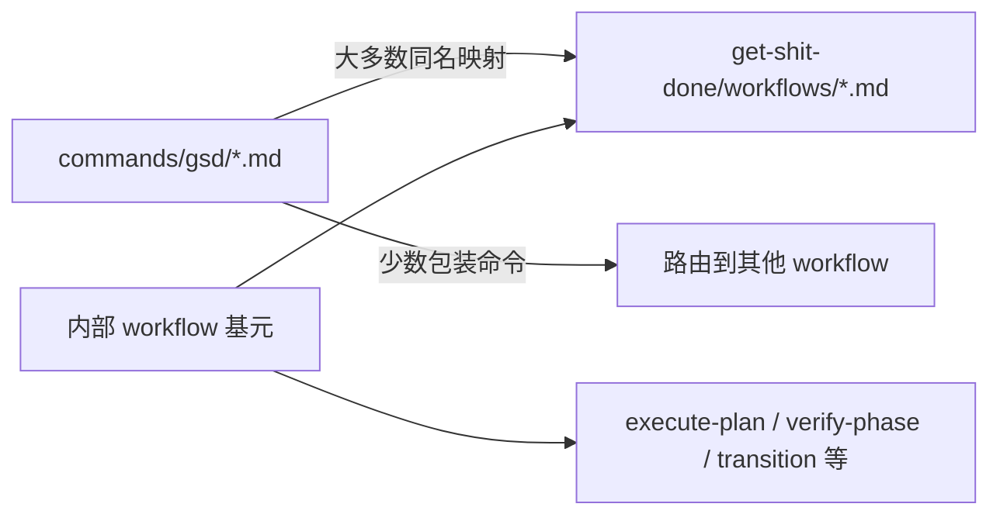

---
aliases:
  - GSD Repo Map
  - GSD 仓库地图
tags:
  - gsd
  - guide
  - repo-map
  - obsidian
---

# 02. Repo Map

> [!INFO]
> 上一章：[[01-system-overview]]
> 下一章：[[03-core-lifecycle]]

这一章只做一件事: 建立“去哪看什么”的目录感。

## 先给结论

如果你从这个仓库里只记 8 个目录，应该是这 8 个:

| 目录 | 作用 | 阅读优先级 |
| --- | --- | --- |
| `bin/` | 安装入口 | 高 |
| `commands/gsd/` | 用户命令入口 prompt | 高 |
| `get-shit-done/workflows/` | 真正的 workflow 编排 | 极高 |
| `agents/` | subagent 角色定义 | 极高 |
| `get-shit-done/bin/lib/` | 旧但仍核心的 CJS 工具层 | 极高 |
| `sdk/src/` | 新的 TypeScript SDK 与 runner | 极高 |
| `hooks/` | 运行时 hook | 高 |
| `get-shit-done/templates/` | 生成产物模板 | 中高 |

## 目录逐个看

### `bin/`

- 关键文件: [`../bin/install.js`](../bin/install.js)
- 角色: 安装器和 runtime 适配器

这是 GSD 的“分发入口”。如果你要回答“它怎么进 Claude/Codex 的”，这里是第一站。

### `commands/gsd/`

- 角色: 面向用户的命令定义
- 特征: 文件通常很短，更多是在声明命令边界、可用工具、`execution_context`

它们经常只是把你路由到对应 workflow。

例如:

- [`../commands/gsd/new-project.md`](../commands/gsd/new-project.md)
- [`../commands/gsd/plan-phase.md`](../commands/gsd/plan-phase.md)

### `get-shit-done/workflows/`

- 角色: 真正的流程逻辑
- 特征: 文件很长，包含步骤、分支、工具调用、回退策略、agent 协作规则

这是你理解 GSD 的核心目录。

最重要的几个 workflow:

- [`../get-shit-done/workflows/new-project.md`](../get-shit-done/workflows/new-project.md)
- [`../get-shit-done/workflows/map-codebase.md`](../get-shit-done/workflows/map-codebase.md)
- [`../get-shit-done/workflows/plan-phase.md`](../get-shit-done/workflows/plan-phase.md)
- [`../get-shit-done/workflows/execute-phase.md`](../get-shit-done/workflows/execute-phase.md)
- [`../get-shit-done/workflows/verify-work.md`](../get-shit-done/workflows/verify-work.md)

### `agents/`

- 角色: 专用 subagent 定义
- 特征: 每个 agent 都是强约束职责，不是通用助手

理解 GSD 的一个关键点是: 它不信任“大一统 agent”，而是倾向把任务切给角色化 agent。

优先看的几个:

- [`../agents/gsd-planner.md`](../agents/gsd-planner.md)
- [`../agents/gsd-executor.md`](../agents/gsd-executor.md)
- [`../agents/gsd-verifier.md`](../agents/gsd-verifier.md)
- [`../agents/gsd-codebase-mapper.md`](../agents/gsd-codebase-mapper.md)

### `get-shit-done/bin/lib/`

- 角色: CJS 工具核心
- 特征: 真正处理 phase、state、roadmap、config、verify、commit 等确定性逻辑

这里是“prompt 背后的机械结构”。

建议先看:

- `core.cjs`: 通用路径、配置、模型解析、项目根定位
- `init.cjs`: 各 workflow 初始化上下文
- `commands.cjs`: 一批通用命令实现
- `state.cjs`: `STATE.md` 的读写和推进
- `phase.cjs`: phase 相关操作
- `roadmap.cjs`: ROADMAP 解析与更新
- `verify.cjs`: 健康检查和验证工具

### `sdk/src/`

- 角色: 新一代 TypeScript SDK
- 特征: 不只是 CLI，还包括 runner、transport、context engine、prompt builder、event stream

如果你想回答“GSD 是不是在从 prompt framework 走向程序化 runtime”，这里就是证据。

优先看的文件:

- [`../sdk/src/cli.ts`](../sdk/src/cli.ts)
- [`../sdk/src/context-engine.ts`](../sdk/src/context-engine.ts)
- [`../sdk/src/phase-runner.ts`](../sdk/src/phase-runner.ts)
- [`../sdk/src/gsd-tools.ts`](../sdk/src/gsd-tools.ts)

### `hooks/`

- 角色: 给宿主运行时补运行期感知与保护

例子:

- [`../hooks/gsd-context-monitor.js`](../hooks/gsd-context-monitor.js): 上下文告警
- [`../hooks/gsd-read-guard.js`](../hooks/gsd-read-guard.js): 读后编辑保护
- [`../hooks/gsd-prompt-guard.js`](../hooks/gsd-prompt-guard.js): prompt 守卫
- [`../hooks/gsd-workflow-guard.js`](../hooks/gsd-workflow-guard.js): workflow 边界守卫

### `get-shit-done/templates/`

- 角色: 输出文档模板

这决定了 `.planning/` 产物长什么样，比如:

- `project.md`
- `requirements.md`
- `roadmap.md`
- `state.md`
- `UAT.md`
- `AI-SPEC.md`
- `UI-SPEC.md`

### `get-shit-done/references/`

- 角色: 被 workflow 和 agent 反复引用的规则库

它更像“内建知识库”，不是用户文档。

例如:

- `gates.md`
- `agent-contracts.md`
- `mandatory-initial-read.md`
- `context-budget.md`
- `verification-patterns.md`

### `tests/`

- 角色: 给安装器、CLI、SDK 和关键行为兜底

这里证明仓库不完全依赖“prompt 正常发挥”，而是有一部分传统测试约束。

## 命令和 workflow 不是完全一一对应

当前快照下:

- 同名命令和 workflow 重叠 71 个
- 只有命令没有同名 workflow 的有 12 个
- 只有 workflow 没有同名命令的有 10 个

这说明两件事:

1. 大部分命令确实是 workflow 的用户入口。
2. 但也有一些命令只是更薄的包装，或者 workflow 是内部基元，不直接暴露给用户。

例如:

- [`../commands/gsd/resume-work.md`](../commands/gsd/resume-work.md) 实际路由到 [`../get-shit-done/workflows/resume-project.md`](../get-shit-done/workflows/resume-project.md)
- 一些 workflow 如 `execute-plan`、`verify-phase`、`transition` 更像内部流程部件

## 最推荐的阅读路线

### 路线 A: 想懂系统运行原理

1. `bin/install.js`
2. `commands/gsd/plan-phase.md`
3. `get-shit-done/workflows/plan-phase.md`
4. `agents/gsd-planner.md`
5. `get-shit-done/bin/lib/init.cjs`
6. `sdk/src/phase-runner.ts`

### 路线 B: 想懂自治执行为什么能跑起来

1. `get-shit-done/workflows/execute-phase.md`
2. `agents/gsd-executor.md`
3. `agents/gsd-verifier.md`
4. `get-shit-done/bin/lib/state.cjs`
5. `get-shit-done/bin/lib/roadmap.cjs`
6. `hooks/gsd-context-monitor.js`

### 路线 C: 想懂 brownfield onboarding

1. `get-shit-done/workflows/map-codebase.md`
2. `agents/gsd-codebase-mapper.md`
3. `get-shit-done/templates/codebase/*.md`

## 这一章最该记住的点

- `commands/` 是入口，不是主体。
- `workflows/` 是主体，不是工具实现。
- `agents/` 是窄职责角色。
- `bin/lib/` 和 `sdk/` 才是很多真实状态变化的落点。
- `templates/` 和 `references/` 是 prompt system 的“文法”和“知识库”。

## 相关笔记

- 总览：[[01-system-overview]]
- 主干流程：[[03-core-lifecycle]]
- 目录入口：[[README]]
