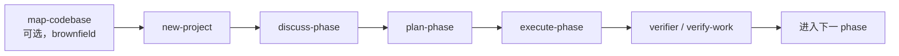
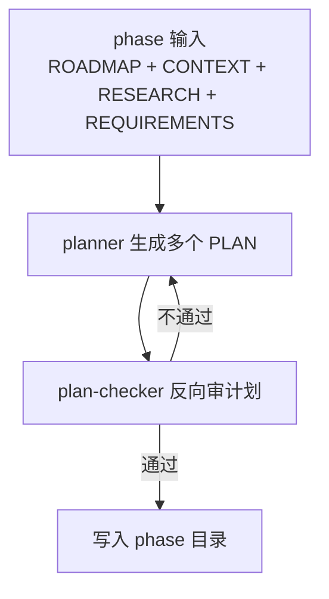
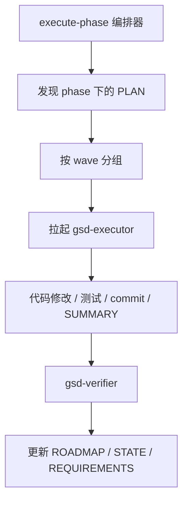
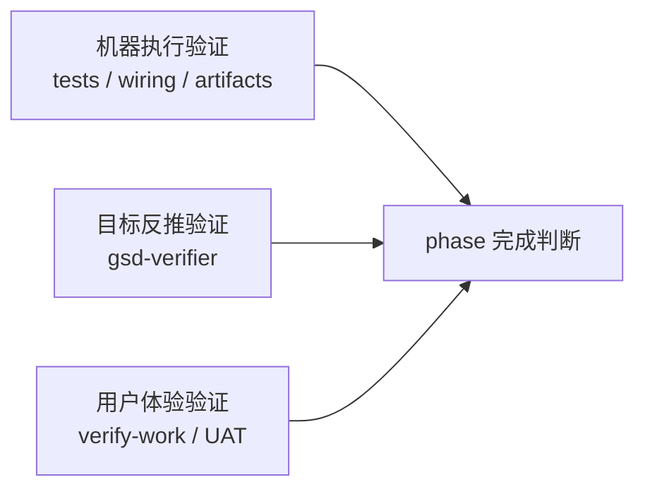

---
aliases:
  - GSD Core Lifecycle
  - GSD 核心生命周期
tags:
  - gsd
  - guide
  - lifecycle
  - obsidian
---

# 03. Core Lifecycle

> [!INFO]
> 上一章：[[02-repo-map]]
> 目录入口：[[README]]

这一章先不追求把 80 多个 workflow 全讲完，而是先抓住 GSD 的主干闭环。

## 主干闭环

从帮助文档和 workflow 设计看，GSD 的黄金路径是:

```text
map-codebase (brownfield 可选)
-> new-project
-> discuss-phase
-> plan-phase
-> execute-phase
-> verify-work / verifier
-> next phase
```



对应的核心价值分别不同。

## 1. `/gsd-map-codebase`

主要文件:

- [`../get-shit-done/workflows/map-codebase.md`](../get-shit-done/workflows/map-codebase.md)
- [`../agents/gsd-codebase-mapper.md`](../agents/gsd-codebase-mapper.md)

它解决的问题不是“写代码”，而是 brownfield 场景下先建立认知。

它的做法很值得学:

- 把代码库理解拆成 tech、arch、quality、concerns 四个视角
- 让 mapper agent 直接把结果写进 `.planning/codebase/`
- 编排器只收确认和摘要，不拿大段分析回流上下文

这个设计的优点非常明显:

- 降低主控上下文污染
- 让每个 mapper 保持单一视角
- 输出直接成为后续 phase 的长期参考材料

## 2. `/gsd-new-project`

主要文件:

- [`../get-shit-done/workflows/new-project.md`](../get-shit-done/workflows/new-project.md)
- [`../agents/gsd-project-researcher.md`](../agents/gsd-project-researcher.md)
- [`../agents/gsd-research-synthesizer.md`](../agents/gsd-research-synthesizer.md)
- [`../agents/gsd-roadmapper.md`](../agents/gsd-roadmapper.md)

这是 GSD 最重视的入口，因为它决定后面所有 phase 的质量上限。

这个 workflow 做了 4 件事:

1. 问清楚你到底要做什么
2. 需要时并行研究
3. 产出 REQUIREMENTS
4. 产出 ROADMAP 和 STATE

它的核心思想是:

- 先把歧义压低，再让 AI 开始执行
- 把用户偏好写进结构化项目记忆，而不是留在聊天上下文里

我认为它最值得学的地方是“前置提问 + 文档沉淀 + 结构化路线图”这一套，而不是单看 prompt 文案。

## 3. `/gsd-discuss-phase`

虽然这次还没深挖它的全部实现，但从 `plan-phase` 的前置依赖就能看出它的地位:

- 它不是多余的聊天步骤
- 它是在给 `CONTEXT.md` 写入用户锁定决策

在 GSD 里，后续 planner 要把这些内容当 hard constraint，而不是建议。

这很关键，因为它减少了 planner 擅自“简化需求”的空间。

## 4. `/gsd-plan-phase`

主要文件:

- [`../get-shit-done/workflows/plan-phase.md`](../get-shit-done/workflows/plan-phase.md)
- [`../agents/gsd-planner.md`](../agents/gsd-planner.md)
- [`../agents/gsd-plan-checker.md`](../agents/gsd-plan-checker.md)
- [`../agents/gsd-phase-researcher.md`](../agents/gsd-phase-researcher.md)

这是整个系统最像“编排器”的地方。

它不只是“生成 PLAN.md”，而是在做一个小型流水线:

1. 读取 phase 上下文和配置
2. 必要时补研究
3. 调 planner 生成计划
4. 调 checker 反向审计划
5. 需要时循环修正

这一层最重要的几个观念:

- PLAN 不是项目文档，而是给 executor 的高质量 prompt
- 用户在 CONTEXT.md 里锁定的决策必须被严格继承
- roadmap success criteria 不能被 plan 偷偷降级
- 一个 phase 可以拆成多 plan，再按 wave 执行

这是 GSD 和“随手让 AI 写 todo list”的根本差别。



## 5. `/gsd-execute-phase`

主要文件:

- [`../get-shit-done/workflows/execute-phase.md`](../get-shit-done/workflows/execute-phase.md)
- [`../agents/gsd-executor.md`](../agents/gsd-executor.md)
- [`../agents/gsd-verifier.md`](../agents/gsd-verifier.md)

这个 workflow 的核心哲学很直白:

- 编排器负责协调，不负责亲自实现每个计划细节

也就是说它主要负责:

- 发现有哪些未完成 plan
- 按 wave 分组
- 决定并行还是串行
- 生成/切换分支
- 拉起 executor
- 收集完成信号
- 最后交给 verifier 验证 phase goal

而真正的代码实现、偏差处理、task commit、SUMMARY 生成，落在 `gsd-executor`。

这个分工很值得学，因为它避免了“主控 prompt 越做越肥，最后谁都不可靠”的问题。



## 6. `gsd-executor`

`gsd-executor` 是最像“现场工程师”的 agent。

它负责:

- 读 PLAN
- 执行 task
- 按规则自动修 bug / 补关键缺失 / 处理阻塞
- 在需要架构决策时停下来
- 生成 SUMMARY
- 更新 STATE

它最值得注意的是 deviation rules。

也就是说 GSD 已经承认: 真实执行时一定会遇到计划外问题。于是系统不是假装不会偏离，而是把“哪些偏离可以自动处理，哪些必须上升给用户”写成规则。

这比“严格照计划走”更现实。

## 7. `gsd-verifier`

`gsd-verifier` 的态度和一般“检查任务有没有做完”很不一样。

它的出发点是:

- 不相信 SUMMARY
- 不相信“文件存在”
- 只相信 goal-backward verification

即:

1. 先问 phase goal 真正要求什么
2. 再问哪些 truth 必须成立
3. 再问哪些 artifact 和 wiring 必须存在

这是这套系统里非常强的一点，因为它把“任务完成”和“目标达成”明确拆开了。

## 8. `/gsd-verify-work`

主要文件:

- [`../get-shit-done/workflows/verify-work.md`](../get-shit-done/workflows/verify-work.md)

它和 `gsd-verifier` 不是一回事。

`gsd-verifier` 偏“代码与目标的结构化验证”。

`verify-work` 更偏“用户可感知行为的 UAT 记录”，特点是:

- 一次只测一个点
- 用户只需要回答“是否符合预期”
- 结果会沉淀到 `UAT.md`
- gap 可以回流到后续计划

这意味着 GSD 的验证并不是单一通道，而是:

- 机器验证
- 结构化 goal 验证
- 人类体验验证

三者叠加。



## 9. 这条主干为什么成立

我觉得原因有 5 个。

### 1. 先收敛上下文，再让 agent 自治

不是直接执行，而是先有 `PROJECT`、`CONTEXT`、`REQUIREMENTS`、`ROADMAP`。

### 2. 让 phase 成为真正的工作单元

每个 phase 都有自己的目录、计划、总结、验证、上下文。

### 3. 把 plan 和 execute 显式拆开

很多 AI coding 流程失败，就是因为规划和执行混在一次对话里，无法回看、无法复用、无法验证。

### 4. 把失败视为常态

deviation、checkpoint、UAT gap、re-plan、re-verify 这些机制都说明 GSD 不是建立在“模型一次成功”的幻想上。

### 5. 用 `.planning/` 把会话寿命变短、项目寿命变长

模型上下文会满，但 `.planning/` 会留下来。

## 这章之后建议怎么继续

下一步最值得深挖的是两条线:

1. 安装器线
   从 [`../bin/install.js`](../bin/install.js) 看这套系统如何进入不同 runtime。
2. 工具层线
   从 [`../get-shit-done/bin/lib/init.cjs`](../get-shit-done/bin/lib/init.cjs)、[`../get-shit-done/bin/lib/state.cjs`](../get-shit-done/bin/lib/state.cjs)、[`../sdk/src/phase-runner.ts`](../sdk/src/phase-runner.ts) 看 prompt 之外的真实状态机。

## 相关笔记

- 目录入口：[[README]]
- 系统总览：[[01-system-overview]]
- 仓库地图：[[02-repo-map]]
- 下一章：[[04-plan-phase-deep-dive]]
