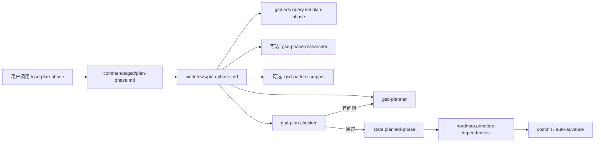
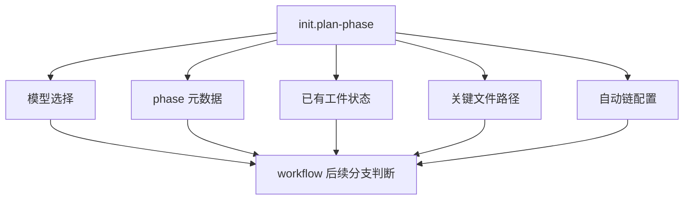
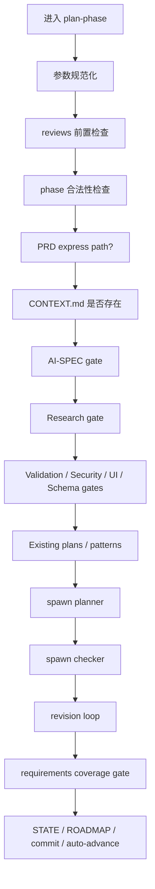
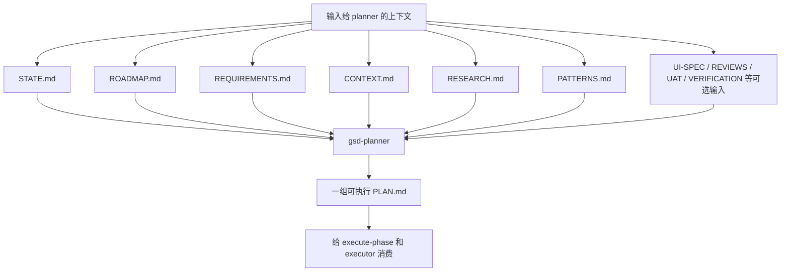
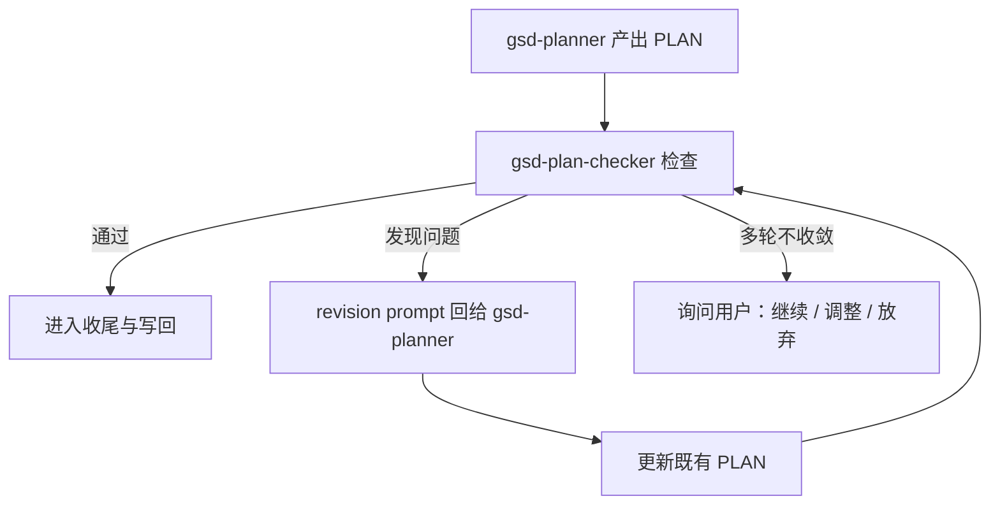

---
aliases:
  - GSD Plan Phase Deep Dive
  - GSD Plan-Phase 深潜
tags:
  - gsd
  - guide
  - workflow
  - planning
  - obsidian
---

# 04. Plan-Phase Deep Dive

> [!INFO]
> 上一章：[[03-core-lifecycle]]
> 目录入口：[[README]]

## 为什么先深挖它

如果只能选一个 workflow 作为“GSD 的代表作”，我会先看 `plan-phase`。

原因很简单：

- 它最完整地体现了 GSD 的流程编排思想
- 它把 `.planning/`、subagent、query 工具层、用户交互 gate 全串起来了
- 它既不是纯初始化，也不是纯执行，而是位于整个系统最关键的中段

换句话说，看懂 `plan-phase`，你基本就看懂了 GSD 的骨架。

> [!TIP]
> 这一章对应的核心源码入口：
> - 命令入口：[`../commands/gsd/plan-phase.md`](../commands/gsd/plan-phase.md)
> - 流程编排：[`../get-shit-done/workflows/plan-phase.md`](../get-shit-done/workflows/plan-phase.md)
> - 规划 agent：[`../agents/gsd-planner.md`](../agents/gsd-planner.md)
> - 校验 agent：[`../agents/gsd-plan-checker.md`](../agents/gsd-plan-checker.md)
> - 研究 agent：[`../agents/gsd-phase-researcher.md`](../agents/gsd-phase-researcher.md)
> - 初始化上下文：[`../get-shit-done/bin/lib/init.cjs`](../get-shit-done/bin/lib/init.cjs)

## 一句话定义

`plan-phase` 的工作不是“列一个 todo list”，而是：

把 phase 的目标、用户决策、研究结果、已有代码模式和各种 gate 条件，压缩成一组可执行 PLAN.md，并在执行前先做一次“计划是否真的能达成目标”的反向校验。

## 先看最短调用链



这张图最重要的含义是：

- command 文件几乎只是入口壳
- 真正的流程编排在 workflow 里
- 真正负责“思考”和“写计划”的不是 workflow 本身，而是 planner/checker/researcher 这些角色 agent
- 真正负责确定性状态读写的是 `gsd-sdk query`

## 1. 命令入口其实很薄

[`../commands/gsd/plan-phase.md`](../commands/gsd/plan-phase.md) 的职责非常有限，主要做三件事：

1. 声明命令名和参数
2. 声明允许使用哪些工具
3. 指向真正的 `execution_context`

你可以把它看成一个“启动配置”：

- 命令名：`gsd:plan-phase`
- 允许工具：`Read`、`Write`、`Bash`、`Task`、`AskUserQuestion`、`WebFetch`、`mcp__context7__*`
- 真正执行逻辑：`@~/.claude/get-shit-done/workflows/plan-phase.md`

这很能体现 GSD 的一个结构特点：

- `commands/` 决定“从哪里进”
- `workflows/` 决定“进来以后怎么走”

## 2. workflow 一开始先做的不是规划，而是取上下文

`plan-phase` 的第一步不是立刻 spawn planner，而是先跑：

```bash
gsd-sdk query init.plan-phase "$PHASE"
```

这一步非常关键。

它说明 GSD 并不希望每个 workflow 都自己去零碎地 `cat` 文件、`ls` 目录、解析 phase 信息，而是先通过一个集中 query 拿到这次规划所需的上下文摘要。

[`../get-shit-done/bin/lib/init.cjs`](../get-shit-done/bin/lib/init.cjs) 里的 `cmdInitPlanPhase` 会返回一组高度结构化的数据，包括：

- 本次应该用的 `researcher_model`、`planner_model`、`checker_model`
- workflow 开关：`research_enabled`、`plan_checker_enabled`、`nyquist_validation_enabled`
- phase 元数据：`phase_number`、`phase_name`、`phase_slug`、`padded_phase`
- 现有工件状态：`has_context`、`has_research`、`has_reviews`、`has_plans`
- 路径信息：`state_path`、`roadmap_path`、`requirements_path`、`context_path`、`research_path`、`verification_path`、`uat_path`、`reviews_path`、`patterns_path`
- 自动链相关状态：`auto_advance`、`auto_chain_active`

也就是说，workflow 从这里拿到的是“本轮规划的控制面板”。



## 3. 这不是一个单线流程，而是一串 gate

很多人第一次看 `plan-phase`，会以为它只是：

`research -> planner -> checker`

其实不是。它更像一条带很多 gate 的漏斗。



这张图的重点是：

- GSD 不是“先计划，再说”
- 它会尽量在规划前把上下文缺口、前置工件缺失、模式信息不足、UI 契约缺失等问题拦下来

### 你可以把这些 gate 分成四类

#### 1. 入口合法性 gate

比如：

- `--reviews` 不能和 `--gaps` 混用
- 有 `--reviews` 但 phase 目录里没有 `REVIEWS.md` 会直接报错
- phase 不存在于 `ROADMAP.md` 也不能继续

#### 2. 上下文完备性 gate

比如：

- 没有 `CONTEXT.md` 时，要么继续，要么先跑 `discuss-phase`
- 有 AI 关键词但没有 `AI-SPEC.md` 时会提醒
- 有 UI 特征但缺少 `UI-SPEC.md` 时，手动模式下甚至会直接终止并建议先跑 `gsd-ui-phase`

#### 3. 研究与验证前置 gate

比如：

- 是否要 research
- 是否生成 `VALIDATION.md`
- Nyquist artifact 缺失时怎么办
- `security_enforcement` 是否开启
- schema 相关文件是否触发强制 push task 注入

#### 4. 计划质量 gate

比如：

- checker 审核不过要 revision
- requirement coverage 不能漏
- wave 依赖要写回 ROADMAP

## 4. `CONTEXT.md` 在这里不是装饰，而是硬约束输入

这一点特别重要。

从 workflow 和 planner agent 的描述可以看出：

- `CONTEXT.md` 缺失时，系统会明确提醒“你的设计偏好不会进入计划”
- 如果通过 `--prd` 走 express path，PRD 内容会直接被转成锁定决策
- `gsd-planner` 会把 `CONTEXT.md` 的 `## Decisions` 当作不能违背的约束

所以 `CONTEXT.md` 在 GSD 里不是“补充说明”，而更像：

- phase 级别的设计契约

这也是为什么 GSD 要么鼓励你先跑 `discuss-phase`，要么允许你用 `--prd` 直接生成 phase context。

## 5. research 在这里的作用，是让 planner 少拍脑袋

`plan-phase` 不是强制每次都 research，但它把 research 设计成一个强烈建议的前置分支。

如果需要研究，它会 spawn：

- [`../agents/gsd-phase-researcher.md`](../agents/gsd-phase-researcher.md)

这个 agent 回答的核心问题不是“怎么实现”，而是：

- “为了把这个 phase 规划好，我需要先知道什么？”

它产出的 `RESEARCH.md` 会给 planner 提供：

- 标准技术栈建议
- 常见模式
- 不要手写哪些轮子
- 常见陷阱
- 代码例子
- 置信度和来源标注

这一步很值钱，因为它把“训练数据里的模糊常识”往“当前、可引用、可约束的研究结果”推进了一步。

## 6. pattern mapper 是一个很有意思的加速器

在 planner 前，workflow 还可能可选地跑一次：

- `gsd-pattern-mapper`

它的作用不是补需求，而是找“代码库里已有的相似模式”。

这一步会生成 `PATTERNS.md`，把未来要新增或修改的文件，尽量对齐到现有代码模式上。

这个设计非常务实，因为它在解决一个真实问题：

- planner 很容易规划出“理论上正确但不贴合现有仓库风格”的任务

`PATTERNS.md` 的存在，就是在给 planner 一个“别重新发明风格和结构”的约束。

## 7. planner prompt 的本质，是给执行器写未来的 prompt

`plan-phase` 最核心的一步，当然是 spawn：

- [`../agents/gsd-planner.md`](../agents/gsd-planner.md)

但这里最值得注意的不是“它会生成计划”，而是 workflow 明确告诉 planner：

- 输出是给 `/gsd-execute-phase` 消费的
- 每个 PLAN 都要有前置读取文件、验收标准、must_haves、wave、depends_on
- 任务必须足够具体，不能只写抽象方向

workflow 里甚至专门加了 `Anti-Shallow Execution Rules`，硬性要求每个 task 至少写清楚三件事：

1. `<read_first>`
2. `<acceptance_criteria>`
3. `<action>` 里的具体目标状态

这透露出一个非常重要的设计哲学：

- PLAN.md 不是写给人看的项目管理文档
- PLAN.md 是写给下游 executor 的高保真执行提示



### planner 被约束得很重

从 [`../agents/gsd-planner.md`](../agents/gsd-planner.md) 看，planner 至少被这几类规则强约束：

- 必须 honor `CONTEXT.md` 中锁定决策
- 不允许偷偷把需求简化成“v1 先静态”“以后再接”
- 必须做 multi-source coverage audit
- scope 超出上下文预算时要建议拆 phase，而不是偷偷漏项
- 计划不是越大越好，而是要控制在合理上下文预算内

这个 agent 的定位，不是“帮我想想怎么做”，而是：

- 在预算内，把 phase 切成执行上足够清晰、覆盖上足够完整的计划组

## 8. checker 不是看计划“像不像样”，而是看“能不能交付目标”

planner 之后，workflow 会立刻 spawn：

- [`../agents/gsd-plan-checker.md`](../agents/gsd-plan-checker.md)

这个 agent 的思路跟 `gsd-verifier` 很像，都是 goal-backward，只不过它检查的是“计划将会不会达成目标”，不是“代码已经有没有达成目标”。

它重点看这些维度：

- requirement coverage
- task completeness
- dependency correctness
- key links 是否有被计划到
- scope sanity
- context compliance

这一步是 GSD 的关键质量控制点。

因为很多“看起来像样”的计划，实际上会在这些地方出问题：

- 某个 requirement 没有任何 plan 认领
- task 有 action 但没有 verify/done
- 只创建 artifact，没有规划 wiring
- 计划和 `CONTEXT.md` 锁定决策冲突
- 波次和依赖关系不对

## 9. revision loop 是一个有上限的质量回路

checker 不过，系统不会立刻放弃，而是进入 revision loop。

这里的结构也很典型：

- 不是无限迭代
- 上限 3 轮
- 还带 stall detection



我认为这一步特别能体现 GSD 的现实主义：

- 它承认 planner 第一次不一定对
- 但它也不相信“多试几次一定会变好”

所以它不是死循环，而是：

- 有质量回路
- 有停损线
- 有人工接管点

## 10. 真正的收尾动作发生在工具层，不在 prompt 里

当 plans 终于通过后，workflow 还会做几件很关键的“确定性写回”：

1. requirements coverage gate
2. `state.planned-phase`
3. `roadmap.annotate-dependencies`
4. commit planning docs
5. 根据 auto flags 决定是否直接进入 execute-phase

### `state.planned-phase`

在 [`../sdk/src/query/state-mutation.ts`](../sdk/src/query/state-mutation.ts) 里，这个 query handler 会把 `STATE.md` 更新成类似状态：

- `Status = Ready to execute`
- `Total Plans in Phase = N`
- `Last Activity = today`
- `Last Activity Description = Phase X planning complete`

它不是让 workflow 自己改 Markdown，而是把状态更新沉到 query handler。

这就是 GSD 一直在做的那种分层：

- prompt 决定什么时候改
- tool layer 决定怎么准确改

### `roadmap.annotate-dependencies`

这个步骤会把 plan frontmatter 中的 wave / depends_on 信息反写到 `ROADMAP.md`，补上：

- wave 分组说明
- cross-cutting constraints

也就是说，plan-phase 的结果不只留在 phase 目录里，还会反哺 roadmap 这个全局视图。

## 11. auto-advance 透露了 GSD 的“平铺链式自治”思路

在 `plan-phase` 的最后，workflow 还会检查：

- `--auto`
- `--chain`
- `auto_advance`
- `auto_chain_active`

`check auto-mode` 这个 query 的语义非常清楚：

- `active` 只要来自临时链标记或持久配置任意一个，就算自动链生效

然后 `plan-phase` 会决定要不要直接平滑跳到：

- `gsd-execute-phase`

这里还有个很细节但很重要的设计：

- 它明确避免深层嵌套 Task
- 更倾向用扁平的 skill 链来推进

这说明作者已经踩过“深层 agent 嵌套导致 runtime 冻住或失控”的坑。

## 12. 这一条 workflow 暴露了 GSD 的几个核心偏好

### 1. 先做上下文压缩，再做决策

先 `init.plan-phase`，再分支，而不是 workflow 里到处自己扫文件。

### 2. 让 planning 成为严肃工序

它不是随手生成计划，而是 gated planning。

### 3. 计划必须服务执行

planner 的输出 contract 本质上是为 executor 设计的。

### 4. 用 checker 约束 planner

这其实是在系统内部制造“对抗性张力”，避免 planner 自说自话。

### 5. prompt 和 deterministic mutation 解耦

真正的状态写回沉到 query 层。

## 13. 我觉得这套设计最值得学的点

### 1. `init.*` 查询层非常值钱

它让 workflow 不必自己组织一堆散乱 shell 读写，这是向程序化 runtime 演进的关键一步。

### 2. 计划输出是“执行契约”，不是“管理文档”

这一点比很多 agent 工程做得清楚。

### 3. gate 太多，但方向是对的

它确实复杂，但这种复杂不是企业流程表演，而是在把常见失败点前置。

### 4. revision loop 比“盲目信任 planner”成熟

很多系统会在计划生成后直接执行，GSD 至少有一个正式的 pre-execution check。

## 14. 这条链路的一个潜在代价

也要看到它的代价。

`plan-phase` 很强，但也很重：

- 分支很多
- 工件依赖很多
- gate 很多
- prompt 很长

这意味着：

- 新手第一次读会觉得密度很高
- 某些 runtime 下可能更容易出现边角兼容问题
- 如果 `.planning/` 状态不健康，整个 phase planning 体验会明显变差

所以它的优点和代价是一体两面：

- 强约束换来更高可控性
- 但也带来更高系统复杂度

## 15. 看完整章后，你应该记住什么

- `plan-phase` 的本体不是 planner，而是整个流程编排。
- planner 只是其中一个被严格约束的角色。
- `init.plan-phase` 是这条链路的上下文装载器。
- `CONTEXT.md`、`RESEARCH.md`、`PATTERNS.md` 这些都不是附件，而是 planner 的正式输入。
- checker 和 revision loop 是这条链路的质量保险丝。
- 最后的 `STATE.md` / `ROADMAP.md` 更新，说明 planning 不是一次性对话，而是系统状态迁移。

## 相关笔记

- 目录入口：[[README]]
- 主干流程：[[03-core-lifecycle]]
- 下一章：[[05-agents-how-they-are-built]]
