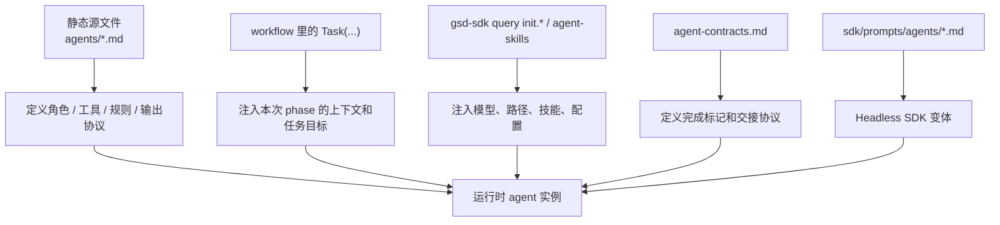
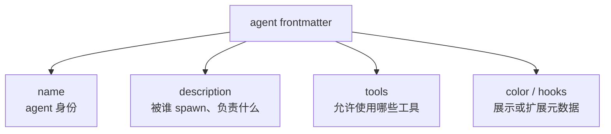
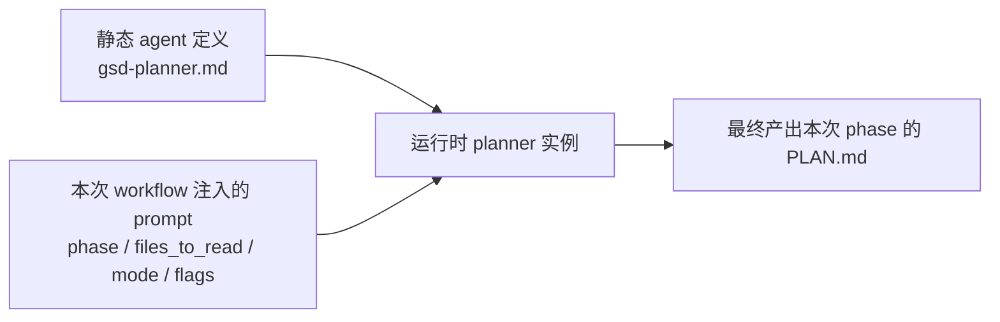
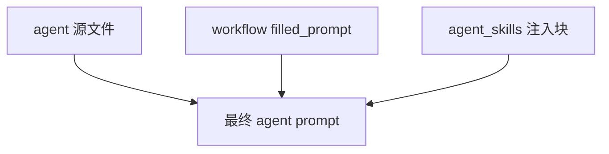
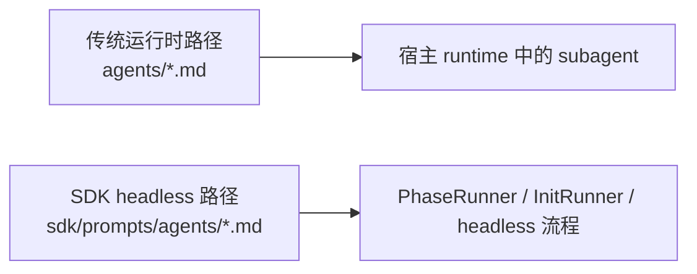
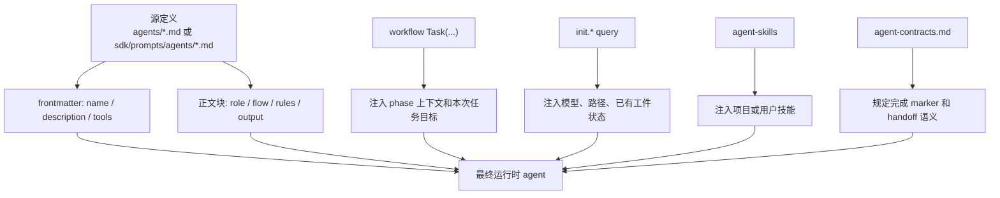

---
aliases:
  - GSD Agents How They Are Built
  - GSD Agents 构造方式
  - GSD Agent Anatomy
tags:
  - gsd
  - guide
  - agents
  - architecture
  - obsidian
---

# 05. Agents: How They Are Built

> [!INFO]
> 上一章：[[04-plan-phase-deep-dive]]
> 目录入口：[[README]]

## 这一章回答什么问题

前面几章已经讲了 agent 在 workflow 里的作用。

这一章换一个角度，不再问“它做什么”，而是问：

1. 一个 GSD agent 在仓库里到底是什么
2. 它是静态写死的，还是运行时拼出来的
3. workflow 在 spawn 它的时候，给它额外塞了什么
4. 编排器又是怎么判断它“完成了”的

如果一句话概括：

> GSD agent 不是单一 prompt 文件，而是“静态定义 + 运行时注入 + 协议约束”的组合体。

## 先给结论



这张图的意思是：

- `agents/*.md` 是 agent 的源定义，但不是它的全部
- 真正运行起来时，还会再拼装一层“本次任务上下文”
- 系统还依赖额外协议来判断这个 agent 是不是完成了

## 1. GSD agent 的最小单位，其实就是一份 Markdown prompt 资产

最直观的源文件就在：

- [`../agents/`](../agents/)

例如：

- [`../agents/gsd-planner.md`](../agents/gsd-planner.md)
- [`../agents/gsd-executor.md`](../agents/gsd-executor.md)
- [`../agents/gsd-plan-checker.md`](../agents/gsd-plan-checker.md)
- [`../agents/gsd-phase-researcher.md`](../agents/gsd-phase-researcher.md)

从仓库结构上看，agent 不是 class，不是 JSON schema，也不是数据库记录。

它首先就是一份“带 frontmatter 的 Markdown 说明书”。

## 2. 静态定义长什么样

以 `gsd-planner` 为例，一份 agent 源文件通常有两层结构：

1. YAML frontmatter
2. 正文中的 XML 风格语义块

### 2.1 YAML frontmatter

像 [`../agents/gsd-planner.md`](../agents/gsd-planner.md) 开头就有：

- `name`
- `description`
- `tools`
- `color`
- 可选的注释式 `hooks`

这部分决定的是 agent 的元信息和能力边界。



### 2.2 XML 风格语义块

正文里常见这些块：

- `<role>`
- `<project_context>`
- `<execution_flow>`
- `<deviation_rules>`
- `<verification_dimensions>`
- `<philosophy>`
- `<success_criteria>`

这些块不是“为了好看”，而是为了让 prompt 结构更稳定、可分段、可被不同 runtime 和工具层引用。

例如：

- `gsd-planner` 强调任务拆分、goal-backward、coverage audit
- `gsd-executor` 强调 deviation rules、checkpoint protocol、commit protocol
- `gsd-plan-checker` 强调 adversarial stance、verification dimensions

所以 agent 的“构造”第一步，其实就是：

- 先把角色规则写成结构化 Markdown 资产

## 3. Agent 不是平铺写法，而是明显有模板化构造习惯

虽然这些 agent 文件不是由脚本自动生成的，但它们有很强的一致结构。

我会把这种一致性叫做“手工模板化”。

### 常见构造槽位

| 槽位 | 作用 | 例子 |
| --- | --- | --- |
| `name` | agent 注册名 | `gsd-planner` |
| `description` | 面向编排器的说明 | “Spawned by /gsd-plan-phase orchestrator” |
| `tools` | 工具能力白名单 | `Read, Write, Bash, Glob...` |
| `<role>` | 角色身份与核心职责 | planner / executor / checker |
| `<project_context>` | 项目级规则如何注入 | `CLAUDE.md`、skills |
| `<..._flow>` | 步骤化执行协议 | `execution_flow` |
| 输出 marker | 给编排器的完成信号 | `## PLANNING COMPLETE` |

这说明 GSD 的 agent 并不是每个都天马行空地写，而是有稳定的“角色 prompt 骨架”。

## 4. 真正运行时，workflow 还会再给 agent 拼一层 prompt

这一步是理解“agent 怎么被构造出来”的关键。

agent 文件本身只是角色说明书。

真正 spawn 时，workflow 会再组装一层“任务实例 prompt”。

以 `plan-phase` 为例，workflow 里不是直接说“去跑 gsd-planner”，而是会构造一个 `filled_prompt`，里面包含：

- 本次 phase 编号和模式
- `<files_to_read>` 块
- 需要读哪些 `.planning/` 文件
- `PATTERNS.md`、`UI-SPEC.md`、`REVIEWS.md` 等可选输入
- 本次 `phase_req_ids`
- 项目技能补丁
- TDD mode 等附加约束

然后再这样 spawn：

```text
Task(
  prompt=filled_prompt,
  subagent_type="gsd-planner",
  model="{planner_model}",
  description="Plan Phase {phase}"
)
```

也就是说：

- `agents/gsd-planner.md` 提供“你是谁、你遵守什么原则”
- `workflows/plan-phase.md` 提供“这次你具体要规划哪一个 phase，用哪些输入”

这两个部分缺一不可。



## 5. 所以 GSD agent 更像“类 + 构造参数”的关系

如果用编程类比，它不是特别像“一个函数”，而更像：

- `agents/*.md` = 类定义
- workflow 里的 `Task(... prompt=...)` = 构造参数

比如：

- `gsd-planner` 这个“类”本身不绑定具体 phase
- 但这次运行时，它会被注入 Phase 4、某组文件路径、某个 model、某些 review/gap/context 约束

这个比喻很贴切，因为它解释了为什么：

- 同一个 `gsd-planner` 能用于标准规划
- 也能用于 gap closure
- 也能用于 revision mode
- 也能用于 reviews 模式

变的是“本次实例化参数”，不是 agent 身份本身。

## 6. `tools:` 是 agent 构造里非常关键的一层

GSD agent 的能力不是模糊的，而是 frontmatter 里显式写出来的。

例如：

- `gsd-planner`: `Read, Write, Bash, Glob, Grep, WebFetch, mcp__context7__*`
- `gsd-plan-checker`: `Read, Bash, Glob, Grep`
- `gsd-executor`: `Read, Write, Edit, Bash, Grep, Glob, mcp__context7__*`
- `gsd-phase-researcher`: `Read, Write, Bash, Grep, Glob, WebSearch, WebFetch, mcp__context7__*, mcp__firecrawl__*, mcp__exa__*`

从这里能直接看出一套构造规律：

- 研究类 agent 往往有 web/doc 工具
- checker 类 agent 往往偏只读
- executor 类 agent 需要 `Edit/Write`

这不是“提示词里顺嘴说一下”，而是 agent identity 的一部分。

SDK 里也会解析这层 frontmatter。比如：

- [`../sdk/src/prompt-builder.ts`](../sdk/src/prompt-builder.ts) 会解析 `tools:`
- [`../sdk/src/tool-scoping.ts`](../sdk/src/tool-scoping.ts) 会把 phase type 映射到 agent 文件和工具范围

所以 `tools:` 不是装饰字段，而是 agent 构造过程里真正参与行为边界控制的字段。

## 7. `agent_skills` 会在 spawn 时继续给 agent 打补丁

这是第二层运行时注入。

GSD 支持在配置里给某类 agent 追加技能：

- `agent_skills.<agent_type>`

仓库里明确写了：

- `agent_skills` 会在 spawn 时被注入成 `<agent_skills>` block

对应实现可以看：

- [`../get-shit-done/bin/lib/init.cjs`](../get-shit-done/bin/lib/init.cjs)

那里会：

1. 读取 `config.agent_skills[agentType]`
2. 验证路径安全性
3. 支持 `global:skill-name`
4. 最后输出一个 `<agent_skills>` 块

也就是说，一个 agent 的最终 prompt 还可能包含：

- 源 agent 定义
- workflow 注入的 phase context
- 用户配置的 skill 注入



这是 GSD 很重要的一点：

- agent 不是封闭资产
- 它允许项目或用户在不改 agent 源文件的情况下，给某类 agent 增加局部知识

## 8. completion marker 是 agent 构造的一部分，不是附带习惯

很多系统把 agent 输出当自然语言去猜。

GSD 明显不是这样。

它给 agent 定义了比较明确的 completion markers 和 handoff contracts。

参考：

- [`../get-shit-done/references/agent-contracts.md`](../get-shit-done/references/agent-contracts.md)

例如：

- `gsd-planner` -> `## PLANNING COMPLETE`
- `gsd-phase-researcher` -> `## RESEARCH COMPLETE`
- `gsd-plan-checker` -> `## VERIFICATION PASSED` / `## ISSUES FOUND`
- `gsd-executor` -> `## PLAN COMPLETE` / `## CHECKPOINT REACHED`

这说明 agent 的“构造”不只包含输入 prompt，还包含：

- 它完成时必须吐出什么形状的结果

所以更准确地说，GSD agent 有两种 contract：

1. 行为 contract
2. 输出 contract

### 行为 contract

由 agent 文件本身定义：

- 该做什么
- 用什么工具
- 不能越过什么边界

### 输出 contract

由 `agent-contracts.md` 和 workflow 共同定义：

- 完成 marker 长什么样
- 编排器应该如何识别
- 下游应该消费什么工件

## 9. 很多 agent 是“不同职责模板”的变体

如果你往上抽一层，会发现这些 agent 大概可以分成几个构造家族。

### 1. Researcher 家族

代表：

- `gsd-phase-researcher`
- `gsd-project-researcher`
- `gsd-domain-researcher`

构造特征：

- 有 web/doc 工具
- 目标是写研究工件
- 强调来源、置信度、标准模式、风险

### 2. Planner / Synthesizer 家族

代表：

- `gsd-planner`
- `gsd-roadmapper`
- `gsd-research-synthesizer`

构造特征：

- 强调 coverage、结构化输出、下游可消费性
- 更像“把信息压缩成可执行结构”

### 3. Checker / Auditor 家族

代表：

- `gsd-plan-checker`
- `gsd-verifier`
- `gsd-security-auditor`
- `gsd-ui-checker`

构造特征：

- 多数偏只读
- 明确带 adversarial stance
- 更强调 fail/pass/blocker 判断

### 4. Executor / Fixer 家族

代表：

- `gsd-executor`
- `gsd-code-fixer`
- `gsd-debugger`

构造特征：

- 允许写代码
- 有 deviation / checkpoint / commit 规则
- 强调遇到计划外问题时怎么处理

这说明 agent 并不是 33 个完全离散的角色，而是若干职责模板的具体化。

## 10. SDK 里其实还有一套 headless agent 变体

这一点很重要，也最能说明 agent 不是单一来源。

仓库里还有一套：

- [`../sdk/prompts/agents/`](../sdk/prompts/agents/)

例如：

- [`../sdk/prompts/agents/gsd-planner.md`](../sdk/prompts/agents/gsd-planner.md)

这些 prompt 明确写了：

- `Headless SDK variant`

而且 [`../sdk/src/phase-prompt.ts`](../sdk/src/phase-prompt.ts) 的 `loadAgentDef()` 会优先读取：

1. `sdk/prompts/agents/`
2. 用户 agents 目录
3. 项目级 agents 目录

这说明现在至少存在两条 agent 来源路径：



### 为什么会有两套

因为它们服务的运行场景不同：

- `agents/*.md` 更偏运行时安装后的 subagent 资产
- `sdk/prompts/agents/*.md` 更偏 headless、自主、无交互的 SDK 运行场景

所以如果你问“agent 是怎么被构造出来的”，答案不是只有一份：

- 它在经典 GSD runtime 下有一套构造方式
- 在 SDK/headless 模式下还有一套更程序化的变体

## 11. SDK 甚至会程序化解析 agent prompt

这就更进一步说明，agent 不是纯自然语言黑盒。

例如：

- [`../sdk/src/prompt-builder.ts`](../sdk/src/prompt-builder.ts) 会解析 `tools:` frontmatter
- 也会抽取 `<role>` 块
- 然后再用于构造 executor prompt

也就是说，agent prompt 已经有一部分被当成“半结构化 DSL”来处理了。

这点非常值得注意，因为它意味着：

- GSD 正在把 prompt 资产从“纯文本说明书”往“可被工具层消费的结构化协议”方向推进

## 12. 所以一个 agent 的完整构造图可以这样理解



这张图就是我对 GSD agent 的最准确定义：

- 它不是“一个 prompt 文件”
- 它是“一个角色协议，在运行时被多层上下文实例化”

## 13. 我觉得这套设计最可取的地方

### 1. 角色定义和任务实例分开

这让同一个 agent 可以重复用于不同 workflow 分支。

### 2. 工具权限被写进身份

而不是临时口头约定。

### 3. 输出协议显式化

completion markers 让编排器不必靠猜。

### 4. 可以被项目局部扩展

`agent_skills` 使 agent 可配置，而不用 fork 整个 agent 文件。

### 5. 正在向程序化 prompt 资产演进

SDK 对 agent 的解析和 headless 变体都说明了这一点。

## 14. 这套构造方式的代价

也有代价，而且不小。

### 1. 双份 prompt 资产会带来同步成本

`agents/*.md` 和 `sdk/prompts/agents/*.md` 需要保持语义一致，这天然有维护压力。

### 2. agent 行为分散在多个地方

一个 agent 的真实行为，往往要同时看：

- `agents/*.md`
- 某个 workflow 的 `Task(prompt=...)`
- `agent-contracts.md`
- `agent-skills`
- 有时还要看 SDK prompt 变体

### 3. 新读者很容易只看到“作用”，看不到“构造”

这正是你刚才指出的问题。

## 15. 看完这章后，你应该记住什么

- agent 的源头首先是 `agents/*.md` 这样的 Markdown 资产。
- 但真正运行时，workflow 会再给它拼本次任务上下文。
- `agent_skills` 会继续在 spawn 时打补丁。
- completion markers 和 handoff contract 是 agent identity 的一部分。
- SDK 里还有一套 headless 变体，说明 agent 已经不是单一路径资产。
- 最准确的说法不是“agent 是一个 prompt”，而是“agent 是一个被运行时实例化的角色协议”。

## 相关笔记

- 上一章：[[04-plan-phase-deep-dive]]
- 目录入口：[[README]]
- 下一章：[[06-execute-phase-deep-dive]]
