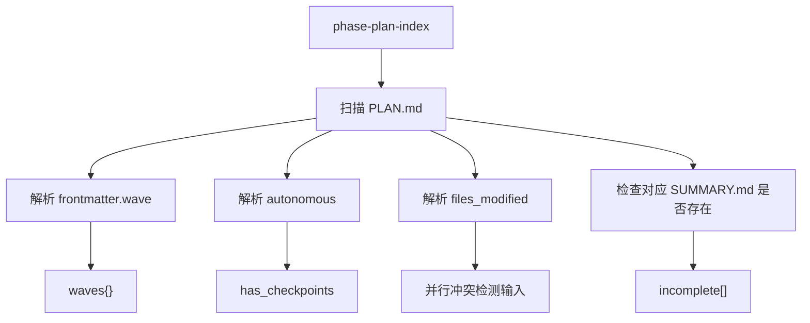
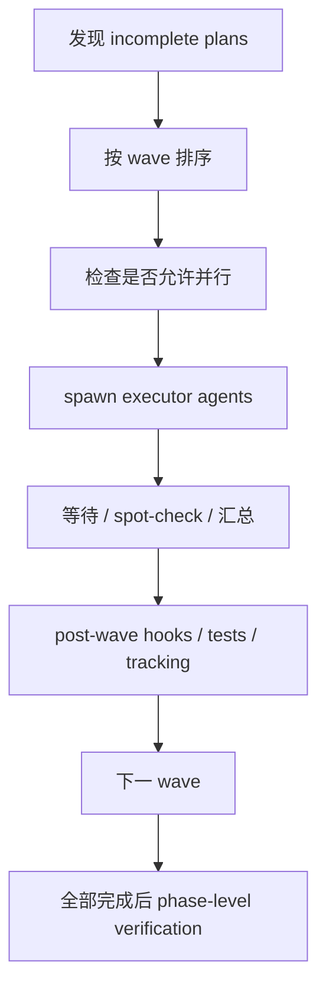
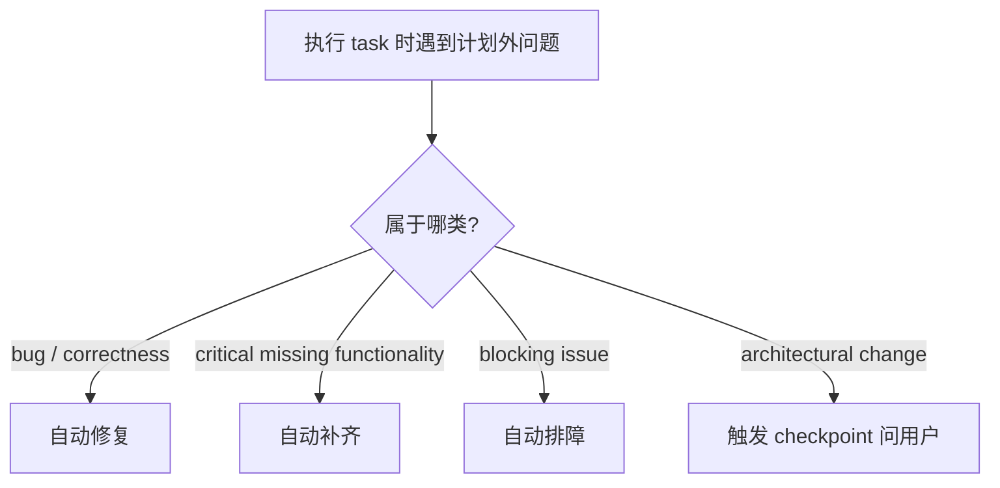
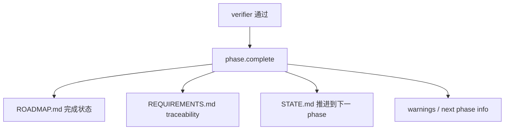

---
aliases:
  - GSD Execute Phase Deep Dive
  - GSD Execute-Phase 深潜
tags:
  - gsd
  - guide
  - workflow
  - execution
  - obsidian
---

# 06. Execute-Phase Deep Dive

> [!INFO]
> 上一章：[[05-agents-how-they-are-built]]
> 目录入口：[[README]]

## 这一章为什么重要

如果说 `plan-phase` 是 GSD 的大脑，那 `execute-phase` 就是它真正把规划变成代码和状态迁移的地方。

这里最值得看的，不只是“它会执行计划”，而是它怎么同时处理这些矛盾目标：

- 想并行，又怕互相改坏
- 想自治，又怕 agent 乱跑
- 想自动推进，又怕错误状态被写进 `.planning/`
- 想依赖 subagent，又要兼容不同 runtime 的不稳定行为

所以 `execute-phase` 是 GSD 里最能体现“工程现实感”的 workflow 之一。

> [!TIP]
> 这一章对应的核心源码入口：
> - 命令入口：[`../commands/gsd/execute-phase.md`](../commands/gsd/execute-phase.md)
> - 流程编排：[`../get-shit-done/workflows/execute-phase.md`](../get-shit-done/workflows/execute-phase.md)
> - 执行 agent：[`../agents/gsd-executor.md`](../agents/gsd-executor.md)
> - 验证 agent：[`../agents/gsd-verifier.md`](../agents/gsd-verifier.md)
> - plan 索引：[`../sdk/src/query/phase.ts`](../sdk/src/query/phase.ts)
> - 阶段完成：[`../sdk/src/query/phase-lifecycle.ts`](../sdk/src/query/phase-lifecycle.ts)

## 一句话定义

`execute-phase` 的工作不是“按顺序把所有 plan 跑一遍”，而是：

把 phase 下的多个 PLAN 转成可控执行波次，让 `gsd-executor` 去实现每个 plan，再通过测试、spot-check、`gsd-verifier` 和 `phase.complete` 把结果安全地写回项目状态。

## 先看总链路


和 `plan-phase` 一样，这里也不是“一个 prompt 一路干到底”，而是：

- workflow 负责编排
- executor/verifier 负责具体判断与执行
- query handlers 负责状态读写

## 1. 命令入口依然很薄

[`../commands/gsd/execute-phase.md`](../commands/gsd/execute-phase.md) 依然是典型的 GSD 风格：

- 声明命令名
- 声明参数
- 声明允许工具
- 把真正逻辑指向 `workflows/execute-phase.md`

这个入口尤其强调了几个 flags：

- `--wave N`
- `--gaps-only`
- `--interactive`

这说明 `execute-phase` 从设计上就不是一种单一执行模式，而是一个带执行策略分支的编排器。

## 2. 它的第一要务不是执行，而是判断“这次该怎么执行”

和 `plan-phase` 一样，真正开始前先做：

```bash
gsd-remix-sdk query init.execute-phase "${PHASE_ARG}"
```

这一步会拿到本轮执行的关键控制信息，比如：

- `executor_model`
- `verifier_model`
- `parallelization`
- `branching_strategy`
- `branch_name`
- `plans`
- `incomplete_plans`
- `plan_count`
- `incomplete_count`
- `phase_dir`

也就是说，workflow 一开始先知道：

- 这个 phase 有没有 plan
- 哪些还没完成
- 是否要并行
- 是否要开分支
- 该用哪个 executor/verifier model

这和 `plan-phase` 的思路完全一致：

- workflow 不自己零碎探测环境
- 先通过 `init.*` 查询拿到一份“执行控制面板”

## 3. `phase-plan-index` 是 execute-phase 的波次调度核心

真正让 `execute-phase` 能“按 wave 执行”的关键，不是 prompt 文案，而是：

- `gsd-remix-sdk query phase-plan-index "${PHASE_NUMBER}"`

[`../sdk/src/query/phase.ts`](../sdk/src/query/phase.ts) 里的这个 handler 会：

1. 找到 phase 目录
2. 读取所有 `*-PLAN.md`
3. 读取所有 `*-SUMMARY.md`
4. 从 frontmatter 解析：
   - `wave`
   - `autonomous`
   - `files_modified`
5. 组装出：
   - `plans[]`
   - `waves{}`
   - `incomplete[]`
   - `has_checkpoints`

这非常关键，因为这说明 wave 分组不是靠编排器现场猜，而是：

- 从 PLAN frontmatter 抽取出来的结构化执行图



所以你可以把 `phase-plan-index` 理解成：

- 执行编排用的 phase 调度索引

## 4. `execute-phase` 本质上是一个波次调度器

它的真正核心不是“运行 task”，而是：

- 发现哪些 plan 还能跑
- 把它们按 wave 排序
- 决定同一 wave 里是并行还是串行
- 处理 checkpoint
- 在每个 wave 完成后做验证和状态更新



这意味着：

- `execute-phase` 自己不实现任务细节
- 它更像一层“phase execution scheduler”

## 5. 并行不是默认信任，而是带很多安全护栏

GSD 在这里非常务实。它不是看到有 wave 就盲目并行，而是加了很多护栏。

### 5.1 `files_modified` overlap 检测

workflow 会在同一 wave 执行前检查：

- 不同 plan 的 `files_modified` 有没有重叠

如果重叠，就会强制把本 wave 从并行降成串行。

这说明 GSD 明确认识到一个事实：

- planner 的 wave 划分可能出错

所以 `execute-phase` 把自己当成最后一道执行前保险丝。

### 5.2 worktree 隔离

如果 `workflow.use_worktrees` 开启，并且不是 submodule 等特殊情况，executor 会以：

- `isolation="worktree"`

的方式运行。

这意味着每个 executor agent 有自己的 worktree，而不是直接在同一个 working tree 里互相踩。

### 5.3 runtime fallback

workflow 还明确写了：

- Claude Code 可以靠 `Task(subagent_type="gsd-executor", ...)`
- Copilot completion signal 不可靠，默认偏向顺序 inline
- 没有 `Task` 的 runtime 也要回退成串行执行

也就是说，并行策略是：

- 想并行
- 但不迷信宿主 runtime 一定靠谱

## 6. `gsd-executor` 是怎么在这里被实例化的

这一章和上一章 `[[05-agents-how-they-are-built]]` 是直接连起来的。

在 `execute-phase` 里，`gsd-executor` 不是裸跑，而是被 workflow 拼成“本次具体 plan 的执行实例”。

注入内容通常包括：

- phase 编号、phase 名称
- 当前 plan 文件路径
- `PROJECT.md`
- `STATE.md`
- `config.json`
- 视上下文窗口大小而定的 `CONTEXT.md` / `RESEARCH.md` / prior wave summaries
- 项目技能
- worktree 相关规则
- success criteria

也就是说，这里的 executor 不是一个抽象“执行者”，而是：

- 某个具体 plan 的一次性执行实例

## 7. `gsd-executor` 的核心不是写代码，而是“带偏差处理规则的执行”

从 [`../agents/gsd-executor.md`](../agents/gsd-executor.md) 看，它最有代表性的不是一般的 `execution_flow`，而是 `deviation_rules`。

这套规则我会概括成四级响应：

1. Auto-fix bugs
2. Auto-add missing critical functionality
3. Auto-fix blocking issues
4. Ask about architectural changes

这说明 executor 的设计前提不是：

- “plan 足够好，所以执行会线性顺滑”

而是：

- “执行时必然会遇到计划外问题，所以必须明确定义什么能自动修，什么要停下来”



这正是 `gsd-executor` 和“普通代码 agent”的差别：

- 它不是只会照 plan 抄作业
- 它有一套制度化的偏差吸收机制

## 8. checkpoint handling 是 execute-phase 的第二个关键结构

`execute-phase` 不是所有 plan 都假设能全自动跑完。

如果 plan 带 checkpoint，或者 executor 运行中到了某个 checkpoint task，它会：

- 返回结构化 checkpoint 状态
- 由编排器展示给用户
- 再用 continuation prompt 生成一个新的 continuation agent

workflow 明确强调：

- 不依赖“恢复原 agent 内部状态”
- 更偏向 fresh agent + explicit state

这也很现实，因为很多 runtime 对复杂 agent resume 的支持并不稳定。

所以这里的设计哲学是：

- 不信任隐式恢复
- 更信任显式 continuation contract

## 9. execute-phase 不完全相信 subagent 回报，它会做 spot-check

这点非常值得学。

workflow 明写了：

- completion signal 可能收不到
- 某些 runtime 下 agent 可能实际完成了，但编排器没拿到正确 marker

所以它会做 spot-check，比如检查：

- 对应 `SUMMARY.md` 是否存在
- 最近 git log 里是否出现相关 plan commit
- `SUMMARY.md` 有没有 `Self-Check: FAILED`

这非常重要，因为它说明 GSD 的编排器不把 agent 输出当唯一真相，而会去做文件系统和 git 层面的交叉验证。

## 10. 并行执行真正难的不是 spawn，而是 merge 后的系统一致性

`execute-phase` 最重的部分其实不是 spawn agents，而是并行 wave 之后的合并和一致性维护。

workflow 里给 worktree 模式写了大量 post-wave 逻辑，主要包括：

- merge worktree branch
- 保护由编排器统一持有的文件
- 检测 bulk deletion
- 必要时恢复 `STATE.md` / `ROADMAP.md`
- 抢救未提交 `SUMMARY.md`
- 删除临时 branch 和 worktree

这说明作者已经很清楚一个现实：

- 多 agent 并行写代码，最大的风险不在“执行时”，而在“合并后”

### 这里最关键的原则

- `STATE.md`、`ROADMAP.md` 这类共享控制文件，不能让多个 executor 各自乱写
- 并行模式下，这些文件更像由编排器统一持有的工件

这就是为什么 workflow 明确告诉 parallel executor：

- 不要自己更新 `STATE.md` 和 `ROADMAP.md`
- 编排器在 wave 完成后统一写回

## 11. post-merge test gate 是对 “agent 自评” 的补刀

这个设计也很强。

即使每个 executor 在自己的 worktree 里都自检通过，合并之后仍然可能出现：

- 类型冲突
- import/export 冲突
- 共享注册表被覆盖
- 跨 plan wiring 断掉

所以 workflow 在 merge 完之后，还会强制跑一轮项目测试。

它其实是在承认一件事：

- agent 的 self-check 只能证明“局部正确”
- 不能证明“合并后整体正确”

这和 `gsd-verifier` 的存在一起，形成了两层兜底：

1. post-merge test gate
2. goal-level verifier

## 12. phase 级别的 verifier 是执行链最终裁判

所有 wave 跑完后，`execute-phase` 不会立刻宣布 phase 完成，而是会 spawn：

- [`../agents/gsd-verifier.md`](../agents/gsd-verifier.md)

它不是看：

- task 都执行了吗

而是看：

- phase goal 达成了吗

这是上一章 `plan-checker` 的镜像版本：

- `plan-checker`：计划是否将会达成目标
- `verifier`：代码是否已经达成目标

workflow 会根据 verifier 结果走三条分支：

- `passed`
- `human_needed`
- `gaps_found`

也就是说，phase execution 的终局不是二元的 done / not done，而是：

- 自动通过
- 需要人类确认
- 发现缺口，回流 gap closure

## 13. `phase.complete` 才是 phase 状态真正推进的时刻

这一点非常关键。

真正把 phase 标记为完成、推进 `ROADMAP.md` / `STATE.md` / `REQUIREMENTS.md` 的，不是 executor，也不是 verifier，而是：

- `gsd-remix-sdk query phase.complete "${PHASE_NUMBER}"`

[`../sdk/src/query/phase-lifecycle.ts`](../sdk/src/query/phase-lifecycle.ts) 里的 `phaseComplete` 会做很多事：

- 更新 `ROADMAP.md` 的 checkbox 和 progress table
- 更新本 phase 的 `Plans:` 状态
- 标记对应 plan checkboxes
- 更新 `REQUIREMENTS.md` 的 requirement checkbox 和 traceability
- 推进 `STATE.md`
- 找下一 phase
- 检查 UAT / verification warnings

所以它不是单点写字段，而是：

- 一次 phase lifecycle transition



这也解释了为什么 GSD 能把 `.planning/` 当成长期记忆区：

- 每个 phase 完成不是一次聊天结论
- 而是一组结构化状态迁移

## 14. `roadmap.update-plan-progress` 和 `state.begin-phase` 是执行中的局部状态写回

除了 `phase.complete` 这种终局写回，还有两个很重要的中间写回点：

### `state.begin-phase`

在 phase 开始执行时，workflow 会调用：

- `state.begin-phase`

它的作用是立刻把 `STATE.md` 切到：

- 当前 phase 正在执行
- 当前有多少 plan
- 当前 focus 是什么

### `roadmap.update-plan-progress`

在 wave 或 plan 执行结束后，workflow 会按需调用：

- `roadmap.update-plan-progress`

这个 query handler 会根据磁盘上的 `PLAN` / `SUMMARY` 数量来同步：

- progress table
- plan checkbox
- phase 状态是 `Planned` / `In Progress` / `Complete`

这说明 GSD 的执行状态更新分成两层：

- phase 开始时的即时写回
- 每轮执行后的进度同步
- verifier 通过后的最终 phase.complete

## 15. auto chain 在 execute-phase 里不只是 convenience，而是链式编排控制

`execute-phase` 的尾部还有一段很重要：

- `--no-transition`
- `--auto`
- `check auto-mode`

这里的设计能看出 GSD 对自动链的控制其实很谨慎：

- 如果是 plan-phase 自动推进过来的，就可以 `--no-transition` 返回给上层
- 如果是完整 auto chain，验证通过后才会继续 transition
- 如果出现 `gaps_found`，就不应该继续自动推进

也就是说，自动链不是“只要开了 auto 就无脑冲到底”，而是：

- 只在 phase-level verification 通过后才允许推进

## 16. 这条 workflow 的核心价值是什么

我觉得 `execute-phase` 最值得学的地方有 6 个。

### 1. 它把并行执行当成“危险能力”来设计

不是默认相信，而是带 worktree、overlap check、merge protection、post-merge tests。

### 2. 它把 executor 当成“带偏差处理规则的工人”

不是只会照计划执行的 dumb worker。

### 3. 它不盲信 agent completion signal

spot-check 是非常成熟的做法。

### 4. 它把共享状态写回收归编排器

并行模式下尤其如此。

### 5. 它把 phase 级验证放在最后

而不是用 task completion 冒充 goal completion。

### 6. 它让 `.planning/` 真正成为状态机，而不是日志堆

因为 `phase.complete`、`roadmap.update-plan-progress`、`state.begin-phase` 都在持续推动状态迁移。

## 17. 这条链路的代价

同样也有明显代价。

### 1. 复杂度非常高

`execute-phase` 远比“循环执行计划文件”复杂。

### 2. 对 git/worktree 语义依赖很重

这对 runtime 稳定性和仓库状态健康度要求都更高。

### 3. 需要强依赖 plan frontmatter 的质量

如果 `wave`、`files_modified`、`autonomous` 写坏了，执行链就会跟着出问题。

### 4. 需要编排器和 executor 边界足够清晰

否则共享文件会被反复踩。

## 18. 看完这章后，你应该记住什么

- `execute-phase` 的本质是 phase-level 调度器，不是直接干活的 agent。
- wave 执行的关键支撑是 `phase-plan-index` 这种结构化查询，不是靠 prompt 现场猜。
- `gsd-executor` 真正强的地方是 deviation rules 和 checkpoint protocol。
- 并行安全靠的不只是 worktree，还靠 overlap 检测、merge 保护和 post-merge tests。
- phase 最终完成不是“计划都跑完了”，而是 verifier 通过后再交给 `phase.complete` 做正式状态迁移。
- 这套设计非常重，但它重在解决真实执行问题，不是为了看起来高级。

## 相关笔记

- 目录入口：[[README]]
- Agent 构造：[[05-agents-how-they-are-built]]
- 下一章：[[07-executor-and-verifier-contracts]]
