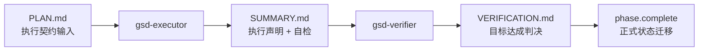
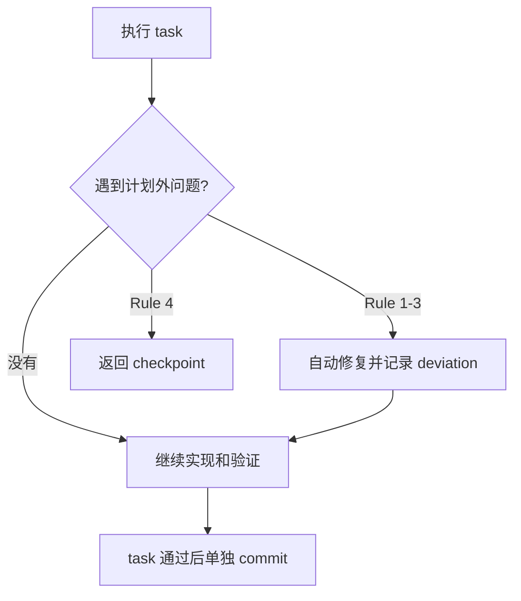
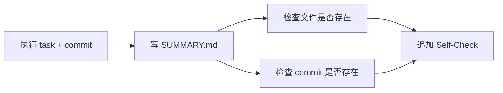
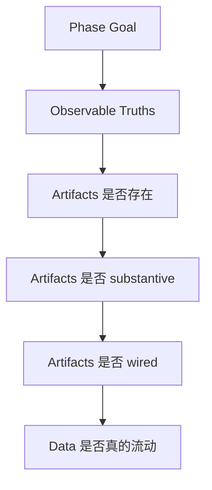

---
aliases:
  - GSD Executor and Verifier Contracts
  - GSD 执行与验证契约
tags:
  - gsd
  - guide
  - agents
  - execution
  - verification
  - obsidian
---

# 07. Executor and Verifier Contracts

> [!INFO]
> 上一章：[[06-execute-phase-deep-dive]]
> 目录入口：[[README]]

## 这一章回答什么问题

前一章讲的是 `execute-phase` 这个 workflow 怎么调度。

这一章把两个最关键的 agent 单独拎出来，看它们各自背着什么契约：

1. `gsd-executor` 到底被允许做什么
2. `gsd-verifier` 到底被要求怀疑什么
3. 它们之间通过哪些工件交接
4. 为什么 workflow 不会完全相信它们的口头回报

一句话先说结论：

> `gsd-executor` 的契约是“把 plan 变成可审计的执行痕迹”，`gsd-verifier` 的契约是“把这些痕迹和真实代码结果重新对账”。

## 先给总图

这里最重要的不是文件名，而是信任链：

- `PLAN.md` 约束 executor
- `SUMMARY.md` 是 executor 的执行声明
- `VERIFICATION.md` 是 verifier 对声明和代码现实的复核
- `phase.complete` 才是最后把结果写进 `.planning/` 状态机

## 1. 这两个 agent 的角色并不对称

| 维度 | `gsd-executor` | `gsd-verifier` |
| --- | --- | --- |
| 主要目标 | 完成 plan | 判断 phase goal 是否真的达成 |
| 主要输入 | `PLAN.md` + phase 上下文 | `ROADMAP.md` + `PLAN.md` + `SUMMARY.md` |
| 默认立场 | 尽量推进、尽量解决阻塞 | 默认不信、反证式检查 |
| 核心工件 | `SUMMARY.md` | `VERIFICATION.md` |
| 对代码的关系 | 改代码、跑验证、提交 commit | 读代码、做证据对账、不提交 |
| 对共享状态的关系 | 在某些运行模式下会尝试更新 | 明确不提交，由 workflow 接管 |
| 口头 completion marker | `## PLAN COMPLETE` | `## Verification Complete` |
| 真正被 workflow 依赖的东西 | `SUMMARY.md`、git、spot-check | `VERIFICATION.md` frontmatter 的 `status:` |

这张表的意思很简单：

- executor 像“施工方”
- verifier 像“验收方”

而且 GSD 不是让施工方自己宣布竣工，而是让验收方再走一遍目标倒推。

## 2. `gsd-executor` 的契约

核心源码入口：

- [`../agents/gsd-executor.md`](../agents/gsd-executor.md)
- [`../get-shit-done/workflows/execute-phase.md`](../get-shit-done/workflows/execute-phase.md)
- [`../get-shit-done/references/agent-contracts.md`](../get-shit-done/references/agent-contracts.md)

## 2.1 它不是“写代码 agent”，而是“可审计执行器”

`gsd-executor` 的 `<role>` 很直接：

- 执行 `PLAN.md`
- 每个 task 单独 commit
- 遇到 checkpoint 就停
- 产出 `SUMMARY.md`

它的工具边界也明显偏执行型：

- `Read, Write, Edit, Bash, Grep, Glob`
- 以及可选的 `mcp__context7__*`

这已经说明它的身份不是普通问答 agent，而是：

- 能改文件
- 能跑命令
- 能提交 git
- 要把每一步留痕

## 2.2 它最核心的不是 task list，而是偏差处理规则

很多读者第一次看会把注意力放在 `<execution_flow>`，但 executor 真正最有辨识度的是 `<deviation_rules>`。

它把计划外问题分成四类：

1. Rule 1：自动修 bug
2. Rule 2：自动补关键缺失
3. Rule 3：自动排除阻塞
4. Rule 4：遇到架构性变化必须停下来问

这套规则非常重要，因为它把 executor 的自治边界写死了：

- 正确性、安全性、关键缺口，默认自动补
- 真正会改动架构边界的事，默认上抛

所以 `gsd-executor` 不是“照 plan 抄作业”，而是：

- 一个带自愈规则的执行器

## 2.3 它的第二个关键契约是 checkpoint 协议

executor 被明确要求支持三种模式：

- 全自动执行
- 遇 checkpoint 立即停止
- continuation agent 接棒继续

而且返回格式不是自由发挥，而是固定的：

- `## CHECKPOINT REACHED`
- `Type`
- `Plan`
- `Progress`
- `Completed Tasks`
- `Current Task`
- `Checkpoint Details`
- `Awaiting`

这说明 checkpoint 在 GSD 里不是“聊天暂停”，而是：

- 一种结构化 handoff 协议

它的作用是让 workflow 能用一个全新的 agent 继续跑，而不是依赖宿主 runtime 去恢复旧 agent 的隐式状态。

## 2.4 它的第三个关键契约是“每个 task 都必须留下提交痕迹”

`<task_commit_protocol>` 规定得很死：

- task 通过验证后立刻 commit
- 逐文件 `git add`
- 禁止 `git add .`
- commit type 要和任务性质对应
- 记录 commit hash 给 `SUMMARY.md`
- 提交后还要检查意外删除和遗留未跟踪文件

这意味着 executor 的输出不只是改过的代码，而是：

- 一串可追溯的任务级 commit

这很像把 agent 执行过程从“一次长对话”变成“一组可审计事务”。

## 2.5 `SUMMARY.md` 是 executor 最核心的输出工件

executor 在完成后必须写：

- `{phase}-{plan}-SUMMARY.md`

而且这份 Summary 不是随便总结，它被要求包含：

- frontmatter
- key-files
- decisions
- deviations
- known stubs
- threat flags
- metrics

然后还必须做一轮 `<self_check>`：

- 检查声称创建的文件是否真的存在
- 检查声称的 commit hash 是否真的存在
- 在 Summary 末尾写 `## Self-Check: PASSED` 或 `FAILED`

这说明 `SUMMARY.md` 在 GSD 里不是汇报作文，而是 executor 的：

- 执行账本
- 自检报告
- 交给 verifier 的声明材料

## 2.6 它还有一个容易忽略的契约：状态写回

从 agent 自身定义看，executor 在 Summary 之后还被要求：

- `state.advance-plan`
- `state.update-progress`
- `state.record-metric`
- `state.add-decision`
- `state.record-session`
- `roadmap.update-plan-progress`
- `requirements.mark-complete`

最后还要做一个 metadata commit，把：

- `SUMMARY.md`
- `STATE.md`
- `ROADMAP.md`
- `REQUIREMENTS.md`

一起提交。

单看 agent 定义，你会以为 executor 的权限很大，几乎是：

- 既执行
- 又写状态
- 还顺手写最终跟踪文件

## 2.7 但这里有一个非常值得注意的“契约张力”

`execute-phase` workflow 在并行 worktree 模式下，明确又收回了一部分权力：

- 不让 parallel executor 自己乱写 `STATE.md`
- 不让 parallel executor 自己乱写 `ROADMAP.md`
- wave 合并后由编排器统一更新 tracking files

所以 executor 的真实契约不是单一的，而是：

- 串行模式下：更接近“全权执行器”
- 并行 worktree 模式下：更接近“只负责代码和 Summary 的局部执行器”

> [!TIP]
> 这是理解 GSD 的关键点之一：
> agent 源文件里的契约是“默认能力边界”，workflow 还会根据运行模式再把边界收紧。

## 2.8 它的口头 completion marker 不是系统唯一真相

`agent-contracts.md` 里给 `gsd-executor` 记的是：

- `## PLAN COMPLETE`
- `## CHECKPOINT REACHED`

但 `execute-phase` workflow 并不主要靠 `## PLAN COMPLETE` 来判定成功，而是会做 spot-check：

- `SUMMARY.md` 是否存在
- git 里是否真的有相关 commit
- `SUMMARY.md` 有没有 `## Self-Check: FAILED`

这说明 GSD 对 executor 的态度很现实：

- 允许它报告完成
- 但不完全相信它的报告

## 3. `gsd-verifier` 的契约

核心源码入口：

- [`../agents/gsd-verifier.md`](../agents/gsd-verifier.md)
- [`../get-shit-done/workflows/execute-phase.md`](../get-shit-done/workflows/execute-phase.md)
- [`../get-shit-done/references/agent-contracts.md`](../get-shit-done/references/agent-contracts.md)

## 3.1 verifier 的起点不是 Summary，而是 phase goal

`gsd-verifier` 的 `<role>` 和 `<core_principle>` 写得非常重：

- 不相信 `SUMMARY.md`
- task 完成不等于 goal 达成
- 从 phase 应该交付的结果往回推

它还额外要求一种很强的 adversarial stance：

- 默认假设 goal 没有达成
- 必须靠代码证据把这个假设推翻

这就决定了 verifier 的思维方式跟 executor 完全相反：

- executor 的默认方向是“推进”
- verifier 的默认方向是“质疑”

## 3.2 它的 must-have 推导顺序本身就是契约

verifier 不是随便挑几条验，而是有固定优先级：

1. 先读 `ROADMAP.md` 的 success criteria
2. 再合并 `PLAN.md` frontmatter 里的 `must_haves`
3. 如果两者都没有，再从 phase goal 自行推导 truths / artifacts / key links

而且它明确写了：

- plan 里的 `must_haves` 不能缩减 roadmap 范围

这很关键，因为这意味着 verifier 实际站在：

- roadmap contract

这一侧，而不是站在 executor 的 Summary 叙事那一侧。

## 3.3 它的证据链是四层递进的

verifier 不是只看文件在不在，而是至少走到四层：

1. Observable truths
2. Artifact verification
3. Key link verification
4. Data-flow trace

这套证据梯子解决的是一个常见假阳性：

- 文件有了
- import 也有了
- 但数据还是空的
- 页面还是 placeholder

也正因为如此，verifier 会专门查：

- static/empty returns
- disconnected props
- orphaned artifacts
- hollow data flow
- anti-patterns

## 3.4 `VERIFICATION.md` 才是 verifier 的真正产物

verifier 被要求创建：

- `{phase_num}-VERIFICATION.md`

它的 frontmatter 很关键，至少包含：

- `status`
- `score`
- `gaps`
- `human_verification`
- 可选的 `overrides`
- 可选的 `deferred`
- 可选的 `re_verification`

其中最重要的是 `status` 只有三种：

- `passed`
- `gaps_found`
- `human_needed`

这个文件才是 workflow 后续分支的真正依据。

## 3.5 它的总体判定逻辑比 completion marker 更重要

`gsd-verifier` 虽然也会返回：

- `## Verification Complete`

但 `execute-phase` 真正读取的重点不是这行标题，而是：

- `VERIFICATION.md` 里的 `status:`

workflow 后续就是按这个分支：

- `passed` → `phase.complete`
- `human_needed` → 生成 `HUMAN-UAT.md`，等人类确认
- `gaps_found` → 回到 gap closure 流程

这说明 verifier 的真正契约不是“说一声我验完了”，而是：

- 产出一个能驱动后续状态机分支的结构化判决文件

## 3.6 它还带着一个很强的边界：不提交

verifier 明确写着：

- `DO NOT COMMIT`

这跟 executor 形成了非常清晰的边界：

- executor 可以改代码、写 Summary、留 commit
- verifier 只能写验证报告，不拥有最终提交权

这等于把“施工”和“验收”故意拆开，防止同一个 agent 同时扮演：

- 做事的人
- 判定是否做成的人

## 4. 两个 agent 的 handoff 关系

这条 handoff 链可以压缩成一句话：

> executor 负责“声明我做了什么”，verifier 负责“判断这些声明是否真的足以证明目标达成”。

更细一点可以拆成这样：

| 环节 | 谁负责 | 工件 | 作用 |
| --- | --- | --- | --- |
| 计划定义 | planner | `PLAN.md` | 规定要做什么 |
| 执行声明 | executor | `SUMMARY.md` | 记录实际做了什么 |
| 目标复核 | verifier | `VERIFICATION.md` | 判断 goal 是否达成 |
| 正式推进 | workflow + SDK | `phase.complete` | 更新 `ROADMAP.md` / `STATE.md` / `REQUIREMENTS.md` |

这条链路最可取的地方是：

- 口头输出只是辅助
- 文件工件才是主线
- 最终状态推进继续上收给 workflow 和 SDK handler

## 5. 这套契约设计最值得学的点

### 1. 用相反激励来减少自我确认偏差

executor 被鼓励推进，verifier 被鼓励怀疑。

这比让一个 agent 既实现又自证，要稳得多。

### 2. 让工件成为交接面，而不是聊天文本

`PLAN.md`、`SUMMARY.md`、`VERIFICATION.md` 都是持久工件，不依赖聊天上下文。

### 3. completion marker 只是辅助信号，不是唯一真相

真正的真相在磁盘和 git 里。

### 4. 共享状态最终仍然归编排器统一写回

这使并行执行有机会成立，不然每个 executor 都会去踩共享文件。

## 6. 同时也有几处很有代表性的历史包袱

### 1. executor 的默认契约和并行模式契约并不完全一致

agent 文件里它会更新 `STATE.md`，但并行 workflow 又把这部分收回。

### 2. executor 的 completion marker 实际上没被强依赖

系统更相信 spot-check，而不是 `## PLAN COMPLETE`。

### 3. verifier 的 marker 命名风格和其他 agent 不一致

它用的是 title case：

- `## Verification Complete`

这也说明 agent 契约是逐步长出来的，不是一次性设计齐整的。

### 4. verifier 要求“快”，但又要尽量证明真实行为

所以它大量依赖：

- grep
- key-link checks
- artifact checks
- data-flow trace

这是一种很务实的折中，不是真正运行系统后的完整验收。

## 7. 看完这章后，你应该记住什么

- `gsd-executor` 的核心契约不是“写代码”，而是“按 plan 执行并留下可审计痕迹”。
- `gsd-verifier` 的核心契约不是“复述 Summary”，而是“从 phase goal 倒推并寻找反证”。
- `SUMMARY.md` 是执行声明，不是最终真相；`VERIFICATION.md` 才是 phase 判决书。
- completion marker 只是辅助信号，workflow 更信磁盘工件和结构化状态字段。
- executor 对共享状态的写权限会被 workflow 按运行模式收紧，这正体现了“静态 agent 定义 + 运行时约束”的组合关系。

## 相关笔记

- 上一章：[[06-execute-phase-deep-dive]]
- 目录入口：[[README]]
- 下一章：[[08-planning-as-external-memory]]
