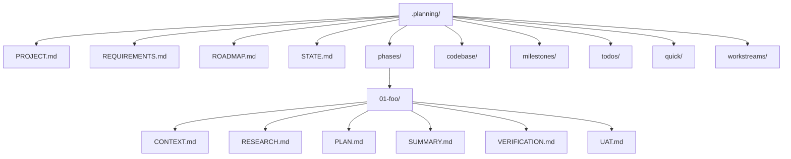
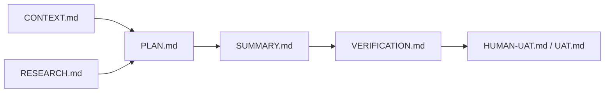
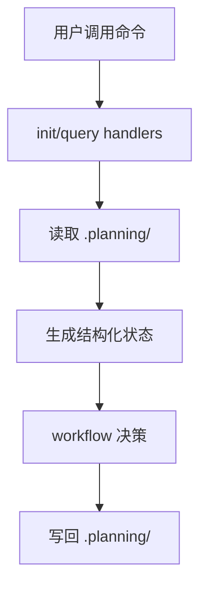
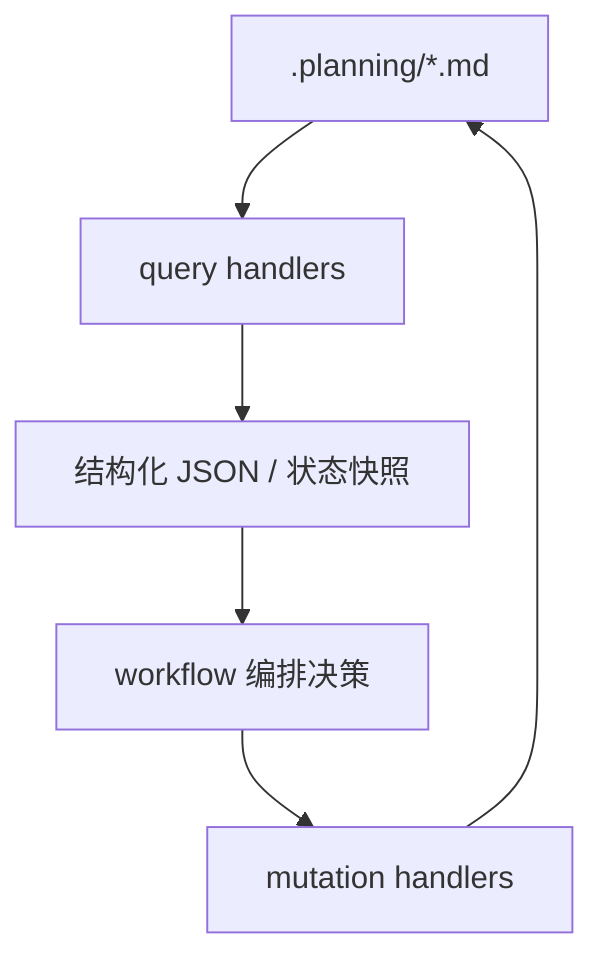
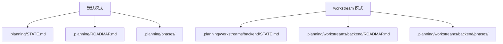

---
aliases:
  - GSD Planning As External Memory
  - GSD 外部记忆系统
tags:
  - gsd
  - guide
  - planning
  - state
  - obsidian
---

# 08. Planning As External Memory

> [!INFO]
> 上一章：[[07-executor-and-verifier-contracts]]
> 目录入口：[[README]]

> [!NOTE]
> 这个仓库根目录当前没有一份正在使用中的 `.planning/` 实例，所以这一章主要是根据：
> - `get-shit-done/templates/*.md`
> - `sdk/src/query/*.ts`
> - `commands/gsd/*`
> 反推 `.planning/` 的结构和运行语义。

## 这一章为什么重要

如果不理解 `.planning/`，就会很容易把 GSD 误解成：

- 一堆 workflow prompt
- 一堆 agent prompt
- 外加一些 query 小工具

但其实 GSD 最关键的一层恰恰是：

- 它把项目上下文、执行痕迹、阶段状态、验证结果都落在 `.planning/`

所以更准确的说法是：

> GSD 不是“靠长对话记住项目”，而是“把项目记忆外置到 `.planning/`，再由 workflow 和 query handlers 持续读写它”。

## 一句话定义

`.planning/` 不是文档目录，而是一个文件系统上的外部记忆区。

它同时承担三件事：

1. 存项目当前状态
2. 存阶段级历史工件
3. 给 workflow 提供可程序化读取的状态源

## 先看全景图

这张图的重点是：

- `.planning/` 不是单文件
- 它是一整个“项目记忆文件系统”

## 1. 为什么说它是“外部记忆”

因为 workflow 并不假设模型自己还记得上一次说过什么。

它们更常见的做法是：

- 先读 `.planning/STATE.md`
- 再读 `.planning/ROADMAP.md`
- 再读当前 phase 目录里的 `CONTEXT.md`、`RESEARCH.md`、`PLAN.md`、`SUMMARY.md`
- 然后才决定下一步该做什么

换句话说，GSD 的默认前提不是：

- “模型上下文里还留着这些信息”

而是：

- “上下文随时会丢，所以必须有一份磁盘上的、可恢复的项目记忆”

## 2. 这套记忆可以分成三层

我会把 `.planning/` 的核心部分分成三层。

| 层级 | 代表文件 | 作用 |
| --- | --- | --- |
| 项目级长期记忆 | `PROJECT.md`、`REQUIREMENTS.md`、`ROADMAP.md` | 定义目标、范围、阶段图 |
| 项目级短期位置记忆 | `STATE.md` | 告诉系统“现在做到哪了” |
| 阶段级情景记忆 | `phases/<phase>/...` | 保存某个 phase 的上下文、计划、执行、验证痕迹 |

这三层是互相配合的，不是互相替代的。

## 3. `REQUIREMENTS.md`、`ROADMAP.md`、`STATE.md` 分别记什么

### 3.1 `REQUIREMENTS.md` 记“承诺了什么”

从 [`../get-shit-done/templates/requirements.md`](../get-shit-done/templates/requirements.md) 看，它主要存：

- v1 requirements
- v2 requirements
- out of scope
- traceability

它不是任务列表，而是：

- 一组面向用户、可检查、可追踪的需求承诺

最关键的是 `Traceability` 表，它把 requirement 和 phase 绑起来。

所以 `REQUIREMENTS.md` 更像：

- 范围契约

### 3.2 `ROADMAP.md` 记“怎么分阶段实现”

从 [`../get-shit-done/templates/roadmap.md`](../get-shit-done/templates/roadmap.md) 看，它主要存：

- phase 列表
- 每个 phase 的 goal
- depends on
- success criteria
- plans 列表
- progress table

这说明 `ROADMAP.md` 不只是路线图说明，而是：

- 一个 phase graph
- 一个执行序列表
- 一个 progress 面板

它既给 planner 提供上游约束，也给 verifier 提供下游验收标准。

### 3.3 `STATE.md` 记“现在处在哪个位置”

[`../get-shit-done/templates/state.md`](../get-shit-done/templates/state.md) 对它的定义很明确：

- `the project's living memory`

它主要存的是：

- Current Position
- Performance Metrics
- Accumulated Context
- Session Continuity

如果说 `REQUIREMENTS.md` 和 `ROADMAP.md` 是项目的“结构记忆”，那 `STATE.md` 就是：

- 项目的短期工作记忆

它的目标不是存全部事实，而是让 workflow 一眼知道：

- 当前 phase 是什么
- 当前 plan 到哪了
- 当前状态是 planning / executing / paused / verifying
- 上一轮停在什么地方

> [!TIP]
> `state` 模板里甚至明确要求把 `STATE.md` 控制在 100 行以内。
> 这说明它不是 archive，而是 digest。

## 4. `phases/` 目录是阶段级情景记忆

项目级文件回答的是：

- 做什么
- 分几步做
- 当前走到哪

而 `phases/<phase>/` 回答的是：

- 这个具体阶段是怎么想的
- 是怎么拆 plan 的
- 实际做了什么
- 有没有通过验证

可以把一个 phase 目录看成一次完整执行周期的记忆包。

这些工件分别承担：

- `CONTEXT.md`：用户决定和边界条件
- `RESEARCH.md`：实现研究和风险
- `PLAN.md`：执行契约
- `SUMMARY.md`：执行声明
- `VERIFICATION.md`：目标达成判决
- `UAT.md` / `HUMAN-UAT.md`：人类测试和未自动化验证

所以 phase 目录不是附件箱，而是：

- 阶段级事件日志
- 阶段级证据包

## 5. 为什么说这不是“文档系统”，而是“状态机”

因为 `.planning/` 里的内容并不是被动摆着的，query handlers 会把它们当成可计算状态源。

这里至少有 4 个关键例子。

### 5.1 `state json` 会重建状态，而不是只读原文

[`../sdk/src/query/state.ts`](../sdk/src/query/state.ts) 里的 `stateJson()` 不只是读 `STATE.md`。

它会：

- 解析 `STATE.md` body
- 扫描 phase 目录
- 统计磁盘上的 `PLAN.md` 和 `SUMMARY.md`
- 重新计算 progress
- 规范化 status

也就是说，`STATE.md` 在程序看来不是纯文本，而是：

- 原始输入
- 加上磁盘扫描后重建出的状态快照

### 5.2 `roadmap.update-plan-progress` 会按磁盘事实回写 `ROADMAP.md`

[`../sdk/src/query/roadmap-update-plan-progress.ts`](../sdk/src/query/roadmap-update-plan-progress.ts) 会：

- 统计 phase 目录里的 `PLAN.md` 数量
- 统计 `SUMMARY.md` 数量
- 更新 progress table
- 更新 phase 的 `Plans:` 文本
- 勾选已完成的 plan checkbox

这说明 `ROADMAP.md` 的进度不是人工维护，而是：

- 从 phase 工件反推回来的

### 5.3 `phase.complete` 会一次性推进多份文件

[`../sdk/src/query/phase-lifecycle.ts`](../sdk/src/query/phase-lifecycle.ts) 里的 `phase.complete` 会联动更新：

- `ROADMAP.md`
- `REQUIREMENTS.md`
- `STATE.md`

还会顺带：

- 检查 UAT / verification warnings
- 找下一 phase
- 把状态切到下一阶段

这就是典型的状态机迁移，不是单文件改字。

### 5.4 `route.next-action` 直接拿 `.planning/` 做命令路由

[`../sdk/src/query/route-next-action.ts`](../sdk/src/query/route-next-action.ts) 会读取：

- `STATE.md`
- `ROADMAP.md`
- 当前 phase 目录
- `.continue-here.md`
- `VERIFICATION.md`

然后决定下一步是：

- `/gsd-new-project`
- `/gsd-discuss-phase`
- `/gsd-resume-work`
- 还是直接阻塞

这说明 `.planning/` 在 GSD 里不仅是“记忆”，还是：

- 路由输入

## 6. 所以 GSD 的真实结构更像这样

> Markdown 是存储层，query handlers 是读写 API，workflow 是状态迁移编排层。

这比“就是几份 Markdown”要准确得多。

这是这一章最值得记住的图。

因为它解释了为什么 GSD 明明用的是 Markdown，却还能有一点“运行时系统”的味道。

## 7. 写入纪律：这套记忆不是随手改的

如果 `.planning/` 真是状态存储，那就必须有写入纪律。

GSD 在这点上是很认真的。

### 7.1 `STATE.md` 写入带 lock

[`../sdk/src/query/state-mutation.ts`](../sdk/src/query/state-mutation.ts) 里明确有：

- `acquireStateLock`
- `releaseStateLock`
- `readModifyWriteStateMd`

这说明对 `STATE.md` 的改动不是随手 `sed` 一把，而是：

- 加锁
- 读
- 改
- 同步 frontmatter
- 写回

### 7.2 `ROADMAP.md` 也走原子 read-modify-write

[`../sdk/src/query/phase-lifecycle.ts`](../sdk/src/query/phase-lifecycle.ts) 里导出了：

- `readModifyWriteRoadmapMd`

`roadmap.update-plan-progress` 和 `phase.complete` 都会走这条路径。

这意味着 `ROADMAP.md` 也被当成：

- 结构化共享状态

而不是“谁都能顺手改两行”的说明文。

### 7.3 frontmatter 不是摆设

`STATE.md` 的 frontmatter 会被 rebuild，`VERIFICATION.md` 的 `status:` 会被 workflow 读取，`PLAN.md` 的 frontmatter 会被 phase index 解析。

也就是说，frontmatter 在 GSD 里不只是文档头，而是：

- 轻量 schema

## 8. `.planning/` 还有几块“辅助记忆区”

除了核心三件套和 phase 目录，GSD 还在 `.planning/` 旁边长出了很多专门记忆区。

| 目录/文件 | 用途 | 典型生产者 |
| --- | --- | --- |
| `.planning/codebase/` | 代码库地图 | [`../commands/gsd/map-codebase.md`](../commands/gsd/map-codebase.md) |
| `.planning/milestones/` | 已完成 milestone 的归档记忆 | [`../commands/gsd/complete-milestone.md`](../commands/gsd/complete-milestone.md) |
| `.planning/todos/` | 待处理想法和任务 | [`../commands/gsd/check-todos.md`](../commands/gsd/check-todos.md) |
| `.planning/quick/` | quick mode 的临时执行记忆 | [`../get-shit-done/workflows/quick.md`](../get-shit-done/workflows/quick.md) |
| `.planning/workstreams/` | 多工作流分支的 namespaced 记忆 | [`../sdk/src/query/workstream.ts`](../sdk/src/query/workstream.ts) |

这说明 `.planning/` 并不是一个扁平目录，而是在不断长出：

- 面向不同 workflow 的专用记忆空间

## 9. workstream 说明这套记忆是“可命名空间化”的

这点非常关键。

从 [`../sdk/src/workstream-utils.ts`](../sdk/src/workstream-utils.ts) 和 [`../sdk/src/query/workstream.ts`](../sdk/src/query/workstream.ts) 看：

- 默认路径是 `.planning/`
- 如果启用 workstream，就变成 `.planning/workstreams/<name>/`

这意味着 GSD 的“记忆”不是硬编码在一个全局目录里，而是：

- 可以按 workstream 分片

这也是为什么它适合并行推进不同工作流，而不是所有东西都挤在一份 `STATE.md` 里互相踩。

## 10. 为什么 GSD 不直接上数据库，而要用 Markdown

我觉得这是这套设计最有意思的地方之一。

它选 Markdown，不是因为简单，而是因为 Markdown 同时满足：

- 对人可读
- 对 git 友好
- 对 agent 可读
- 能挂 frontmatter 做轻量结构化
- 出问题时可以手工修

也就是说，它牺牲了一些严谨性，换来了：

- 可审计
- 可恢复
- 可 diff
- 可被普通开发者直接理解

## 11. 这套外部记忆设计最可取的地方

### 1. 把易丢失的上下文移出聊天窗口

这直接降低了长流程自治对上下文窗口的依赖。

### 2. 让 workflow 能“从磁盘恢复”

哪怕换会话、换 runtime，很多状态也能重建。

### 3. 让执行痕迹变成长期资产

`SUMMARY.md`、`VERIFICATION.md`、`UAT.md` 不只是一次性的日志。

### 4. 让命令路由变成可计算问题

`route.next-action` 就是典型例子。

## 12. 但它也有明显代价

### 1. Markdown parser 复杂度会不断上升

一旦把 Markdown 当状态存储，用的人越多，解析规则就会越重。

### 2. 多份文件之间容易出现重复和漂移

比如：

- `ROADMAP.md` 里有进度
- `STATE.md` 里也有位置
- phase 目录里还有真实执行工件

所以必须不断靠 query handlers 做同步。

### 3. 对格式稳定性要求很高

如果 header、checkbox、frontmatter 写坏，很多 handler 就会变脆。

### 4. 读者很容易低估它的“程序性”

表面上它像一堆文档，实际上它已经接近：

- 文件系统上的轻量数据库

## 13. 看完这章后，你应该记住什么

- `.planning/` 在 GSD 里不是附件目录，而是外部记忆层。
- `REQUIREMENTS.md` 记范围承诺，`ROADMAP.md` 记阶段图，`STATE.md` 记当前位置。
- `phases/<phase>/` 是阶段级情景记忆，保存上下文、计划、执行和验证工件。
- query handlers 会把这些 Markdown 当成结构化状态源来读写，所以它更像“文件系统状态机”而不是笔记系统。
- workstream 机制说明这套记忆还能被 namespaced，而不是只能有一份全局状态。

## 相关笔记

- 上一章：[[07-executor-and-verifier-contracts]]
- 目录入口：[[README]]
- 下一章：[[09-query-registry-and-cjs-bridge]]
