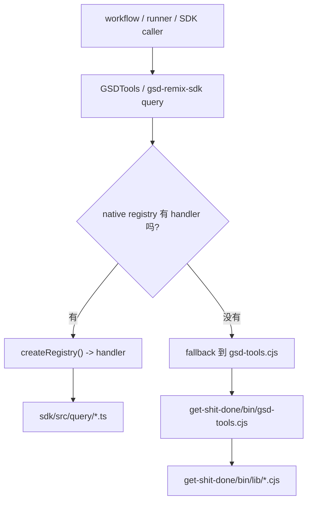
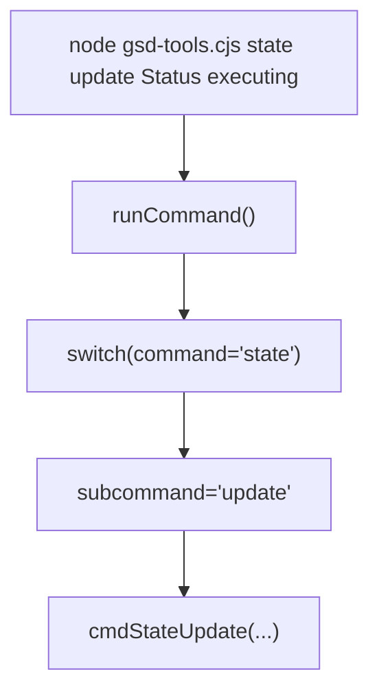
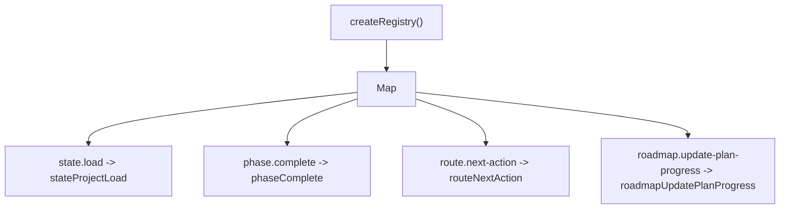
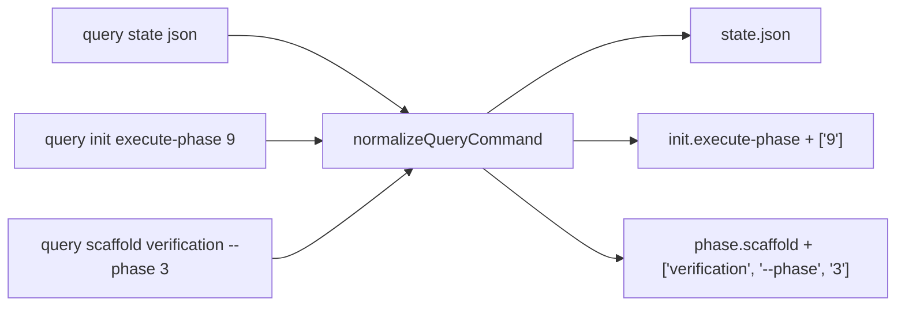
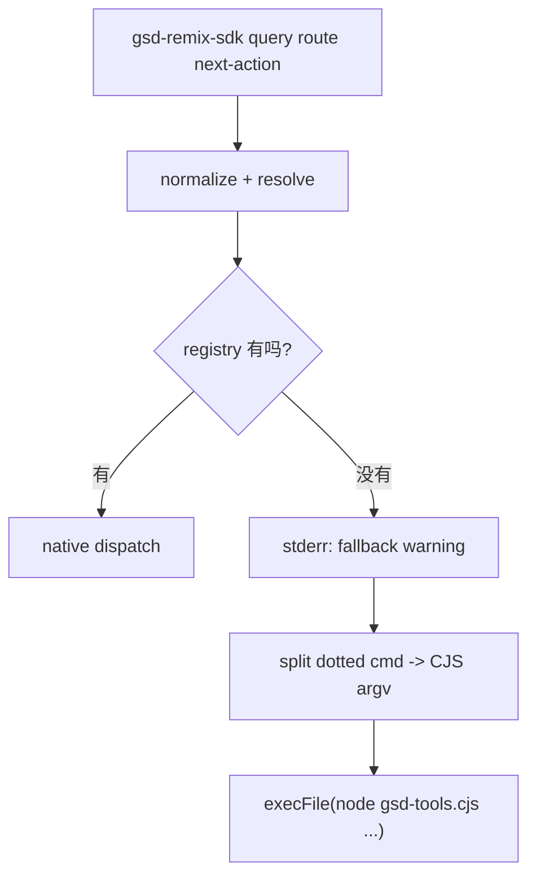
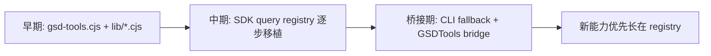

---
aliases:
  - GSD Query Registry And CJS Bridge
  - GSD Query 双轨结构
tags:
  - gsd
  - guide
  - sdk
  - query
  - architecture
  - obsidian
---

# 09. Query Registry And CJS Bridge

> [!INFO]
> 上一章：[[08-planning-as-external-memory]]
> 目录入口：[[README]]

## 这一章回答什么问题

看到这个仓库的人，很容易有一个疑问：

- 既然已经有 `gsd-remix-sdk query` 了，为什么还保留 `get-shit-done/bin/gsd-tools.cjs`？

这章就专门回答这个问题。

核心要点是：

1. 旧世界是 `gsd-tools.cjs` 这条 CLI 路线
2. 新世界是 `sdk/src/query/*` 这条 typed registry 路线
3. 现在两者不是互斥，而是通过 bridge 共存

一句话先说结论：

> GSD 不是“从旧 CLI 全量重写到 SDK”，而是“把命令面逐步迁移到 native query registry，同时保留一条兼容旧世界和 CLI-only 能力的 CJS 后路”。

## 先看总图

这张图里最重要的是：

- 新路已经存在
- 旧路还没完全消失
- bridge 层负责决定走哪条

## 1. 旧世界：`gsd-tools.cjs` 是一个大 CLI router

最核心的入口是：

- [`../get-shit-done/bin/gsd-tools.cjs`](../get-shit-done/bin/gsd-tools.cjs)

它开头就写得很直白：

- 这是兼容实现
- 推荐的新程序化接口是 `gsd-remix-sdk query`
- 但它仍然服务于 shell scripts 和 older workflows

### 1.1 它的结构本质上是“总开关 + 嵌套 subcommand”

旧 CLI 的核心分发方式就是：

- 一个大的 `runCommand(command, args, cwd, raw, defaultValue)`
- 里面再按 `switch (command)` 分发

例如：

- `state json`
- `state update`
- `phase complete`
- `init execute-phase`
- `workstream create`

这是一种非常经典的 CLI 设计：

- 顶层命令
- 子命令
- 一堆 `parseNamedArgs`

### 1.2 旧世界的优点

这套结构的优点很实际：

- shell 友好
- 调试直接
- 每个子命令都能单独跑
- 很多历史 workflow 都已经依赖它

所以它不会被一夜删掉。

## 2. 新世界：SDK query 是一个 flat registry

新路线的核心入口是：

- [`../sdk/src/query/index.ts`](../sdk/src/query/index.ts)
- [`../sdk/src/query/registry.ts`](../sdk/src/query/registry.ts)
- [`../sdk/src/cli.ts`](../sdk/src/cli.ts)

这里的思路和旧 CLI 很不一样。

### 2.1 它不是大 switch，而是注册表

`createRegistry()` 会把 handler 一次性注册进去，例如：

- `state.load`
- `state.update`
- `phase.complete`
- `init.execute-phase`
- `roadmap.update-plan-progress`
- `route.next-action`

这意味着新 query 层的核心抽象不是：

- “命令字符串进入一个大 switch”

而是：

- “命令 key 映射到 handler”

### 2.2 这层最大的变化是“命令名结构化”

新 registry 更偏向 dotted command：

- `state.load`
- `state.begin-phase`
- `init.plan-phase`
- `workstream.status`

但它又为了兼容旧世界，注册了很多 space-delimited alias：

- `state signal-waiting`
- `phase complete`
- `init execute-phase`

这说明它不是想强制所有调用方一夜切换风格，而是：

- 让新旧命名都能命中同一个 handler

## 3. 命令标准化层：`normalizeQueryCommand()`

新旧世界能接上，很大程度靠的是：

- [`../sdk/src/query/normalize-query-command.ts`](../sdk/src/query/normalize-query-command.ts)

它做的事情可以概括成：

- 把 CLI 风格 token 归一成 registry 能理解的命令键

例如：

- `state` + 无参数 -> `state.load`
- `state json` -> `state.json`
- `init execute-phase 9` -> `init.execute-phase` + `['9']`
- `scaffold verification --phase 3` -> `phase.scaffold` + 后续参数

这层非常关键，因为它把：

- 人类习惯的 CLI 写法

转换成了：

- registry 习惯的 canonical key

## 4. 命中规则：`resolveQueryArgv()` 做最长前缀匹配

标准化之后，还要决定到底命中哪个 handler。

这一步由：

- [`../sdk/src/query/registry.ts`](../sdk/src/query/registry.ts)

里的 `resolveQueryArgv()` 完成。

它的规则不是简单取第一个 token，而是：

- longest-prefix match

也就是说，它会尽量把更多前缀拼成命令名去试：

- 先试 `a.b.c`
- 再试 `a b c`
- 不行再缩短

这让下面这些写法都能工作：

- `state.update`
- `state update`
- `init.execute-phase`
- `init execute-phase`

所以新 registry 的命令分发，其实比旧 CLI 更灵活，不是更死。

## 5. CLI 层的真实分流：`gsd-remix-sdk query`

这一层最值得看的文件是：

- [`../sdk/src/cli.ts`](../sdk/src/cli.ts)

它把 `gsd-remix-sdk query` 这条链路写得很明确：

1. 先 parse CLI args
2. 抽出 `--pick`
3. `normalizeQueryCommand()`
4. `resolveQueryArgv()`
5. 如果 registry 命中，就直接 `registry.dispatch()`
6. 如果没命中，就看是否允许 fallback 到 `gsd-tools.cjs`

## 5.1 fallback 不是暗箱行为，而是显式策略

`cli.ts` 明确有：

- `queryFallbackToCjsEnabled()`

它看环境变量：

- `GSD_QUERY_FALLBACK`

默认是允许 fallback 的；如果你设成：

- `off`
- `never`
- `false`
- `0`

就会进入 strict mode。

这说明双轨并存不是 accidental，而是：

- 一条显式迁移策略

## 5.2 没命中时，CLI 会怎么 fallback

如果 registry 没找到 handler，CLI 会：

1. 打一条 bridge warning
2. 用 `dottedCommandToCjsArgv()` 把 dotted command 拆回 CJS 风格 argv
3. `execFile(node, [gsdToolsPath, ...argv])`
4. 解析 JSON 或 `@file:` 输出

也就是说：

- `gsd-remix-sdk query` 这个 CLI 表面上是统一入口
- 但底下可以透明桥接到旧 `gsd-tools.cjs`

## 6. 程序化入口：`GSDTools` 是 bridge 类

如果说 `cli.ts` 是命令行侧的桥，那：

- [`../sdk/src/gsd-tools.ts`](../sdk/src/gsd-tools.ts)

就是程序化调用侧的桥。

它非常关键，因为很多 runner 和 SDK 内部不是自己 shell 命令，而是走这个类。

## 6.1 `GSDTools` 的默认立场是“能 native 就 native”

`GSDTools` 构造时会：

- `createRegistry()`
- 根据 `preferNativeQuery`
- 再结合 `workstream`
- 决定 `shouldUseNativeQuery()`

默认逻辑是：

- `preferNativeQuery = true`
- 且没有 workstream 时，优先 native query

这说明 SDK 内部已经把 native registry 当成默认路径，而不是实验路径。

## 6.2 但它有一个重要例外：workstream

`GSDTools` 明确写了：

- 当 `workstream` 存在时，不走 native query，而回到 `gsd-tools.cjs`

原因也写得很实在：

- 要让 workstream 环境和 CJS 保持一致

这其实很好理解：

- workstream 路径路由、环境变量、老逻辑兼容
- 在这里还没有完全抽象到 SDK 内部统一处理

所以 workstream 是双轨结构仍然存在的一个现实原因。

## 6.3 更关键的一点：native handler 报错时，不会偷偷 fallback

`GSDTools` 的行为非常重要：

- 如果 native handler 命中了，但执行时报错
- 它不会悄悄再试一次 `gsd-tools.cjs`

只有一种情况会走 CJS：

- 根本没命中 native handler

这个设计很成熟，因为它避免了一个很糟的语义问题：

- 你以为自己在测 native handler
- 实际系统偷偷换到旧实现

所以这里的原则是：

- “没有 native handler” 可以回退
- “native handler 有但失败了” 必须显式暴露

## 6.4 它还为 hot path 做了 direct dispatch

`GSDTools` 里有一些 typed convenience methods：

- `phaseComplete()`
- `initPhaseOp()`
- `phasePlanIndex()`
- `initNewProject()`
- `configSet()`

这些方法很多都不是再走一次 CLI 解析，而是直接：

- `dispatchNativeJson(...)`
- `dispatchNativeRaw(...)`

这说明 SDK 已经不只是“包装 CLI”，而是开始有：

- 直接调用 registry 的热路径

## 7. 为什么要保留两套，而不是硬切

这一点在：

- [`../sdk/src/query/QUERY-HANDLERS.md`](../sdk/src/query/QUERY-HANDLERS.md)

里写得很清楚。

它明确区分了几类情况：

- native handler 已注册，追求和 CJS JSON parity
- 某些命令明确不注册，保留 CLI-only
- 某些是 SDK-only，还没有 CJS mirror

### 7.1 明确保留的 CLI-only 能力

文档里直接点名了：

- `graphify`
- `from-gsd2` / `gsd2-import`

这些不是“还没做”，而是：

- 产品决策上就暂时留在 CLI-only

### 7.2 也有反过来的 SDK-only 能力

例如 decision routing 这组：

- `check.config-gates`
- `check.phase-ready`
- `route.next-action`
- `check.completion`
- `check.gates`
- `check.verification-status`

文档明确说了：

- no `gsd-tools.cjs` mirror yet

这说明迁移不是单向“旧 -> 新”，而是新世界也在长出旧世界从来没有的能力。

## 8. 这条双轨真正靠什么维持一致性

最关键的不是桥接本身，而是：

- parity discipline

### 8.1 `QUERY-HANDLERS.md` 是迁移契约文档

这份文档不是随便写的说明书，而是在记录：

- 哪些命令已经注册
- 哪些保持 CLI-only
- fallback 规则
- golden parity 策略
- 哪些比较是 full `toEqual`
- 哪些只是 subset / shape parity

这说明迁移是被文档化和测试化的，不是口头约定。

### 8.2 golden tests 在帮它对齐 CJS 和 SDK

`QUERY-HANDLERS.md` 里还明确提到：

- `sdk/src/golden/*`
- `read-only-parity.integration.test.ts`

也就是说，native handler 不是“看起来差不多就行”，而是很多地方要跟 CJS 做对照。

所以新 registry 并不是在凭空重新定义行为，而是在：

- 尽可能复制旧 CLI 的可观察输出契约

## 9. `createRegistry()` 不只是 handler 列表，它还是统一事件面

`createRegistry()` 里除了注册 handler，还有一个很值得注意的设计：

- `QUERY_MUTATION_COMMANDS`

它会把：

- `state.*`
- `phase.*`
- `roadmap.update-plan-progress`
- `requirements.mark-complete`
- `commit`

这类 durable writes 命令统一包上一层 event emission。

也就是说，native query 层除了提供：

- 统一读写 API

还顺手提供了：

- mutation event surface

这一点是旧 `gsd-tools.cjs` 时代没有那么清晰抽出来的。

## 10. 所以这条演化路线大概可以这样理解

这里不是“rewrite complete”的故事，而更像：

- 一边搬
- 一边兼容
- 一边加新能力

## 11. 这套双轨设计最值得学的地方

### 1. 迁移不是硬切，而是带兼容桥

这减少了对现有 workflows、scripts、automation 的破坏。

### 2. bridge 规则写得很明确

什么时候 native，什么时候 fallback，不是猜的。

### 3. native 失败不做静默降级

这避免把 bug 掩盖掉。

### 4. parity 被文档和测试共同约束

这让“迁移”变成工程问题，而不是口头承诺。

### 5. 新世界不是只在复制旧世界

它已经开始长出 SDK-only 的 decision routing 等能力。

## 12. 但它的代价也很明显

### 1. 命令命名会显得复杂

你会同时看到：

- `state load`
- `state.load`
- `state json`
- `state.json`

这对新读者并不轻松。

### 2. 一致性维护成本很高

每迁一个 handler，都要考虑：

- 输出契约
- alias
- fallback
- tests
- 文档

### 3. workstream 还在强迫部分路径回旧世界

这说明迁移还没有到“纯 SDK”阶段。

### 4. 桥接期天然更难 debug

因为你必须先判断：

- 当前到底走的是 native registry
- 还是 CJS subprocess

## 13. 看完这章后，你应该记住什么

- 旧世界的核心是 `gsd-tools.cjs` 大 CLI router，新世界的核心是 `createRegistry()`。
- `normalizeQueryCommand()` 和 `resolveQueryArgv()` 是新旧命令风格之间的关键适配层。
- `gsd-remix-sdk query` 默认优先 native handler，没命中时才 fallback 到 `gsd-tools.cjs`。
- `GSDTools` 是程序化 bridge；它偏向 native query，但 workstream 仍会把它拉回 CJS。
- native handler 一旦命中却执行失败，不会静默 fallback，这一点非常关键。
- 这套双轨不是临时混乱，而是一种显式、可测试、可逐步迁移的架构策略。

## 相关笔记

- 上一章：[[08-planning-as-external-memory]]
- 目录入口：[[README]]
- 下一章：[[10-hooks-and-guards]]
