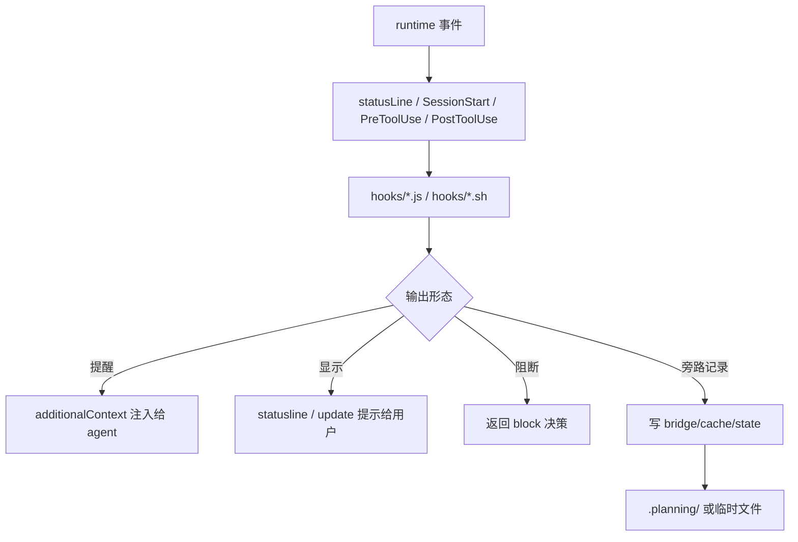
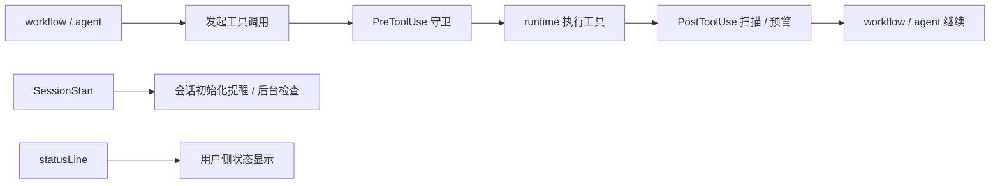
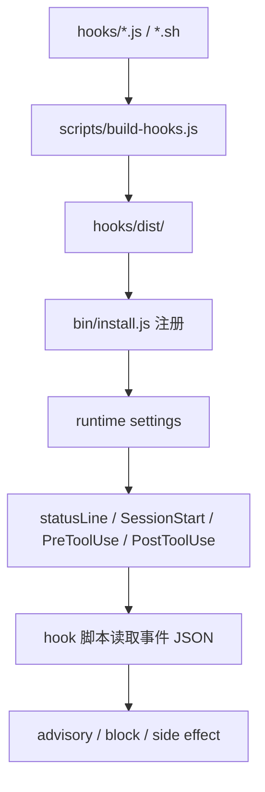
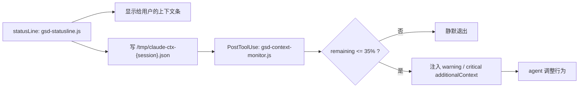
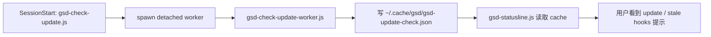

---
aliases:
  - GSD Hooks And Guards
  - GSD Hook 与守卫层
tags:
  - gsd
  - guide
  - hooks
  - guards
  - runtime
  - obsidian
---

# 10. Hooks And Guards

> [!INFO]
> 上一章：[[09-query-registry-and-cjs-bridge]]
> 目录入口：[[README]]

## 这一章回答什么问题

前面几章我们已经把 command、workflow、agent、query、`.planning/` 这些主干机制拆开了。

但如果你继续读源码，很快会碰到一个问题：

- workflow 在做流程编排
- agent 在做具体工作
- query handler 在读写状态

那谁在盯着这些工作什么时候开始偏航、什么时候上下文快耗尽、什么时候读进来的文本可能带 prompt injection、什么时候有人绕开 GSD 直接改代码？

这一章专门回答这个问题。

一句话先说结论：

> `hooks/` 这一层不是另一个 workflow，而是贴着 runtime 事件边界运行的“观察层 + 守卫层”。它不负责推进 phase，但负责在 session 和 tool 调用周围持续提醒、扫描、约束，必要时阻断。

## 关键源码入口

- [`../hooks/gsd-statusline.js`](../hooks/gsd-statusline.js)
- [`../hooks/gsd-context-monitor.js`](../hooks/gsd-context-monitor.js)
- [`../hooks/gsd-prompt-guard.js`](../hooks/gsd-prompt-guard.js)
- [`../hooks/gsd-read-guard.js`](../hooks/gsd-read-guard.js)
- [`../hooks/gsd-read-injection-scanner.js`](../hooks/gsd-read-injection-scanner.js)
- [`../hooks/gsd-workflow-guard.js`](../hooks/gsd-workflow-guard.js)
- [`../hooks/gsd-validate-commit.sh`](../hooks/gsd-validate-commit.sh)
- [`../hooks/gsd-session-state.sh`](../hooks/gsd-session-state.sh)
- [`../hooks/gsd-phase-boundary.sh`](../hooks/gsd-phase-boundary.sh)
- [`../hooks/gsd-check-update.js`](../hooks/gsd-check-update.js)
- [`../hooks/gsd-check-update-worker.js`](../hooks/gsd-check-update-worker.js)
- [`../scripts/build-hooks.js`](../scripts/build-hooks.js)
- [`../bin/install.js`](../bin/install.js)
- [`../get-shit-done/templates/config.json`](../get-shit-done/templates/config.json)

## 先看总图

这张图里最重要的一点是：

- workflow 是“业务流程编排”
- hook 是“runtime 边界拦截”

两者不在一个层次上。

更准确地说，hook 不替 workflow 做 phase 逻辑，而是在 workflow 之外做：

- 观察
- 预警
- 轻量策略执行
- 极少数硬阻断

## 1. hook 不是业务工作流，而是 runtime 边界层

如果把前面的章节比作主干流水线，这一层更像是贴在流水线旁边的传感器和护栏。

它的触发方式不是：

- “用户执行了哪个 `/gsd-*` 命令”

而是：

- session 启动了
- 某个工具即将被调用
- 某个工具刚刚返回
- statusline 需要刷新

所以它的心智模型应该是：

也就是说，hook 是围绕“工具调用生命周期”工作的，而不是围绕“phase 生命周期”工作的。

## 2. 这些 hook 是怎么被构造出来的

你前面提过，希望不只知道它们“干什么”，还要知道它们“怎么被构造出来”。

hook 这一层也一样。

它不是单纯把几个脚本丢到 `hooks/` 目录里就完了，而是至少有四步。

### 2.1 第一步：源码定义

原始定义都在：

- [`../hooks/`](../hooks/)

里面。

这里的每个文件本质上都是一个小的 runtime filter：

- 从 `stdin` 收 JSON 事件
- 判断当前事件是不是自己关心的类型
- 输出 advisory JSON，或者安静退出
- 少数情况下返回明确 block 决策

### 2.2 第二步：构建成可安装资产

[`../scripts/build-hooks.js`](../scripts/build-hooks.js) 会把这些 hook 复制到 `hooks/dist/`。

这里最值得注意的不是“复制”，而是它在复制前会先做一层 JavaScript 语法校验。

这说明 hook 在作者眼里不是随手附带的小脚本，而是一个一旦出错就会污染整条 runtime 交互链的关键资产。

### 2.3 第三步：注册到 runtime 事件

真正把 hook 接进系统的是 [`../bin/install.js`](../bin/install.js)。

从源码上看，它做了几件关键事：

1. 决定这个 runtime 支持哪些 hook 事件
2. 给不同 hook 绑定不同 matcher
3. 设置 timeout
4. 处理 runtime 差异
   例如 Claude 侧是 `PreToolUse` / `PostToolUse`，Gemini 一侧会出现 `BeforeTool` / `AfterTool`

这意味着 hook 的完整构造并不是：

- `hooks/xxx.js`

而是：

- `hooks/xxx.js`
- `scripts/build-hooks.js` 产物
- `install.js` 注册规则
- runtime settings 里的事件绑定
- 项目级 `.planning/config.json` 开关

### 2.4 第四步：运行时再受项目配置约束

并不是所有 hook 都永远同样生效。

[`../get-shit-done/templates/config.json`](../get-shit-done/templates/config.json) 里至少能看到这一类开关：

- `hooks.context_warnings`

而源码里还能看到两类常用 gating：

- `hooks.workflow_guard`
- `hooks.community`

这说明 hook 不是纯 runtime 全局策略，而是“runtime 注册 + project 局部启停”的组合。

## 3. 事件模型：GSD 到底挂了哪些通道

把这一层压缩成表格，会比较清楚：

| 通道 | 代表 hook | 主要职责 |
| --- | --- | --- |
| `statusLine` | `gsd-statusline.js` | 给用户显示当前任务、目录、上下文压力、更新提示 |
| `SessionStart` | `gsd-check-update.js`、`gsd-session-state.sh` | 会话开始时做后台检查和状态定向 |
| `PreToolUse` / `BeforeTool` | `gsd-prompt-guard.js`、`gsd-read-guard.js`、`gsd-workflow-guard.js`、`gsd-validate-commit.sh` | 工具执行前提醒、扫描、策略约束 |
| `PostToolUse` / `AfterTool` | `gsd-context-monitor.js`、`gsd-read-injection-scanner.js`、`gsd-phase-boundary.sh` | 工具执行后根据结果做告警、扫描或提醒 |

这里一个很关键的认知是：

- `gsd-statusline.js` 不是普通 Pre/Post hook
- 它是一条并行的“用户可见状态通道”

而 `gsd-context-monitor.js` 则是“agent 可见告警通道”。

这两条通道一起，才补齐了“用户看得到上下文压力，agent 也能感知到上下文压力”。

## 4. 最关键的桥：`statusline -> bridge file -> context monitor`

这一段是整个 hook 层里最值得单独记住的设计。

如果只有 statusline，用户能看见上下文快满了，但 agent 本身并不知道。
如果只有 post-tool 告警，用户未必知道当前上下文到底已经危险到什么程度。

GSD 的做法是把这两者桥接起来。

### 4.1 `gsd-statusline.js` 负责两件事

第一件事是用户侧显示：

- 当前 model
- 当前 task 或 GSD state
- 当前目录
- context usage bar
- update / stale hooks 提示

第二件事是把上下文指标写到临时 bridge 文件：

- `/tmp/claude-ctx-{session_id}.json`

这个文件里有：

- `session_id`
- `remaining_percentage`
- `used_pct`
- `timestamp`

### 4.2 `gsd-context-monitor.js` 再读取这份 bridge

它在每次 tool 调用后运行，做下面这些判断：

- 指标是不是太旧
- 剩余上下文是不是低于 `35%`
- 是否已经进入 `25%` 以下的 critical 区
- 最近是否刚提醒过，需要做 debounce

然后把结果作为 `additionalContext` 注入回 agent。

### 4.3 critical 时它还会自动留下恢复面包屑

这个点非常关键。

当：

- 上下文已经 critical
- 当前目录里有 `.planning/STATE.md`
- 还没有记录过这次 critical

`gsd-context-monitor.js` 会 fire-and-forget 地调用：

- `gsd-tools.cjs state record-session --stopped-at ...`

也就是说，这个 hook 不只是“喊一声上下文不够了”，还会在真正要撞墙时，给 `/gsd-resume-work` 留一份自动恢复线索。

这就是很典型的 GSD 风格：

- 不把恢复能力只寄托在聊天上下文里
- 而是顺手把恢复面包屑落回外部记忆层

## 5. `PreToolUse` 这一侧：写之前先提醒、先筛查、必要时阻断

`PreToolUse` 这一层主要管“不要把错误带进系统里”。

### 5.1 `gsd-prompt-guard.js`

这是 `.planning/` 写入前的 prompt injection 扫描。

它只关注：

- `Write`
- `Edit`
- 目标路径位于 `.planning/`

它会检查：

- 常见 prompt injection pattern
- invisible Unicode

但它是 advisory only，不会 block。

这背后的设计取舍很明确：

- `.planning/` 是高价值上下文
- 写进去的文本以后会被很多 agent 当成可信输入
- 但这里如果做强阻断，误报会把正常 workflow 卡死

所以它选择“强提醒，不强拦截”。

### 5.2 `gsd-read-guard.js`

这个 hook 主要是给非 Claude runtime 兜底。

它针对的问题不是业务错误，而是工具使用死循环：

- 目标文件已经存在
- 模型还没读过
- runtime 要求 read-before-edit
- 模型不断重试 edit

所以它会在 `Write/Edit` 前提醒：

- 先 `Read`
- 再改

但在 Claude 环境里它会主动跳过，因为 Claude Code 本身已经原生处理这件事。

这说明 hook 层里有一类逻辑其实是在补不同 runtime 的行为差异，而不是在补 workflow 差异。

### 5.3 `gsd-workflow-guard.js`

这个 hook 很有代表性，因为它体现了 GSD 对“绕开 workflow 直接改代码”的态度。

它会在下面这组条件同时成立时提醒：

- 当前是 GSD 项目
- `hooks.workflow_guard` 被显式开启
- 当前在 `Write/Edit`
- 改的不是 `.planning/`
- 也不是 `.gitignore`、`.env`、`CLAUDE.md` 这类白名单文件
- 当前也不在 task subagent / workflow 上下文里

它不会 block，只会提醒：

- 这次改动不会进 `STATE.md`
- 也不会产出 `SUMMARY.md`
- 如果想保留 GSD 的状态追踪，考虑走 `/gsd-fast` 或 `/gsd-quick`

这其实是在做“流程边界提醒”，不是在做权限控制。

### 5.4 `gsd-validate-commit.sh`

这是这一层里最明显的硬约束例子。

它只盯：

- `Bash`
- 并且 command 是 `git commit ...`

如果提交信息不符合 Conventional Commits，它会：

- 输出 `{"decision":"block","reason":"..."}` JSON
- `exit 2`

这里就不是 advisory 了，而是真正让 runtime 不要继续执行。

## 6. `PostToolUse` 这一侧：结果出来以后再做二次检查

如果说 `PreToolUse` 更像入口守卫，那么 `PostToolUse` 更像结果扫描器。

### 6.1 `gsd-read-injection-scanner.js`

这是非常值得学的一层防线。

它不是扫描“将要写入”的内容，而是扫描“刚刚读进上下文”的内容。

它关注的是：

- 普通 injection pattern
- 专门为 summarisation / compaction 设计的持久化指令
- invisible Unicode
- Unicode tag block

最妙的点不只是“扫描”，而是它知道自己什么时候该闭嘴。

它明确排除了很多高误报路径，比如：

- `.planning/`
- `REVIEW.md`
- `CHECKPOINT`
- security / injection 相关文档
- hook 自己的源码

所以这个 hook 的思路不是：

- “看到像 injection 的东西一律报警”

而是：

- “重点盯不受信的 read 输入，同时降低已知高噪声路径的误报”

### 6.2 `gsd-phase-boundary.sh`

这个 hook 很轻，但很有 GSD 味道。

它在 `.planning/` 文件被改动后提醒：

- 你改了 planning 资产
- 现在要不要顺手确认 `STATE.md` 也该更新

它不做自动修正，也不做复杂推断，只做边界提醒。

### 6.3 `gsd-context-monitor.js`

它虽然已经在上面单独讲过，但从事件分类上看，它本质上也属于：

- post-tool 结果判断器

也就是等工具跑完，才根据最新上下文压力决定要不要给 agent 发 warning。

## 7. `SessionStart` 和 `statusline`：会话定向与后台侧车

这一组 hook 不是围绕单次工具调用，而是围绕 session 生命周期工作。

### 7.1 `gsd-session-state.sh`

这是一个很朴素但很实用的 SessionStart hook。

当：

- `.planning/config.json` 里 `hooks.community` 为 `true`

它就会在会话开始时输出：

- `STATE.md` 开头部分
- 当前 config mode

这相当于在会话刚建立时，先给 agent 一个“你现在站在哪”的定向提醒。

### 7.2 `gsd-check-update.js` 与 `gsd-check-update-worker.js`

这一对脚本展示了 hook 层里的另一种模式：

- 前台触发器
- 后台 worker

`gsd-check-update.js` 本身并不做重活，它只是：

- 定位版本文件
- 准备 cache 路径
- spawn 一个 detached worker

真正的检查和 stale hook 探测，是在 `gsd-check-update-worker.js` 里做的。

而这个 worker 的结果，最后又会被 `gsd-statusline.js` 读出来，变成：

- `⬆ /gsd-update`
- `⚠ stale hooks`

所以这又是一条桥：

这条链说明 hook 层不只会“拦”和“扫”，也会做轻量后台观察，并把结果回灌给 statusline。

## 8. 这层真正的设计取舍：大多数 hook 都是软性的

如果把这些 hook 按行为方式分，差别会很明显：

| hook | 默认行为 |
| --- | --- |
| `gsd-context-monitor.js` | advisory |
| `gsd-prompt-guard.js` | advisory |
| `gsd-read-guard.js` | advisory |
| `gsd-read-injection-scanner.js` | advisory |
| `gsd-workflow-guard.js` | advisory |
| `gsd-phase-boundary.sh` | advisory |
| `gsd-session-state.sh` | advisory |
| `gsd-validate-commit.sh` | hard block |

这不是偶然。

因为在长流程自治系统里，hook 如果动不动就强阻断，很容易产生两类坏后果：

1. 误报把正常 workflow 卡住
2. 模型遇到硬错误后反复重试，反而更烧 token

所以 GSD 大量使用的是：

- advisory warning
- `additionalContext`
- background side effect

只有在 commit message 这种规则非常稳定、误判代价低的场景，才上硬 block。

我觉得这是这层最成熟的地方之一。

## 9. 配置模型：它不是“全开”或“全关”，而是三层门控

把源码合起来看，hook 大致有三种启用方式。

### 9.1 默认开启型

例如：

- `hooks.context_warnings`

模板里默认就是 `true`。

这类 hook 更像系统基础卫生。

### 9.2 显式 opt-in 型

例如：

- `hooks.workflow_guard`

默认不开，要用户明确选择。

因为它已经开始介入“你应该怎么改代码”的工作方式，不适合作为强默认。

### 9.3 community bundle 型

例如：

- `gsd-session-state.sh`
- `gsd-phase-boundary.sh`
- `gsd-validate-commit.sh`

这些 hook 在安装时会被注册，但运行时如果：

- `hooks.community !== true`

就直接 no-op。

这个设计非常务实：

- 安装期不需要再做复杂的按项目选择
- 运行期再按项目策略开关

## 10. 这套 hook 设计最值得学的地方

### 1. 它把“用户可见状态”和“agent 可见告警”拆成了两条通道

`gsd-statusline.js` 给用户看，`gsd-context-monitor.js` 给 agent 看，中间再靠 bridge 文件连接。

### 2. 它做的是 defense-in-depth，不是单点防御

写入 `.planning/` 前扫一遍，`Read` 结果进上下文后再扫一遍，这就是典型的双层防线。

### 3. 它知道哪里该软，哪里该硬

大多数场景只提醒，不把系统卡死；极少数高确定性规则再硬阻断。

### 4. 它把恢复能力和状态感知重新接回 `.planning/`

critical context warning 不只是告警，还会顺手留下 session 记录面包屑。

### 5. 它的耦合方式很轻

大部分 hook 不需要理解完整 workflow 语义，只要理解事件输入和少量项目状态即可。

## 11. 但它的代价和历史债也很明显

### 1. runtime 差异把事件模型搞复杂了

你会同时看到：

- `PreToolUse`
- `BeforeTool`
- `PostToolUse`
- `AfterTool`
- `statusLine`

这会让 hook 文档化和测试都更重。

### 2. 策略分散在多个地方

真正的行为是四处拼起来的：

- hook 源码
- `install.js` 注册
- runtime settings
- `.planning/config.json`

所以理解成本不低。

### 3. advisory hook 本质上仍依赖模型配合

它能提醒，但不保证模型一定听。

这意味着安全性和流程纪律不是完全由系统强制出来的。

### 4. bridge file / cache file 很务实，但不算优雅

像 `/tmp/claude-ctx-{session}.json` 这种桥接，是很好用的工程折中，但它也说明这层不是一个统一抽象干净的 event bus，而是多条 side channel 拼出来的。

## 12. 看完这章后，你应该记住什么

- `hooks/` 在 GSD 里是 runtime 边界层，不是另一个 workflow 层。
- hook 的完整构造是“源码脚本 + 构建复制 + runtime 事件注册 + 项目级配置 gating”，不是一个孤立脚本文件。
- `gsd-statusline.js` 和 `gsd-context-monitor.js` 通过临时 bridge 文件形成了一条“用户可见状态 + agent 可见告警”的双通道。
- `PreToolUse` 主要防止坏输入和坏操作进入系统，`PostToolUse` 主要在结果出来后做扫描和预警。
- 这套设计大量采用 advisory hook，只在 commit message 这种高确定性场景做硬阻断。
- hook 层最值得学的不是某个单点脚本，而是这种低耦合、分层、带恢复意识的防线设计。

## 相关笔记

- 上一章：[[09-query-registry-and-cjs-bridge]]
- 目录入口：[[README]]
- 下一章：[[11-agent-family-map]]
