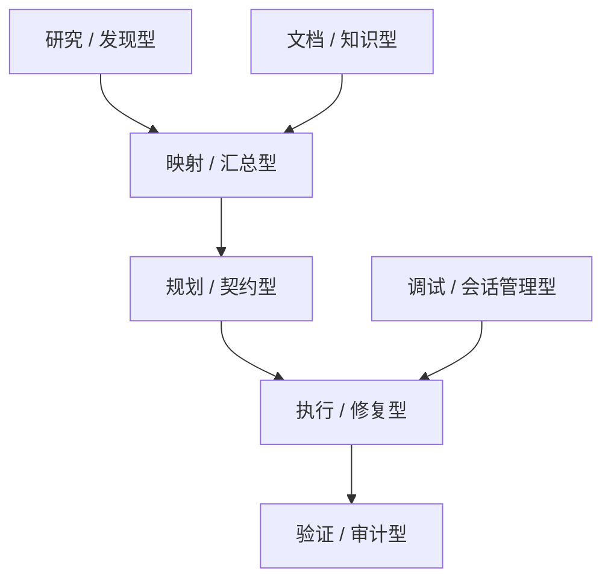
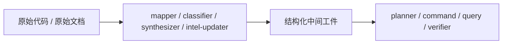
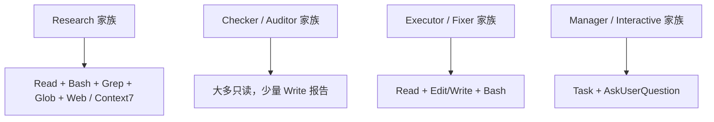

---
aliases:
  - GSD Agent Family Map
  - GSD Agent 谱系图
tags:
  - gsd
  - guide
  - agents
  - architecture
  - obsidian
---

# 11. Agent Family Map

> [!INFO]
> 上一章：[[10-hooks-and-guards]]
> 目录入口：[[README]]

## 这一章回答什么问题

读到 `agents/` 目录时，很多人的第一反应是：

- 为什么会有 33 个 agent？
- 这些 agent 是不是只是“一个任务一个 prompt”地不断堆出来的？

如果只是平铺文件名，你会觉得很散。

但如果按“它在整条流水线里的位置”和“它交付什么工件”去看，这 33 个 agent 其实是几类非常稳定的角色模板。

一句话先说结论：

> GSD 不是有 33 个互不相干的 agent，而是有一组重复出现的角色原型。每个 agent 的差异，主要体现在它负责哪个阶段、交付哪种工件、拿到多大的工具权限。

## 关键源码入口

- [`../agents/gsd-project-researcher.md`](../agents/gsd-project-researcher.md)
- [`../agents/gsd-codebase-mapper.md`](../agents/gsd-codebase-mapper.md)
- [`../agents/gsd-planner.md`](../agents/gsd-planner.md)
- [`../agents/gsd-plan-checker.md`](../agents/gsd-plan-checker.md)
- [`../agents/gsd-executor.md`](../agents/gsd-executor.md)
- [`../agents/gsd-verifier.md`](../agents/gsd-verifier.md)
- [`../agents/gsd-doc-writer.md`](../agents/gsd-doc-writer.md)
- [`../agents/gsd-doc-verifier.md`](../agents/gsd-doc-verifier.md)
- [`../agents/gsd-debug-session-manager.md`](../agents/gsd-debug-session-manager.md)
- [`../commands/gsd/new-project.md`](../commands/gsd/new-project.md)
- [`../commands/gsd/plan-phase.md`](../commands/gsd/plan-phase.md)
- [`../commands/gsd/execute-phase.md`](../commands/gsd/execute-phase.md)

## 先看总图

你可以把这张图理解成：

- 有些 agent 负责发现事实
- 有些 agent 负责把事实变成结构化资产
- 有些 agent 负责把资产变成计划
- 有些 agent 负责真正干活
- 有些 agent 负责怀疑前面的结果

这不是 agent 名字的分类，而是流水线位置的分类。

## 1. 最重要的分类原则：按“工件”和“位置”看，不按名字看

如果只按名字看：

- researcher
- planner
- checker
- auditor

你会觉得它们只是语义上不同。

但从源码看，真正稳定的是三件事：

1. 它接收什么输入
2. 它产出什么工件
3. 它拿到什么工具预算

比如：

- `gsd-project-researcher` 产出 `.planning/research/*.md`
- `gsd-planner` 产出 `PLAN.md`
- `gsd-executor` 产出代码变更和 `SUMMARY.md`
- `gsd-verifier` 产出 `VERIFICATION.md`

所以 agent 家族图本质上是“工件流转图”。

## 2. 第一大家族：研究 / 发现型 agent

这一族最常见的动词是：

- research
- analyze
- profile

它们的共同点是：

- 输入通常是 phase / project / gray area
- 输出通常是研究结论或假设，不直接改业务代码
- 工具上经常有 `Read`、`Bash`、`Grep`、`Glob`
- 更靠近外部知识的 agent 会拿到 `WebSearch`、`WebFetch`、`Context7`

### 2.1 这一族包含谁

| agent | 主要位置 | 典型产物 |
| --- | --- | --- |
| `gsd-project-researcher` | `new-project` | `.planning/research/*.md` |
| `gsd-phase-researcher` | `plan-phase` | `RESEARCH.md` |
| `gsd-ai-researcher` | `ai-integration` | `AI-SPEC.md` 的框架实现建议 |
| `gsd-domain-researcher` | `ai-integration` | 业务域评估标准和风险 |
| `gsd-ui-researcher` | `ui-phase` | `UI-SPEC.md` |
| `gsd-advisor-researcher` | `discuss-phase advisor mode` | 单个 gray area 的比较表 |
| `gsd-assumptions-analyzer` | `discuss-phase assumptions mode` | 带证据的假设清单 |
| `gsd-user-profiler` | profile 工作流 | 用户行为画像 |

### 2.2 这一族最值得注意的点

它们不是泛化的“去搜搜看” agent，而是把研究对象切得很细：

- 项目级研究
- phase 级研究
- UI 设计契约研究
- AI 集成研究
- 单个 gray area 决策研究

这说明 GSD 的思路不是“一个 researcher 全包”，而是按下游消费者来定研究粒度。

换句话说：

- `gsd-project-researcher` 研究给 `roadmapper`
- `gsd-phase-researcher` 研究给 `planner`
- `gsd-advisor-researcher` 研究给 `discuss-phase`

## 3. 第二大家族：映射 / 汇总 / 索引型 agent

这一族不直接做“决策”，它们更像是把代码库或已有文档压成更容易消费的中间层。

### 3.1 这一族包含谁

| agent | 主要位置 | 典型产物 |
| --- | --- | --- |
| `gsd-codebase-mapper` | `map-codebase` / `scan` | `.planning/codebase/*.md` |
| `gsd-pattern-mapper` | `plan-phase` | `PATTERNS.md` |
| `gsd-intel-updater` | `/gsd-intel refresh` | `.planning/intel/*` |
| `gsd-research-synthesizer` | `new-project` | `.planning/research/SUMMARY.md` |
| `gsd-doc-classifier` | `ingest-docs` | 单文档分类 JSON |
| `gsd-doc-synthesizer` | `ingest-docs` | 聚合后的冲突与综合上下文 |

### 3.2 这一族为什么重要

它们解决的是同一个问题：

- 原始输入太大、太散、太贵，不能每次都重新读

所以这类 agent 会把信息“压缩成可复用工件”。

例如：

- `gsd-codebase-mapper` 把代码库压成 7 份专题地图
- `gsd-intel-updater` 把代码库压成结构化索引
- `gsd-research-synthesizer` 把 4 份研究压成一份 roadmap 友好的 `SUMMARY.md`

这也是 GSD 减轻主编排器上下文负担的核心手段之一。

## 4. 第三大家族：规划 / 契约型 agent

这一族处在“理解”与“执行”之间，负责把模糊目标收缩成更硬的执行契约。

### 4.1 这一族包含谁

| agent | 主要位置 | 典型产物 |
| --- | --- | --- |
| `gsd-roadmapper` | `new-project` | `ROADMAP.md`、`STATE.md` |
| `gsd-planner` | `plan-phase` | `PLAN.md` |
| `gsd-plan-checker` | `plan-phase` | 对计划的 blocker/warning 审核 |
| `gsd-eval-planner` | `ai-integration` | AI eval strategy |
| `gsd-framework-selector` | `ai-integration` / `select-framework` | 框架决策矩阵 |
| `gsd-ui-checker` | `ui-phase` | `UI-SPEC.md` 的 PASS / FLAG / BLOCK |

### 4.2 这一族的共同模式

它们几乎都在做“contract hardening”：

- roadmapper 把 requirements 变 phase contract
- planner 把 phase contract 变 execution contract
- plan-checker 验证 execution contract 是否真能交付
- ui-checker 验证 design contract 是否足够清晰

所以这类 agent 的本质不是“想点子”，而是“把边界锁硬”。

### 4.3 一个很值得记住的对子

GSD 里最经典的配对就是：

- `gsd-planner`
- `gsd-plan-checker`

前者负责产出，后者负责怀疑。

这对配对后来在别处也重复出现了：

- `gsd-doc-writer` / `gsd-doc-verifier`
- `gsd-ui-researcher` / `gsd-ui-checker`
- `gsd-executor` / `gsd-verifier`

也就是说，GSD 很少让“同一个 agent 既写又判自己写得对不对”。

## 5. 第四大家族：执行 / 修复型 agent

这一族是真正会动代码、写文件、做提交的 agent。

它们的工具预算也明显更重：

- `Edit`
- `Write`
- `Bash`

### 5.1 这一族包含谁

| agent | 主要位置 | 典型产物 |
| --- | --- | --- |
| `gsd-executor` | `execute-phase` | 代码变更、提交、`SUMMARY.md` |
| `gsd-code-fixer` | `code-review-fix` | 按 REVIEW 修复后的代码和 `REVIEW-FIX.md` |
| `gsd-debugger` | `debug` | 调试发现、测试、可能的 fix |
| `gsd-debug-session-manager` | `debug` | 多轮调试会话的 checkpoint 和路由 |

### 5.2 这一族内部也分两种

一种是直接执行计划：

- `gsd-executor`

另一种是基于“已有问题清单”做定向修复：

- `gsd-code-fixer`
- `gsd-debugger`

所以它们虽然都能改代码，但“改代码的理由”不同：

- executor 是按 plan 前推
- fixer/debugger 是按问题后推

## 6. 第五大家族：验证 / 审计型 agent

这一族是 GSD 里最“怀疑主义”的一层。

它们的共性是：

- 通常偏只读
- 目标不是继续产出，而是找缺口
- 输出更接近 verdict、review、audit、coverage gap

### 6.1 这一族包含谁

| agent | 主要位置 | 典型产物 |
| --- | --- | --- |
| `gsd-verifier` | `execute-phase` 之后 | `VERIFICATION.md` |
| `gsd-code-reviewer` | `code-review` | `REVIEW.md` |
| `gsd-doc-verifier` | `docs-update` | 逐文档验证 JSON |
| `gsd-integration-checker` | cross-phase integration | E2E 集成检查 |
| `gsd-nyquist-auditor` | `validate-phase` | 测试与覆盖缺口 |
| `gsd-security-auditor` | `secure-phase` | `SECURITY.md` |
| `gsd-eval-auditor` | `eval-review` | `EVAL-REVIEW.md` |
| `gsd-ui-auditor` | `ui-review` | `UI-REVIEW.md` |

### 6.2 这一族最值得学的地方

它们不是“补充说明”，而是另一套独立判断层。

比如：

- `gsd-verifier` 明确说不信 `SUMMARY.md`
- `gsd-doc-verifier` 假设文档默认是错的，逐条 claim 去核
- `gsd-plan-checker` 假设计划默认有缺口

这说明 GSD 的质量策略不是“让上游更努力”，而是“下游必须带怀疑地验”。

## 7. 第六大家族：文档 / 知识交付型 agent

这类 agent 不是在做规划或验证，而是在维护知识成品本身。

### 7.1 这一族包含谁

| agent | 主要位置 | 典型产物 |
| --- | --- | --- |
| `gsd-doc-writer` | `docs-update` | README / ARCHITECTURE / API 文档等 |

严格说，`doc-classifier`、`doc-synthesizer`、`doc-verifier` 也都在文档链路上，但它们更像 intake / synthesis / audit，所以我前面把它们拆到别的家族去了。

`gsd-doc-writer` 之所以值得单列，是因为它展示了另一种 agent 设计：

- 不是围绕 phase
- 而是围绕 assignment block

也就是：

- 同一个 agent
- 通过 `<doc_assignment>` 改变输出模式

这和 `planner / executor` 这种 phase-centered agent 是不同风格。

## 8. 这些家族背后还有一个更深的模式：工具预算分层

如果你看各 agent 的 `tools:` frontmatter，会发现它们也按家族成簇。

这说明 agent 家族不只是“prompt 主题不同”，而是连能力预算都一起被设计进去了。

例如：

- 研究型 agent 常有 `WebSearch`
- checker 常没有 `Edit`
- executor/fixer 常有 `Edit`
- debug-session-manager 这种管理型 agent 同时有 `Task` 和 `AskUserQuestion`

这正是“角色边界”在工具层上的体现。

## 9. 把 33 个 agent 压成一句话，你应该怎么记

我会这样记：

- 研究型：找事实、找模式、找选择
- 映射型：把大量输入压成中间工件
- 规划型：把目标锁成执行契约
- 执行型：真正改代码、交工件
- 验证型：不信上游，专找缺口
- 管理型：在长流程里做路由、checkpoint、交接

如果你记住这六层，`agents/` 目录就不会再像随机堆出来的 33 份 prompt。

## 10. 这套 agent 谱系最值得学的地方

### 1. agent 不是按“话题”切，而是按“工件责任”切

这让交接边界更清楚。

### 2. 同一类模式会重复复用

research / synthesize / create / check / audit 这条链，在很多子系统里都重复出现。

### 3. 工具权限和角色是绑定设计的

不是所有 agent 都能改代码，也不是所有 agent 都能上网。

### 4. agent 数量多，但真正的原型并不多

所以系统复杂度没有文件数量看起来那么失控。

## 11. 但它的代价也很明显

### 1. taxonomy 很容易膨胀

当系统越来越大时，很容易再多出：

- 新 researcher
- 新 checker
- 新 auditor

名字会越来越细，学习门槛也会上升。

### 2. 家族边界并不总是完美

例如某些 agent 同时带一点 synthesis 和 planning 味道，某些 doc agent 既像 intake 又像 verification。

### 3. 使用者必须理解“找谁来做”

如果没有 workflow 帮忙路由，单看 agent 名字不一定容易选对。

## 12. 看完这章后，你应该记住什么

- `agents/` 的 33 个文件背后其实是 6 类比较稳定的角色家族。
- 最好的分类方式不是看名字，而是看它在流水线里的位置、交付的工件、拥有的工具预算。
- GSD 最常见的模式是成对出现：research / synthesize、planner / checker、executor / verifier、writer / verifier。
- 研究型 agent 往往拿 Web/Context7，执行型 agent 才拿 `Edit`，这体现了权限按角色切分。
- 这套系统最强的地方不是 agent 多，而是 agent 之间的“工件交接”非常明确。

## 相关笔记

- 上一章：[[10-hooks-and-guards]]
- 目录入口：[[README]]
- 下一章：[[12-discuss-spec-and-context-capture]]
