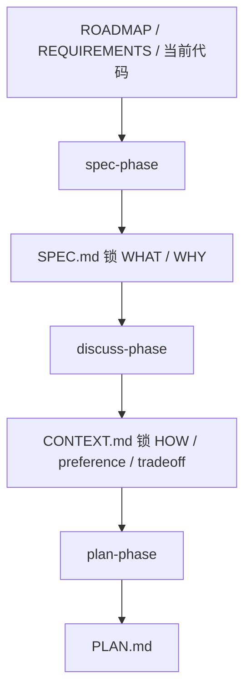
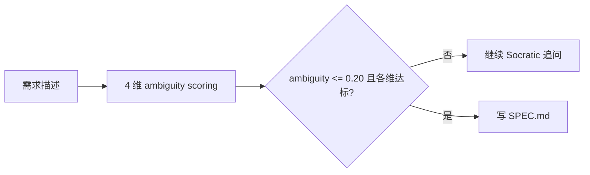
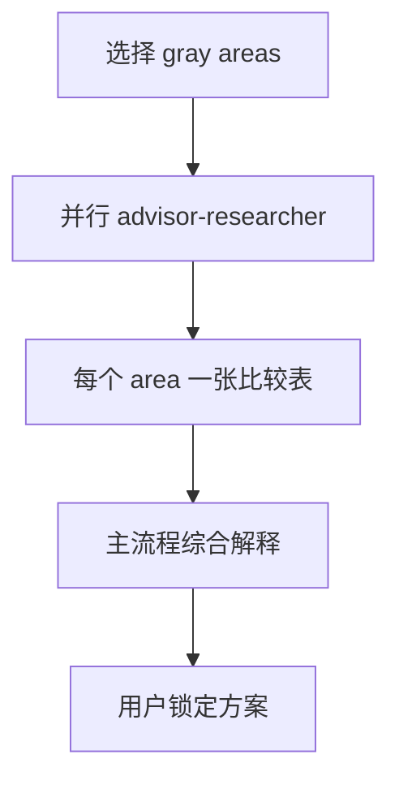

---
aliases:
  - GSD Discuss Spec And Context Capture
  - GSD 上下文捕获链
tags:
  - gsd
  - guide
  - discuss
  - spec
  - context
  - obsidian
---

# 12. Discuss, Spec, And Context Capture

> [!INFO]
> 上一章：[[11-agent-family-map]]
> 目录入口：[[README]]

## 这一章回答什么问题

前面几章已经说明了：

- `plan-phase` 会读 `CONTEXT.md`
- `discuss-phase` 负责把用户决策落进 `CONTEXT.md`
- 后来系统又加了一条 `spec-phase`

那真正的问题其实是：

- 为什么不能直接让 planner 从 `ROADMAP.md` 开始猜？
- 为什么要先拆出 `SPEC.md`，再写 `CONTEXT.md`？
- `discuss-phase` 到底捕获了哪些东西，怎么避免反复问用户？

一句话先说结论：

> GSD 用的是“两段式意图固化”。`SPEC.md` 先锁定 `WHAT / WHY`，`CONTEXT.md` 再锁定 `HOW / preference / tradeoff`。这样 planner 接到的不是聊天碎片，而是一套已经压实的决策工件。

## 关键源码入口

- [`../commands/gsd/spec-phase.md`](../commands/gsd/spec-phase.md)
- [`../get-shit-done/workflows/spec-phase.md`](../get-shit-done/workflows/spec-phase.md)
- [`../commands/gsd/discuss-phase.md`](../commands/gsd/discuss-phase.md)
- [`../get-shit-done/workflows/discuss-phase.md`](../get-shit-done/workflows/discuss-phase.md)
- [`../get-shit-done/workflows/discuss-phase-assumptions.md`](../get-shit-done/workflows/discuss-phase-assumptions.md)
- [`../get-shit-done/workflows/discuss-phase-power.md`](../get-shit-done/workflows/discuss-phase-power.md)
- [`../agents/gsd-advisor-researcher.md`](../agents/gsd-advisor-researcher.md)
- [`../agents/gsd-assumptions-analyzer.md`](../agents/gsd-assumptions-analyzer.md)

## 先看总图

这张图里最核心的认知是：

- `SPEC.md` 不是替代 `CONTEXT.md`
- 它是在 `CONTEXT.md` 之前，先把“需求清晰度”压到一个可规划的门槛

## 1. 为什么 GSD 要把“上下文捕获”拆成两步

如果只靠 `ROADMAP.md`，planner 很容易碰到三种信息混在一起：

1. 这 phase 到底要交付什么
2. 哪些边界是锁死的
3. 用户对实现风格和体验细节到底偏向哪边

把这三种信息混在一起的问题是：

- 需求不清，会让 planner 脑补 scope
- 偏好不清，会让 planner 替用户做体验决策
- 边界不清，会让 discuss 变成 scope creep 通道

所以 GSD 后来明确拆成：

- `spec-phase`: 只问 `WHAT / WHY / boundary / acceptance`
- `discuss-phase`: 只问 `HOW / approach / interaction / library / style`

这是非常关键的职责分离。

## 2. `spec-phase`：先把 WHAT 锁硬

`spec-phase` 的定位在 command 文件里写得非常明确：

- 它是 `spec-phase -> discuss-phase -> plan-phase -> execute-phase -> verify` 这条链最前面的澄清器
- 输出是一个 falsifiable 的 `SPEC.md`

### 2.1 它不是闲聊，而是带量化 gate 的访谈

[`../get-shit-done/workflows/spec-phase.md`](../get-shit-done/workflows/spec-phase.md) 里最有特点的设计，是 ambiguity model。

它把需求清晰度拆成四个维度：

- Goal Clarity
- Boundary Clarity
- Constraint Clarity
- Acceptance Criteria

并且给了权重、最低分和总 gate：

- ambiguity `<= 0.20`
- 且每个维度都达到最低分

这个设计说明：

- `spec-phase` 不是“问到差不多就算了”
- 而是在尝试把“需求是否足够清楚”做成一个显式 gate

### 2.2 它先 scout 代码，再提问题

这点非常重要。

`spec-phase` 并不是完全脱离现有代码和状态在聊愿景，它会先读：

- `REQUIREMENTS.md`
- `STATE.md`
- `ROADMAP.md`
- 相关代码与前序 phase 产物

也就是说，它不是凭空问用户“你想要什么”，而是先形成当前状态基线，然后再问：

- 现在缺什么
- 边界在哪
- done 到底怎么算

### 2.3 它产出的 SPEC.md 是锁 WHAT，不锁 HOW

workflow 里有一句特别关键：

- “This workflow handles what and why — discuss-phase handles how.”

所以 `SPEC.md` 的本质不是设计文档，而是：

- requirements lock file

它要求：

- 每条 requirement 可验证
- current state / target state / acceptance criterion 明确
- in scope / out of scope 明确

这让后面的 discuss 不再去重新谈“要不要做这件事”，而只谈“怎么做更符合你的意图”。

## 3. `discuss-phase`：把 HOW、偏好和 tradeoff 压成 CONTEXT.md

当 `SPEC.md` 锁完 WHAT 后，`discuss-phase` 负责捕获实现决策。

它的核心产物是：

- `NN-CONTEXT.md`
- `NN-DISCUSSION-LOG.md`

### 3.1 它的起点不是空白会话

`discuss-phase` 在真正问问题前，会做很重的前置加载：

- `init.phase-op`
- 读取 `PROJECT.md`、`REQUIREMENTS.md`、`STATE.md`
- 读取前序 phase 的 `CONTEXT.md`
- 检查是否有 `SPEC.md`
- 检查是否已有 `CONTEXT.md`
- 检查是否有 `DISCUSS-CHECKPOINT.json`
- 检查 spike / sketch findings
- 匹配待办 `todo.match-phase`
- 轻量 scout 代码库

这就是为什么它能做到：

- 尽量不重复问已经决定过的东西
- 能把 prior decisions 带进当前 phase
- 能把已有代码模式当成讨论上下文

### 3.2 它明确区分“新能力”与“实现灰区”

workflow 里对 scope guardrail 写得很重：

- 允许澄清 how
- 不允许顺手加新 capability

如果用户在 discuss 里冒出新功能点，标准动作不是把它吞进去，而是：

- 记到 `Deferred Ideas`
- 把讨论拉回当前 phase 域

这意味着 `discuss-phase` 是决策捕获器，不是 scope 扩张器。

## 4. “gray areas” 才是 discuss-phase 真正的核心抽象

`discuss-phase` 最重要的词不是 question，而是：

- gray area

也就是：

- 会改变实现结果、而且用户确实在意的决策分叉点

workflow 里强调了两件事：

1. 不要生成泛泛的 UI / UX / Behavior 类别标签
2. 要生成 phase-specific 的具体 gray areas

例如不是问：

- “你想聊 UI 吗？”

而是问：

- “布局是 cards、list 还是 timeline？”
- “加载行为是 infinite scroll 还是 pagination？”

### 4.1 gray area 的生成是带上下文注释的

这一点很值得学。

它在 `present_gray_areas` 阶段，不只是丢给用户几个抽象问题，而会把两类上下文折进去：

- prior decision annotation
- code context annotation

也就是：

- “你在 Phase 4 选过 infinite scroll，还要改吗？”
- “现在代码里已经有 Card 组件，沿用它会更一致”

所以 discuss 不是纯口头访谈，而是：

- 结合历史决策和现有代码做带注释的决策呈现

## 5. `SPEC.md` 会如何改变 discuss-phase 的问题空间

这一块是很多人第一次读源码时最容易忽略的。

当 `discuss-phase` 检测到 `SPEC.md` 存在，它会进入一种很明确的约束状态：

- Goal、Boundary、Constraint、Acceptance 这些已经是 locked requirements
- 不再生成关于 WHAT / WHY 的 gray areas
- 只生成 HOW 相关 gray areas

而且最后写 `CONTEXT.md` 时：

- 不把 `SPEC.md` 内容重复抄一遍
- 而是把它作为 canonical ref 加进去
- 明确告诉下游 agent：requirements 在 `SPEC.md` 里已经锁定

这就是一种很漂亮的 artifact layering：

- `SPEC.md` 是 requirements contract
- `CONTEXT.md` 是 implementation decision contract

## 6. discuss-phase 其实不是一种模式，而是四种模式

这一章最容易低估的，就是 discuss-phase 的分支复杂度。

### 6.1 标准 discuss 模式

这是默认模式：

- 识别 gray areas
- 让用户选择讨论哪些
- 逐个讨论
- 写 `CONTEXT.md`

### 6.2 assumptions 模式

如果配置把 `workflow.discuss_mode` 设成 `assumptions`，它会走：

- [`../get-shit-done/workflows/discuss-phase-assumptions.md`](../get-shit-done/workflows/discuss-phase-assumptions.md)

这条线的想法是：

- 用户不是代码考古学家
- 先由 `gsd-assumptions-analyzer` 深读代码形成假设
- 再让用户纠偏，而不是从零回答二十个问题

这是一种把“访谈模式”切成“假设校正模式”的设计。

### 6.3 advisor 模式

如果用户 profile 和配置满足条件，workflow 会进入 advisor 路径：

- 对每个已选 gray area 并行 spawn `gsd-advisor-researcher`
- 每个 agent 产出一个对比表
- 主流程再把表格和 rationale 综合后呈现给用户

这条线的本质是：

- 把“讨论前的方案空间研究”外包给子 agent

所以 discuss 不再只是问答，而更像 guided decision review。

### 6.4 power 模式

如果传 `--power`，会走：

- [`../get-shit-done/workflows/discuss-phase-power.md`](../get-shit-done/workflows/discuss-phase-power.md)

这条线最特别，因为它不在当前聊天里一问一答，而是：

- 生成 `QUESTIONS.json`
- 生成 `QUESTIONS.html`
- 用户离线填写
- 再回来 `refresh` / `finalize`

这说明 GSD 已经把“上下文捕获”从聊天交互扩展到了文件化问卷 UI。

## 7. 还有一组很实用的控制旗标

除了模式分支，还有几个执行旗标很关键：

- `--all`
- `--auto`
- `--chain`
- `--text`

它们分别改变：

- 是否跳过 gray area 选择
- 是否自动替用户选推荐项
- 讨论后是否自动接 `plan-phase -> execute-phase`
- 是否不用 TUI 问答，而改成纯文本编号问题

这也是为什么 `discuss-phase` 的复杂度明显高于表面感觉。

它不是一个“单流程 prompt”，而是一个会根据 runtime、profile、config、flag 重写交互方式的 capture engine。

## 8. CONTEXT.md 最终到底装什么

`write_context` 这一步的目标不是写会议纪要，而是写一份下游 agent 真会消费的决策文件。

它至少承担几种职责：

- 记录 locked decisions
- 记录 specifics
- 记录 deferred ideas
- 纳入 folded todos
- 保留 `canonical_refs`
- 在有 `SPEC.md` 时标明 requirements 已锁定

其中最容易被低估的是：

- `canonical_refs` 是强要求

因为下游 planner / researcher / executor 其实很依赖这份“应该去读哪些文件”的路径清单。

所以 `CONTEXT.md` 不是聊天摘要，而是：

- 面向后续 agent 的引用入口 + 决策 contract

## 9. 它还带 checkpoint 和 auto-advance 能力

这一层不只会写最终产物，还会处理中断和链式推进。

### 9.1 checkpoint

如果会话中断，它可以写：

- `DISCUSS-CHECKPOINT.json`

下次再进来时：

- 发现还没有 `CONTEXT.md`
- 但 checkpoint 在
- 就可以恢复上次的 areas / decisions

### 9.2 auto-advance

如果走 `--auto` 或 `--chain`：

- 写完 `CONTEXT.md`
- 持久化 `_auto_chain_active`
- 接着自动进 `plan-phase`
- 视模式再继续进 `execute-phase`

这说明 discuss 不是总在“停在一份文档”结束，而是可以是自治链的一段前置捕获器。

## 10. 这套上下文捕获设计最值得学的地方

### 1. 它把 WHAT 和 HOW 明确拆开了

这是整个链条最重要的设计之一。

### 2. 它尽量不让用户重复回答已经知道的事

prior context、code scout、todo folding、spike/sketch findings 都在为这件事服务。

### 3. 它真正把“聊天决策”沉淀成了可复用工件

`SPEC.md` 和 `CONTEXT.md` 都是后续 agent 会直接消费的资产。

### 4. 它支持多种认知负担模型

标准讨论、假设校正、研究辅助、离线问卷，这几种模式对应不同用户习惯。

## 11. 但它的代价也很明显

### 1. 分支非常多

spec、discuss、assumptions、advisor、power、auto、chain、text，一起看时复杂度不低。

### 2. 提示词层面已经有明显状态机味道

这让它很强，但也让维护难度上升。

### 3. 它依然依赖 prompt discipline

很多 guardrail 是写在 workflow 里的，而不是系统硬约束。

## 12. 看完这章后，你应该记住什么

- GSD 的上下文捕获不是一轮聊天，而是 `SPEC.md + CONTEXT.md` 的两段式固化。
- `spec-phase` 锁 `WHAT / WHY / boundaries / acceptance`，`discuss-phase` 锁 `HOW / preference / tradeoff`。
- `discuss-phase` 的核心抽象不是“问题”，而是“gray areas”。
- prior context、代码 scout、todo folding、spike/sketch findings 都是在降低重复提问和错误决策。
- advisor / assumptions / power 模式说明 discuss 已经不是单一交互，而是一套多模式 capture engine。

## 相关笔记

- 上一章：[[11-agent-family-map]]
- 目录入口：[[README]]
- 下一章：[[13-brownfield-intel-and-map-codebase]]
