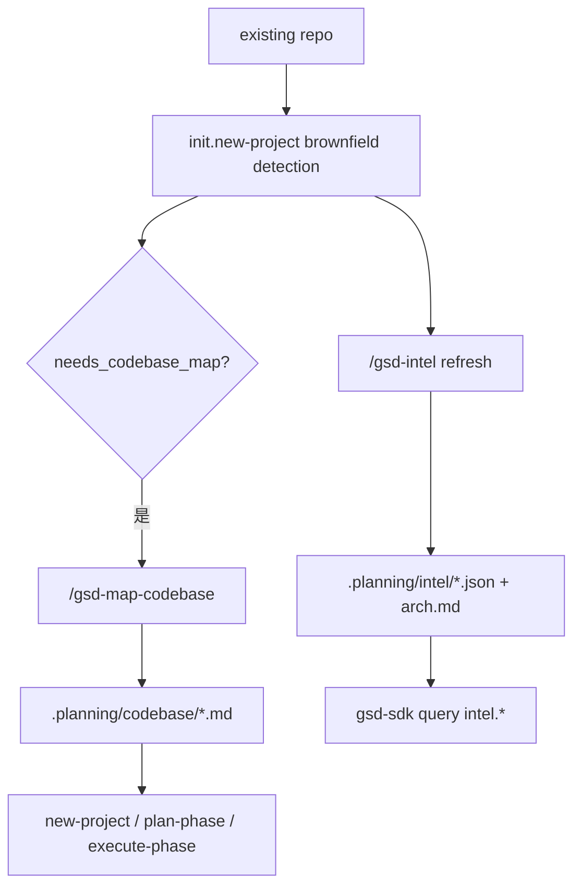
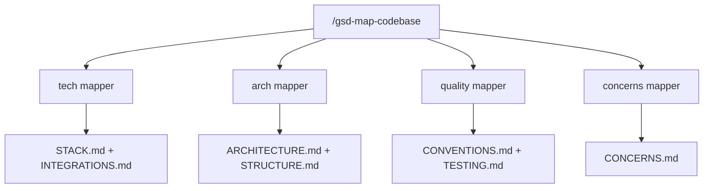

---
aliases:
  - GSD Brownfield Intel And Map Codebase
  - GSD Brownfield 初始化链
tags:
  - gsd
  - guide
  - brownfield
  - intel
  - map-codebase
  - obsidian
---

# 13. Brownfield, Intel, And Map-Codebase

> [!INFO]
> 上一章：[[12-discuss-spec-and-context-capture]]
> 目录入口：[[README]]

## 这一章回答什么问题

如果这是一个全新项目，很多事情都简单：

- 没旧代码
- 没历史结构
- 没隐含依赖

但 GSD 明显不是只为 greenfield 准备的。

它一开始就有一整套 brownfield 进入路径：

- 检测目录里是不是已有代码
- 需不需要先做 codebase map
- 需不需要维护 machine-queryable intel

所以这一章真正要回答的是：

- GSD 如何进入一个既有仓库？
- `.planning/codebase/` 和 `.planning/intel/` 分别解决什么问题？

一句话先说结论：

> GSD 对 brownfield 的策略是“双记忆层”。`.planning/codebase/` 提供给人和 planner 阅读的代码地图，`.planning/intel/` 提供给 query handler 和命令快速查询的结构化索引。前者偏可读，后者偏可算。

## 关键源码入口

- [`../commands/gsd/new-project.md`](../commands/gsd/new-project.md)
- [`../get-shit-done/workflows/new-project.md`](../get-shit-done/workflows/new-project.md)
- [`../commands/gsd/map-codebase.md`](../commands/gsd/map-codebase.md)
- [`../get-shit-done/workflows/map-codebase.md`](../get-shit-done/workflows/map-codebase.md)
- [`../commands/gsd/scan.md`](../commands/gsd/scan.md)
- [`../get-shit-done/workflows/scan.md`](../get-shit-done/workflows/scan.md)
- [`../commands/gsd/intel.md`](../commands/gsd/intel.md)
- [`../agents/gsd-codebase-mapper.md`](../agents/gsd-codebase-mapper.md)
- [`../agents/gsd-intel-updater.md`](../agents/gsd-intel-updater.md)
- [`../sdk/src/query/init-complex.ts`](../sdk/src/query/init-complex.ts)
- [`../sdk/src/query/intel.ts`](../sdk/src/query/intel.ts)

## 先看总图

这张图里要记住的是：

- brownfield 不是一条附属功能
- 它从 `new-project` 初始化阶段就已经被认真建模了

## 1. `new-project` 一开始就在判断“这是不是 brownfield”

在 [`../sdk/src/query/init-complex.ts`](../sdk/src/query/init-complex.ts) 里，`initNewProject` 会直接做一轮环境探测。

它关心的几个字段很关键：

- `has_existing_code`
- `has_package_file`
- `is_brownfield`
- `has_codebase_map`
- `needs_codebase_map`

也就是说，它不是只看有没有 `.planning/`，而是看：

- 目录里是不是已经有代码
- 是不是已经像一个真实项目
- 如果是，当前有没有配套的代码地图

### 1.1 `needs_codebase_map` 的意义

这个字段其实就是 brownfield 入口的判断器：

- 有现有代码或包管理文件
- 但还没有 `.planning/codebase/`

满足这两个条件，就说明：

- 你已经不是白纸项目
- 但 GSD 还没有拿到对代码库的结构理解

所以 new-project workflow 会在很靠前的位置给出 brownfield offer：

- 要不要先跑 `/gsd-map-codebase`

这不是可有可无的 UX 提示，而是架构上承认：

- 旧项目不能直接当新项目来规划

## 2. `/gsd-map-codebase`：给人和 planner 读的代码地图

[`../commands/gsd/map-codebase.md`](../commands/gsd/map-codebase.md) 对这条命令的定义非常直接：

- analyze codebase with parallel mapper agents
- 产物写到 `.planning/codebase/`

### 2.1 它的核心思路：并行拆专题，不让主编排器吃全文

workflow 里最值得看的，是这句哲学：

- agents write documents directly
- orchestrator only receives confirmations

这说明 `map-codebase` 的真正目标不只是“写 7 份文档”，而是：

- 把代码库理解工作外包给多个 mapper
- 每个 mapper 自己把成果落盘
- 主编排器只拿回最小确认信息

这是一个非常典型的 context-saving 设计。

### 2.2 4 个 mapper，各看不同焦点

标准 `map-codebase` 会并行 spawn 4 个 `gsd-codebase-mapper`：

- tech
- arch
- quality
- concerns

然后产出 7 份文档：

- `STACK.md`
- `INTEGRATIONS.md`
- `ARCHITECTURE.md`
- `STRUCTURE.md`
- `CONVENTIONS.md`
- `TESTING.md`
- `CONCERNS.md`

这 7 份文档不是为了好看，而是为了给后续 planner / executor / verifier 提供专题入口。

### 2.3 为什么它写 Markdown，而不是 JSON

因为 `.planning/codebase/` 的主要消费对象是：

- 人
- planner
- executor

这些消费者都更适合读“带解释和文件路径的专题文档”，而不是纯结构化索引。

比如 `STRUCTURE.md` 的核心价值并不是统计目录，而是回答：

- 新代码应该放哪

这类信息用 Markdown 比 JSON 更合适。

## 3. `/gsd-scan`：轻量版地图，不做全套

`scan` 可以看成 `map-codebase` 的缩小版。

它不是 4 个 mapper 并发，而是：

- 1 个 mapper
- 只针对一个 focus

例如：

- `tech`
- `arch`
- `quality`
- `concerns`
- `tech+arch`

这很说明问题：

- GSD 并不认为每次都必须重建完整 codebase map
- 它也支持“我现在只想补这一块认知”

所以 `scan` 更像：

- partial remap

## 4. brownfield map 会怎样反过来影响 `new-project`

new-project workflow 不是把 codebase map 当旁支工具，而是真会消费它。

从 workflow 可以看到至少两层影响：

### 4.1 它会影响 requirements 初始化

workflow 明确写了：

- 对 brownfield 项目，可以从现有 codebase map 推断已经“Validated”的 requirements

这意味着需求不是总从零开始列，而会承认：

- 旧代码已经实现了一部分东西
- 某些 requirements 在当前里程碑里其实是已存在基础

### 4.2 它会影响 roadmap 和后续 planning 的 groundedness

有 codebase map 时，roadmapper 和后续 planner 不需要每次重新读整库才能知道：

- 现有技术栈
- 结构分层
- 约定和测试模式
- 主要技术债

所以 brownfield map 的真正价值，是把“进入既有代码库”的门槛显著压低。

## 5. `.planning/intel/` 完全是另一套东西

如果说 `.planning/codebase/` 是给人看的地图，那么 `.planning/intel/` 更像给命令和 query handler 用的本地索引。

### 5.1 `/gsd-intel` 先做 config gate

[`../commands/gsd/intel.md`](../commands/gsd/intel.md) 开头最醒目的部分就是：

- 先读 `.planning/config.json`
- 只有 `intel.enabled === true` 才继续

这说明 intel 在系统里不是默认必开，而是一套显式启用的增强能力。

### 5.2 `/gsd-intel` 把操作拆成两类

第一类是 inline query：

- `query <term>`
- `status`
- `diff`

第二类才是真正重建索引：

- `refresh`

而 `refresh` 会 spawn：

- `gsd-intel-updater`

这说明 intel 命令本身像一个壳：

- 简单读操作直接走 query
- 重活交给专门 agent

### 5.3 intel-updater 写的是结构化索引，不是说明文

`gsd-intel-updater` 的输出 schema 很明确：

- `stack.json`
- `files.json`
- `apis.json`
- `deps.json`
- `arch.md`

而且要求：

- JSON 里带 `_meta.updated_at`
- `files.json` 里的 exports 必须是真实 symbol
- `deps.json` 里要有 `used_by`

这类要求说明 intel 的设计目标不是“概览”，而是：

- 机器可验证
- 机器可查询
- 机器可 diff

## 6. `sdk/src/query/intel.ts` 说明它真的是“可算”的

如果你只看命令层，可能会觉得 intel 只是另一批文件。

但 [`../sdk/src/query/intel.ts`](../sdk/src/query/intel.ts) 会让你看清楚：

- intel 有 `status`
- 有 `diff`
- 有 `snapshot`
- 有 `validate`
- 有 `query`
- 还有 `extract-exports` / `patch-meta`

这说明 intel 不只是静态缓存，而是一套被 registry 正式接管的 query 子系统。

换句话说：

- `.planning/codebase/` 更像 agent-readable docs
- `.planning/intel/` 更像 query runtime 的本地知识库

## 7. 所以为什么系统同时保留 codebase map 和 intel

这是这一章最重要的问题。

### 7.1 两者服务的消费者不同

| 维度 | `.planning/codebase/` | `.planning/intel/` |
| --- | --- | --- |
| 主要消费者 | 人、planner、executor | query handler、命令、结构化检查 |
| 主要格式 | Markdown | JSON + 少量 Markdown |
| 主要目标 | 理解代码模式和布局 | 快速查询、校验、diff |
| 生产方式 | mapper agent 直接写专题文档 | intel-updater 写 schema 化索引 |
| 典型问题 | “代码应该放哪？” | “这个符号/依赖/API 在哪？” |

### 7.2 两者代表的是两种不同的压缩方式

`map-codebase` 压的是：

- 解释性知识
- 约定和模式
- 人类可消费的专题理解

`intel` 压的是：

- 检索性知识
- 路径、导出、依赖、接口
- 程序可消费的结构化状态

这两个方向不能完全互相替代。

## 8. 这条 brownfield 初始化链最值得学的地方

### 1. 它从一开始就承认“既有仓库需要先建立模型”

不是把 old repo 当 greenfield 硬套流程。

### 2. mapper 直接写外部记忆，极大减轻主编排器上下文

这是很实用的工程设计。

### 3. 它同时保留人类可读和机器可查两种知识层

这是很多 agent 系统没有做到的。

### 4. brownfield 支持不是单一命令，而是会反向影响 requirements 和 roadmap

说明它不是边角功能。

## 9. 但它的代价也很明显

### 1. codebase map 和 intel 之间天然会有漂移风险

因为它们是两套不同产物、不同更新路径。

### 2. brownfield 入口会让初始化流程更长

先 map，再 new-project，再 research，再 requirements，再 roadmap，对轻量项目来说会显得重。

### 3. intel 不是默认开启，所以使用者很容易不知道它的价值

这意味着它更像一套高级能力，而不是主线默认体验。

## 10. 看完这章后，你应该记住什么

- `new-project` 从 init 阶段就会检测 brownfield 状态，而不是后面才补救。
- `.planning/codebase/` 是给人和 planner 读的专题地图，核心由 `gsd-codebase-mapper` 生成。
- `.planning/intel/` 是给 query handler 和命令用的结构化索引，核心由 `gsd-intel-updater` 维护。
- `scan` 是局部重绘，`map-codebase` 是全量建图，`intel refresh` 是结构化重建。
- 这三者合起来，构成了 GSD 进入既有代码库时的认知基础设施。

## 相关笔记

- 上一章：[[12-discuss-spec-and-context-capture]]
- 目录入口：[[README]]
- 下一章：[[14-architecture-strengths-and-debts]]
