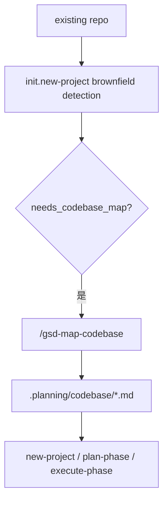
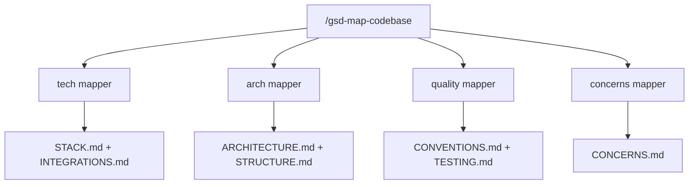

---
aliases:
  - GSD Brownfield And Map Codebase
  - GSD Brownfield 初始化链
tags:
  - gsd
  - guide
  - brownfield
  - map-codebase
  - obsidian
---

# 13. Brownfield 与 Map-Codebase

> [!INFO]
> 上一章：[[12-discuss-spec-and-context-capture]]
> 目录入口：[[README]]

## 这一章回答什么问题

如果这是一个全新项目，很多事情都简单：

- 没旧代码
- 没历史结构
- 没隐含依赖

但 GSD 明显不是只为 greenfield 准备的。

它一开始就有一整套 brownfield 进入路径：

- 检测目录里是不是已有代码
- 需不需要先做 codebase map

所以这一章真正要回答的是：

- GSD 如何进入一个既有仓库？
- `.planning/codebase/` 解决什么问题，又怎么反过来影响后续规划？

一句话先说结论：

> GSD 对 brownfield 的策略是先建立一份可读的代码地图。`.planning/codebase/` 提供给人和 planner 阅读的结构化理解，让旧仓库不必被当成白纸重新规划。

## 关键源码入口

- [`../commands/gsd/new-project.md`](../commands/gsd/new-project.md)
- [`../get-shit-done/workflows/new-project.md`](../get-shit-done/workflows/new-project.md)
- [`../commands/gsd/map-codebase.md`](../commands/gsd/map-codebase.md)
- [`../get-shit-done/workflows/map-codebase.md`](../get-shit-done/workflows/map-codebase.md)
- [`../agents/gsd-codebase-mapper.md`](../agents/gsd-codebase-mapper.md)
- [`../sdk/src/query/init-complex.ts`](../sdk/src/query/init-complex.ts)

## 先看总图

这张图里要记住的是：

- brownfield 不是一条附属功能
- 它从 `new-project` 初始化阶段就已经被认真建模了

## 1. `new-project` 一开始就在判断“这是不是 brownfield”

在 [`../sdk/src/query/init-complex.ts`](../sdk/src/query/init-complex.ts) 里，`initNewProject` 会直接做一轮环境探测。

它关心的几个字段很关键：

- `has_existing_code`
- `has_package_file`
- `is_brownfield`
- `has_codebase_map`
- `needs_codebase_map`

也就是说，它不是只看有没有 `.planning/`，而是看：

- 目录里是不是已经有代码
- 是不是已经像一个真实项目
- 如果是，当前有没有配套的代码地图

### 1.1 `needs_codebase_map` 的意义

这个字段其实就是 brownfield 入口的判断器：

- 有现有代码或包管理文件
- 但还没有 `.planning/codebase/`

满足这两个条件，就说明：

- 你已经不是白纸项目
- 但 GSD 还没有拿到对代码库的结构理解

所以 new-project workflow 会在很靠前的位置给出 brownfield offer：

- 要不要先跑 `/gsd-map-codebase`

这不是可有可无的 UX 提示，而是架构上承认：

- 旧项目不能直接当新项目来规划

## 2. `/gsd-map-codebase`：给人和 planner 读的代码地图

[`../commands/gsd/map-codebase.md`](../commands/gsd/map-codebase.md) 对这条命令的定义非常直接：

- analyze codebase with parallel mapper agents
- 产物写到 `.planning/codebase/`

### 2.1 它的核心思路：并行拆专题，不让主编排器吃全文

workflow 里最值得看的，是这句哲学：

- agents write documents directly
- orchestrator only receives confirmations

这说明 `map-codebase` 的真正目标不只是“写 7 份文档”，而是：

- 把代码库理解工作外包给多个 mapper
- 每个 mapper 自己把成果落盘
- 主编排器只拿回最小确认信息

这是一个非常典型的 context-saving 设计。

### 2.2 4 个 mapper，各看不同焦点

标准 `map-codebase` 会并行 spawn 4 个 `gsd-codebase-mapper`：

- tech
- arch
- quality
- concerns

然后产出 7 份文档：

- `STACK.md`
- `INTEGRATIONS.md`
- `ARCHITECTURE.md`
- `STRUCTURE.md`
- `CONVENTIONS.md`
- `TESTING.md`
- `CONCERNS.md`

这 7 份文档不是为了好看，而是为了给后续 planner / executor / verifier 提供专题入口。

### 2.3 为什么它写 Markdown，而不是 JSON

因为 `.planning/codebase/` 的主要消费对象是：

- 人
- planner
- executor

这些消费者都更适合读“带解释和文件路径的专题文档”，而不是纯结构化索引。

比如 `STRUCTURE.md` 的核心价值并不是统计目录，而是回答：

- 新代码应该放哪

这类信息用 Markdown 比 JSON 更合适。

## 3. brownfield map 会怎样反过来影响 `new-project`

new-project workflow 不是把 codebase map 当旁支工具，而是真会消费它。

从 workflow 可以看到至少两层影响：

### 3.1 它会影响 requirements 初始化

workflow 明确写了：

- 对 brownfield 项目，可以从现有 codebase map 推断已经“Validated”的 requirements

这意味着需求不是总从零开始列，而会承认：

- 旧代码已经实现了一部分东西
- 某些 requirements 在当前里程碑里其实是已存在基础

### 3.2 它会影响 roadmap 和后续 planning 的 groundedness

有 codebase map 时，roadmapper 和后续 planner 不需要每次重新读整库才能知道：

- 现有技术栈
- 结构分层
- 约定和测试模式
- 主要技术债

所以 brownfield map 的真正价值，是把“进入既有代码库”的门槛显著压低。

## 4. 为什么这层记忆用专题 Markdown 而不是机器索引

这其实是这一章最值得想清楚的取舍。

### 4.1 它服务的消费者是人和 planner

| 维度 | `.planning/codebase/` |
| --- | --- |
| 主要消费者 | 人、planner、executor |
| 主要格式 | Markdown |
| 主要目标 | 理解代码模式和布局 |
| 生产方式 | mapper agent 直接写专题文档 |
| 典型问题 | “代码应该放哪？” |

### 4.2 它压缩的是“解释性知识”

`map-codebase` 压的是：

- 解释性知识
- 约定和模式
- 人类可消费的专题理解

换句话说，它不是要做一份可以被程序精确检索的符号表，而是要给下游“怎么在这个代码库里正确地加东西”提供判断依据。

正因为目标是解释而不是检索，Markdown 才是更合适的载体。

## 5. 这条 brownfield 初始化链最值得学的地方

### 1. 它从一开始就承认“既有仓库需要先建立模型”

不是把 old repo 当 greenfield 硬套流程。

### 2. mapper 直接写外部记忆，极大减轻主编排器上下文

这是很实用的工程设计。

### 3. brownfield 支持不是单一命令，而是会反向影响 requirements 和 roadmap

说明它不是边角功能。

## 6. 但它的代价也很明显

### 1. codebase map 会随代码演进而漂移

它是一次性快照，代码继续改之后，需要重新跑 `/gsd-map-codebase` 才能保持准确。

### 2. brownfield 入口会让初始化流程更长

先 map，再 new-project，再 research，再 requirements，再 roadmap，对轻量项目来说会显得重。

### 3. 它是可读地图，不是可算索引

好处是人和 agent 都能直接理解，代价是命令层无法像查数据库一样对它做结构化检索。

## 7. 看完这章后，你应该记住什么

- `new-project` 从 init 阶段就会检测 brownfield 状态，而不是后面才补救。
- `.planning/codebase/` 是给人和 planner 读的专题地图，核心由 `gsd-codebase-mapper` 生成。
- `map-codebase` 会并行 spawn 4 个 mapper，产出 7 份专题文档，主编排器只收确认。
- 这份地图会反向影响 requirements 初始化和 roadmap 的 groundedness，是 GSD 进入既有代码库时的认知基础设施。

## 相关笔记

- 上一章：[[12-discuss-spec-and-context-capture]]
- 目录入口：[[README]]
- 下一章：[[14-architecture-strengths-and-debts]]
