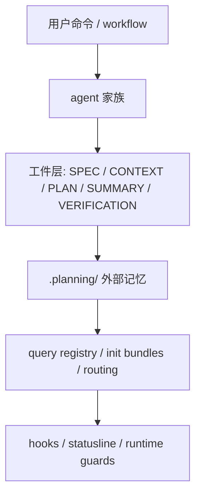

---
aliases:
  - GSD Architecture Strengths And Debts
  - GSD 架构优点与历史债
tags:
  - gsd
  - guide
  - architecture
  - tradeoffs
  - obsidian
---

# 14. Architecture Strengths And Debts

> [!INFO]
> 上一章：[[13-brownfield-intel-and-map-codebase]]
> 目录入口：[[README]]

## 这一章回答什么问题

到这一章，其实已经可以不再按某个 workflow 或某个 agent 去看了。

真正要问的是：

- 这套系统到底最值得学什么？
- 如果你要自己做一个类似系统，哪些设计应该借，哪些不要照抄？

一句话先说结论：

> GSD 最值得学的，不是它有多少 prompt、多少命令，而是它把“长流程 agent 工作”拆成了文件化外部记忆、显式工件交接、typed query、runtime hook、防怀疑验证这几层。它最大的历史债，也正来自这些层越来越多、越来越分叉之后的复杂性累积。

## 关键源码入口

- [`../commands/gsd/`](../commands/gsd/)
- [`../get-shit-done/workflows/`](../get-shit-done/workflows/)
- [`../agents/`](../agents/)
- [`../sdk/src/query/`](../sdk/src/query/)
- [`../hooks/`](../hooks/)
- [`../get-shit-done/bin/lib/init.cjs`](../get-shit-done/bin/lib/init.cjs)
- [`../get-shit-done/templates/`](../get-shit-done/templates/)

## 先看总图

如果只用一句话概括整套系统，我会写成：

- 一个以 Markdown / JSON 为外部记忆、以 workflow 和 agent 为行为层、以 query registry 为状态机、以 hook 为 runtime 护栏的文件系统工作流 runtime

这个定义比“Claude Code 提示词仓库”准确得多。

## 1. 我认为这套架构最强的 6 个设计点

### 1.1 外部记忆不是附件，而是主系统

这一点是整个仓库最值得学的地方。

`.planning/` 在这里不是文档目录，而是：

- phase 记忆
- session 恢复点
- 决策工件库
- 状态机后端

好处非常直接：

- 不依赖长会话上下文存活
- 可以换 runtime / 换 session 恢复
- git 可审计
- 人也能手工介入修复

如果你只想从 GSD 拿走一件东西，我觉得就是这个。

### 1.2 工件交接非常明确

GSD 的强点不只是“有很多文档”，而是这些文档有很明确的上下游关系：

- `SPEC.md`
- `CONTEXT.md`
- `RESEARCH.md`
- `PATTERNS.md`
- `PLAN.md`
- `SUMMARY.md`
- `VERIFICATION.md`

这意味着不同 agent 不是靠聊天上下文模糊交接，而是靠工件 contract 交接。

这是它能做长流程自治的根本前提。

### 1.3 查询层把 prompt 系统变成了状态系统

如果没有 `gsd-remix-sdk query`、`init.*`、`route.next-action` 这些层，这套东西仍然会比较像 prompt 编排。

但 query 层的存在，让它开始变成：

- 可计算的路由
- 可复用的初始化 bundle
- 可验证的状态变更

也就是说，prompt 不再独自承载所有控制逻辑。

### 1.4 producer / checker 配对做得很彻底

这点我非常认可。

系统里不断重复出现这类对子：

- planner / plan-checker
- executor / verifier
- doc-writer / doc-verifier
- ui-researcher / ui-checker

这比“一个 agent 自己写、自己说自己写好了”靠谱得多。

### 1.5 hook 层把 runtime awareness 补上了

很多 agent 系统只关心 workflow，不关心 runtime 边界。

GSD 在这方面明显做得更完整：

- statusline
- context monitor
- prompt injection guard
- read-before-edit guard
- workflow guard

这让系统不仅有业务流程编排，还有运行时自我保护。

### 1.6 brownfield 支持是第一等公民

这一点很少见。

很多类似系统默认假设：

- 从零开始
- 目录干净
- 没有历史包袱

GSD 则明显承认：

- 多数真实项目是半成品、老仓库、混杂上下文

所以才会有：

- `map-codebase`
- `scan`
- `intel`
- brownfield detection

这让它更贴近真实开发。

## 2. 我认为最明显的 6 个历史债

### 2.1 分支和模式已经很多了

这是读完整个仓库后最明显的感觉。

你会不断遇到：

- `--auto`
- `--chain`
- `--all`
- `--power`
- discuss assumptions mode
- advisor mode
- text mode
- runtime-specific hook events

这会让系统非常强，但也会让维护者越来越难在脑中保持完整模型。

### 2.2 双轨迁移增加了理解成本

第 09 章已经讲过：

- 旧 CJS CLI 还在
- SDK query registry 已经起来

这当然是合理迁移策略，但在用户和维护者视角里，它也是显式复杂度。

### 2.3 Markdown 既是优势，也是脆弱点

把 Markdown 当状态后端有很多优点，但它也天然带来：

- parser 负担
- 格式漂移
- 多文件同步问题
- “看起来像文档，实际上是数据库”的心智错位

这不是设计错误，但确实是长期维护成本。

### 2.4 agent taxonomy 已经开始膨胀

33 个 agent 还不是灾难，但已经明显进入：

- 需要家族地图才能舒服理解

的阶段了。

如果继续增长，就会开始面临：

- 职责重叠
- 命名边界模糊
- 使用者不知道该找谁

### 2.5 真实行为分散在多层

要理解一条完整链路，往往得同时看：

- command 文件
- workflow 文件
- agent prompt
- query handler
- `.planning/` 工件
- hooks

这就是它强大的来源，也是 onboarding 成本高的来源。

### 2.6 还有一些 runtime-specific 折中

例如：

- `statusLine`
- `PreToolUse` / `BeforeTool`
- `PostToolUse` / `AfterTool`
- temp bridge file

这些都很务实，但也说明系统不是建立在一个统一抽象很干净的 runtime 接口上，而是要不断做适配和补缝。

## 3. 如果让我从这套系统里挑 5 个“值得偷”的模式

### 1. 外部记忆优先

把长期状态从会话中移出来。

### 2. 工件型交接

让 agent 通过文件 contract 交接，而不是靠“上一轮聊了什么”。

### 3. producer / checker 分离

写和验尽量不要是同一角色。

### 4. init / query 组合层

把 workflow 需要的大 bundle 预组装出来，而不是让 prompt 自己每次拼命 grep。

### 5. advisory hooks

很多安全和流程纪律问题，不必全靠硬 block，也可以用低耦合提醒和 side-effect 解决。

## 4. 如果让我挑 5 个“不要直接照抄”的地方

### 1. 不要一开始就把模式做得这么多

先把一条主链闭合，再加分支。

### 2. 不要太早让命令面和状态面双轨共存太久

迁移期可以接受，但要尽量给退出计划。

### 3. 不要在没有 query 层的情况下把 Markdown 当数据库

否则很快会变成一堆脆弱脚本互相读写。

### 4. 不要让 agent 数量先于家族边界增长

否则 taxonomy 会先炸。

### 5. 不要指望 prompt 纪律单独扛住复杂度

复杂到一定程度，一定要补系统性 guard 和 typed handler。

## 5. 这套架构最准确的评价，不是“重”或“轻”，而是“层次化得很深”

有些人第一次看到会说它太重。

但更准确的说法其实是：

- 它不是轻工具
- 它也不是企业平台
- 它是一个被长期打磨出来的、层次很深的个人开发工作流 runtime

它的优点和问题都来自这一点：

- 因为层次深，所以恢复力强、自治能力强、边界清楚
- 也因为层次深，所以学习成本高、维护难度高、分支复杂

## 6. 看完整个 guide 后，你应该记住什么

- GSD 本质上不是 prompt 集合，而是一套文件系统驱动的 agent workflow runtime。
- 最强设计是外部记忆、工件交接、producer/checker 配对、query 状态层和 runtime hook 护栏。
- 最真实的代价是模式分支太多、双轨路径共存、Markdown 状态脆弱性和 agent taxonomy 膨胀。
- 如果要借鉴，优先借“结构原则”，不要直接照搬“文件数量”和“分支数量”。
- 真正让这套系统成立的，不是某一个神 prompt，而是这些层叠起来之后形成的可恢复、可验证、可编排的整体。

## 相关笔记

- 上一章：[[13-brownfield-intel-and-map-codebase]]
- 目录入口：[[README]]
- 当前核心主线已完成
