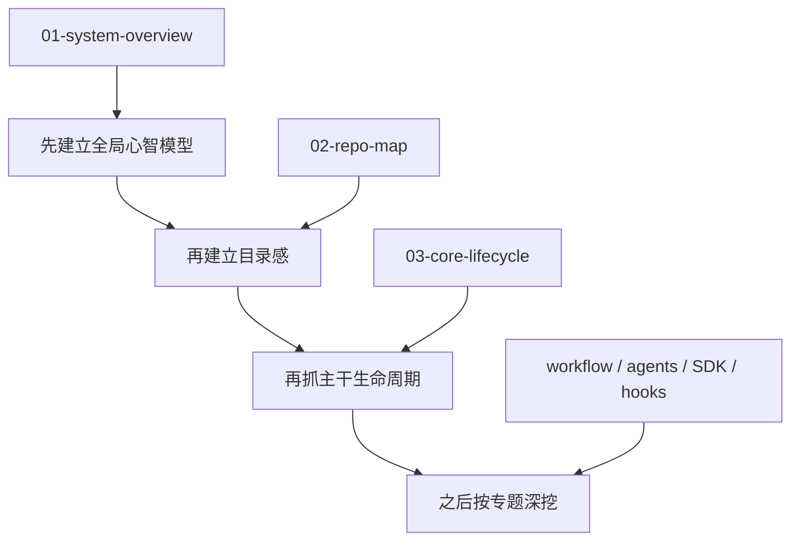

---
aliases:
  - GSD Study Guide
  - GSD 学习指南
tags:
  - gsd
  - guide
  - obsidian
---

# GSD Study Guide

这个目录是为了系统化理解 `get-shit-done` 仓库而建的。

目标不是重复 README，而是把这套系统拆成可以逐章学习的几个层次:

1. 它到底是什么
2. 仓库每一层代码分别负责什么
3. 一个命令是如何从“提示词”一路落到 `.planning/`、git、subagent、hook 和 SDK 的
4. 每个核心 workflow 和 agent 的职责边界在哪里
5. 这套设计有哪些值得借鉴的地方，有哪些明显的历史包袱

## 术语约定

- `orchestration`：统一译为 `流程编排`
- `orchestrator`：统一译为 `编排器`
- `workflow`：保留英文，必要时解释为“工作流定义”

## 强约束

- 写作规范： [00-writing-conventions.md](./00-writing-conventions.md)
  Obsidian: [[00-writing-conventions]]
  这是后续继续补 `guide/` 时的强约束文件。若上下文重置，优先先读它。

> [!TIP]
> 这套 guide 后面会默认兼容 Obsidian：
> - 尽量补 `frontmatter`
> - 章节之间优先提供 `[[wiki links]]`
> - 适合用图谱视图、反向链接和标签来串联阅读

## 学习地图

## 当前学习顺序

1. [01-system-overview.md](./01-system-overview.md)
   Obsidian: [[01-system-overview]]
   先建立全局心智模型，知道这不是单纯的 prompt 集合，而是一套“提示词编排 + 可执行工具层 + 状态与查询层”的系统。
2. [02-repo-map.md](./02-repo-map.md)
   Obsidian: [[02-repo-map]]
   再看仓库地图，知道去哪里找命令入口、workflow、本体 agent、工具实现和模板。
3. [03-core-lifecycle.md](./03-core-lifecycle.md)
   Obsidian: [[03-core-lifecycle]]
   最后先抓住主干流程，理解从 `new-project` 到 `plan-phase` 再到 `execute-phase` 的核心闭环。
4. [04-plan-phase-deep-dive.md](./04-plan-phase-deep-dive.md)
   Obsidian: [[04-plan-phase-deep-dive]]
   用一条最关键的 workflow 打穿 command、流程编排、agent、query 层和状态写回。
5. [05-agents-how-they-are-built.md](./05-agents-how-they-are-built.md)
   Obsidian: [[05-agents-how-they-are-built]]
   不只看 agents 做什么，而是看它们由哪些静态资产、运行时注入和输出协议共同构成。
6. [06-execute-phase-deep-dive.md](./06-execute-phase-deep-dive.md)
   Obsidian: [[06-execute-phase-deep-dive]]
   深挖 wave 调度、executor 实例化、并行安全、phase-level verification 和状态推进。
7. [07-executor-and-verifier-contracts.md](./07-executor-and-verifier-contracts.md)
   Obsidian: [[07-executor-and-verifier-contracts]]
   单独拆开 `gsd-executor` 和 `gsd-verifier`，看它们的角色契约、交接工件和真实信任边界。
8. [08-planning-as-external-memory.md](./08-planning-as-external-memory.md)
   Obsidian: [[08-planning-as-external-memory]]
   把 `.planning/` 讲成外部记忆层，解释核心文件、phase 工件、query handlers 和 workstream 命名空间是怎么连起来的。
9. [09-query-registry-and-cjs-bridge.md](./09-query-registry-and-cjs-bridge.md)
   Obsidian: [[09-query-registry-and-cjs-bridge]]
   拆开 `gsd-remix-sdk query`、`createRegistry()`、`GSDTools` 和旧 `gsd-tools.cjs` 的共存关系，讲清楚双轨迁移是怎么做的。
10. [10-hooks-and-guards.md](./10-hooks-and-guards.md)
   Obsidian: [[10-hooks-and-guards]]
   把 `statusLine`、`SessionStart`、`PreToolUse`、`PostToolUse` 这一层拆开，讲清楚 hook 如何被构造、如何挂到 runtime 事件上，以及它们如何承担上下文预警、注入扫描和流程守卫。
11. [11-agent-family-map.md](./11-agent-family-map.md)
   Obsidian: [[11-agent-family-map]]
   把 33 个 agent 压成几类稳定角色家族，重点看它们在流水线里的位置、交付的工件、拿到的工具预算。
12. [12-discuss-spec-and-context-capture.md](./12-discuss-spec-and-context-capture.md)
   Obsidian: [[12-discuss-spec-and-context-capture]]
   解释 `SPEC.md` 和 `CONTEXT.md` 这两段式意图固化链，讲清楚 `spec-phase`、`discuss-phase`、advisor / assumptions / power 模式如何把用户意图压成可规划工件。
13. [13-brownfield-intel-and-map-codebase.md](./13-brownfield-intel-and-map-codebase.md)
   Obsidian: [[13-brownfield-intel-and-map-codebase]]
   单独拆 brownfield 进入路径，讲清楚 `map-codebase`、`scan`、`intel` 三者分别在建什么记忆层。
14. [14-architecture-strengths-and-debts.md](./14-architecture-strengths-and-debts.md)
   Obsidian: [[14-architecture-strengths-and-debts]]
   对整套系统做收束，回答真正值得学什么、主要历史债在哪里、哪些结构应该借、哪些不要照抄。

## 这次先确认的仓库快照

- `commands/gsd/`: 83 个命令入口
- `get-shit-done/workflows/`: 81 个 workflow 定义
- `agents/`: 33 个专用 agent
- `hooks/`: 11 个 hook
- `sdk/src/`: 161 个 TypeScript 源文件

这些数字的意义不是“越多越好”，而是说明这个仓库已经不是一个小型提示词仓库了，它其实长成了一个小型运行时系统。

## 你可以怎么读

- 如果你关心“一个 slash command 实际会发生什么”，从 [`../commands/gsd/`](../commands/gsd/) 对应文件跳到 [`../get-shit-done/workflows/`](../get-shit-done/workflows/)。
- 如果你关心“subagent 到底怎么分工、怎么被构造出来”，先看 [`../agents/`](../agents/)，再对照 `[[05-agents-how-they-are-built]]`。
- 如果你关心“提示词之外的真实逻辑在哪”，看 [`../get-shit-done/bin/lib/`](../get-shit-done/bin/lib/) 和 [`../sdk/src/`](../sdk/src/)。
- 如果你关心“为什么它敢做长流程自治”，看 [`../hooks/`](../hooks/) 和 `.planning/*` 体系。
- 如果你关心“真正执行阶段怎么防止并行踩踏和状态写坏”，直接看 `[[06-execute-phase-deep-dive]]`。

## 当前状态

核心主线 `01` 到 `14` 已经闭合。

如果后面还继续扩展，我会更建议走专题篇，而不是再补主线：

- AI integration 专题
- UI phase / UI audit 专题
- docs / ingest / verifier 专题
- debug / repair / review 专题

## Obsidian 导航

- 入口：[[README]]
- 下一章：[[01-system-overview]]
